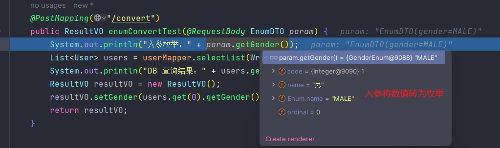

## 序

一般在项目当中，关于字典的管理方式可概括为以下两种：

1. 交由数据库维护，前后端需要时调用接口获取，好处是可以对字典做成页面配置，随时增删查改，前后端同步；
2. 前后端根据业务约定好字典内容后，各自存储，这样就无需依赖 API 调用。

第一种做法比较有利于字典需要频繁变化的场景，缺点是需要网络调用接口；而第二种虽然避免了网络问题，但要求前后端手动同步好字典数据，以免出错，对于变化较多的字典较为麻烦。

用哪一种根据业务决定即可，因为根据实际情况，前端总是需要对字典数据做一些特殊处理，比如根据订单状态执行不同操作，需要依赖字典做条件判断，这避免不了需要在前端存储一份字典数据的问题。（个人）目前所接触过的实际项目也基本都是前后端自己维护，除了个别纯后台管理系统才采用了第一种方案。

以下内容是基于第二种方案，针对枚举字典的出入参转化进行介绍。

## 基于 MyBatisPlus + Jackson 实现枚举出入参转换 

当接口的出入参中包含字典字段时，比如性别`gender`，常见的做法是出入参都用`Integer`类型修饰，前后端传递字典数值即可。对于前端，倘若查询列表数据过多且字典字段存在好几个，则需要前端一一转化，增加了前端计算量，对于页面渲染性能有影响。对于后端则无大碍，但获取到的参数若直接是枚举类型，那么使用参数时也可以更灵活。因此，可通过对字典字段的出入参进行转化，返回给前端时不仅有字典值，还有对应的字典描述以直接展示，而后端获取到的参数就是一个枚举类型。

在 MyBatis 中提供了字段类型处理器，用于`JavaType`与`JdbcType`之间的转换，而这正巧可以作用于枚举类型字段的出参转化。

MyBatis 基础字段类型处理器对象为`BaseTypeHandler<T>`，该类提供了对引用泛型类型的转化，简单看下其源码：

```java
public abstract class BaseTypeHandler<T> extends TypeReference<T> implements TypeHandler<T> {
    
    /**
     * ...其它内容
     */
    
    // 该类提供了四个可供开发者实现的钩子方法，用于自定义转化非空、可空的参数
	public abstract void setNonNullParameter(PreparedStatement ps, int i, T parameter, JdbcType jdbcType) throws SQLException;
	public abstract T getNullableResult(ResultSet rs, String columnName) throws SQLException;
	public abstract T getNullableResult(ResultSet rs, int columnIndex) throws SQLException;
	public abstract T getNullableResult(CallableStatement cs, int columnIndex) throws SQLException;

}
```

因为要转化的是枚举类型，首先创建一个枚举接口（枚举无法继承），在其中封装常用的操作；

```java
public interface BasicEnum<E extends Enum<E>> {
	
    Integer code();  // 枚举代码
    String name();  // 枚举内容

    /**
     * 用枚举代码获取枚举对象，该方法会在 MP 的字段类型处理器中使用
     */
    static BasicEnum<?> fromCode(Class<?> enumCls, Integer code) {
        if (enumCls == null || code == null) {
            return null;
        }
        BasicEnum<?>[] enumConstants = (BasicEnum<?>[]) enumCls.getEnumConstants();
        for (BasicEnum<?> enumConstant : enumConstants) {
            if (enumConstant.code().equals(code)) {
                return enumConstant;
            }
        }
        log.error("类 {} 中没有值为[{}]的枚举", enumCls, code);
        throw new RuntimeException(String.format("值[%s]没有对应的枚举!", code));
    }

    //... 其它操作，比如根据值获取文本、通过文本获取值、遍历等等
}

/**
 * 性别枚举，实现 BasicEnum
 */
public enum GenderEnum implements BasicEnum<DemoEnum> {

    MALE(1, "男"),
    FEMALE(2, "女"),
    UNKNOWN(3, "未知");

    DemoEnum(Integer code, String name) {
        this.code = code;
        this.name = name;
    }

    private final Integer code;
    private final String name;

    @Override
    public Integer code() { return this.code; }
    @Override
	public String name() { return this.name; }
}
```

因为上面为枚举抽象了一个统一接口`BasicEnum`，因此可以直接利用它来创建一个类型处理器：

```java
public class EnumHelperTypeHandler <E extends Enum<E>> extends BaseTypeHandler<BasicEnum<E>> {
    
    // 要转化的类型，因为泛型指定为 BasicEnum，所以该处理器只针对枚举类型字段
    private final Class<E> cls;
    public EnumHelperTypeHandler(Class<E> cls) { this.cls = cls; }
    
    /**
     * 该方法将 DB 查询到的枚举 code 转为指定的 jdbc 类型
     */
    @Override
    public void setNonNullParameter(PreparedStatement ps, int i, BasicEnum<E> parameter, JdbcType jdbcType) throws SQLException {
        
        if (jdbcType == null){
            ps.setObject(i,parameter.code());
            log.warn("SQL 中枚举字段没有指定 JdbcType");
            return;
        }
        switch (jdbcType) {
            case TINYINT: ps.setByte(i, parameter.code().byteValue()); break;
            case SMALLINT: ps.setShort(i, parameter.code().shortValue()); break;
            case INTEGER: ps.setInt(i, parameter.code()); break;
            case BIGINT: ps.setLong(i, parameter.code().longValue()); break;
            case VARBINARY:
            case CHAR:
                ps.setString(i, String.valueOf(parameter.code())); break;
            default: throw new IllegalArgumentException(String.format("不支持枚举转换JDBC类型 => %s", jdbcType));
        }
    }
    
    /**
     * 以下三个方法调用 value2Enum() 方法，根据 code 转为枚举对象
     */
    @Override
    public BasicEnum<E> getNullableResult(ResultSet rs, String columnName) throws SQLException {
        return value2Enum(rs.getObject(columnName));
    }
    @Override
    public BasicEnum<E> getNullableResult(ResultSet rs, int columnIndex) throws SQLException {
        return value2Enum(rs.getObject(columnIndex));
    }
    @Override
    public BasicEnum<E> getNullableResult(CallableStatement cs, int columnIndex) throws SQLException {
        return value2Enum(cs.getObject(columnIndex));
    }

    @SuppressWarnings("unchecked")
    public BasicEnum<E> value2Enum(Object val) {
        if (val == null) {
            return null;
        }
        int code;
        if (val instanceof String) {
            code = Integer.parseInt((String) val);
        } else if (val instanceof Number) {
            code = ((Number) val).intValue();
        } else {
            throw new IllegalArgumentException(String.format("不支持的类型转枚举 => %s", val.getClass()));
        }
        return (BasicEnum<E>) BasicEnum.fromCode(cls, code);
    }
    
}
```

类型转化器创建好后，需要在`application.yml`中配置如下信息：

```yaml
mybatis-plus:
  configuration:
    # 设置默认的枚举类型转化器
    default-enum-type-handler: com.bingqiling.enumconv.enums.EnumHelperTypeHandler
```

到这一步关于枚举类型数据的出参就搞定了，接下来是入参，需要利用到 Jackson 的序列化与反序列化功能：

```java
/**
 * 反序列化，转化入参
 */
public class EnumHelperJsonDeserializer<E extends Enum<E>> extends JsonDeserializer<BasicEnum<E>> {
	@Override
    public BasicEnum<E> deserialize(JsonParser p, DeserializationContext deserializationContext) throws IOException {
        // 枚举的code值
        Integer code = p.getIntValue();
        JsonStreamContext parsingContext = p.getParsingContext();
        // 当前反序列化目标对象的类
        Object currentValue = parsingContext.getCurrentValue();
        // 当前字段所在类
        Class<?> cls = parsingContext.getCurrentValue().getClass();
        // 当前反序列化的字段名
        String fieldName = parsingContext.getCurrentName();
        // 当前反序列化字段的类型
        Field field = ReflectionUtils.findField(cls, fieldName);
        Class<?> fieldType = null;
        if (field != null) {
            fieldType = field.getType();
        }
        
        // 如果 filedType 为 null，那么执行 fromCode() 将会抛出异常，根据异常决定返回什么信息给前端即可
        return (BasicEnum<E>) BasicEnum.fromCode(fieldType, code);
    }
}

/**
 * 序列化，转化出参
 */
public class EnumHelperJsonSerializer extends JsonSerializer<BasicEnum<?>> {

    @Override
    public void serialize(BasicEnum basicEnum, JsonGenerator gen, SerializerProvider serializers) throws IOException {
        if (basicEnum == null || basicEnum.code() == null) {
            gen.writeNull();
            return;
        }
        // 写枚举的值
        gen.writeNumber(basicEnum.code());
        // 写出枚举名称键值，就是在这一步，为枚举字段添加一个字段来描述对应的内容
        String currentName = gen.getOutputContext().getCurrentName();
        if (currentName != null) {
            // 这里的做法是字段名使用参数名+Name，值为枚举的 name
            gen.writeStringField(currentName + "Name", basicEnum.name());
        }
    }
}

// 然后在 BasicEnum 接口添加两个注解使用上述的序列化与反序列化器即可
@JsonSerialize(using = com.example.config.EnumHelperJsonSerializer.class)
@JsonDeserialize(using = com.example.config.EnumHelperJsonDeserializer.class)
public interface BasicEnum<E extends Enum<E>> { 
    //... 
}
```

到这里基本配置就已经完成，可以构建入参、接口进行测试了。如下：

```java
public class EnumDTO {
    // 直接使用枚举类型
    private GenderEnum gender; // getter/setter 方法省略
}

public class ResultVO {
    private GenderEnum gender; // getter/setter 方法省略
}

// Controller
@RestController
@RequestMapping("/demo")
public class DemoController {

    // user 表只是测试用，User 对象包含了一个字段 GenderEnum gender，知道这个即可
    @Resource
    private UserMapper userMapper;

    @PostMapping("/convert")
    public ResultVO enumConvertTest(@RequestBody EnumDTO param) {
        System.out.println("入参枚举：" + param.getGender());
        List<User> users = userMapper.selectList(Wrappers.emptyWrapper());
        ResultVO resultVO = new ResultVO();
        resultVO.setGender(users.get(0).getGender());
        return resultVO;
    }
}
```

```http
### 请求
GET localhost:8091/demo/convert
Content-Type: application/json

{
  "gender": 1
}
```

如上代码，HTTP 请求只需指定数值，出入参返回皆会自动转为枚举和增加相应字段，入参与返回数据如下：



```txt
{
    "code": 200,
    "msg": "成功",
    "data":
        {
            "gender": 1, 
            "genderName": "男"
        }
}
```

到这里所有操作就已完成，实现了出入参的改变。

至于 MyBatis 提供的`TypeHandler`类型转换器原理并不复杂，就是对 MyBatis 查询结果集的遍历处理，调用相应转化器器进行转化，而且还内置了默认的类型转换器，如字符串`StringTypeHandler`、数值`IntegerTypeHandler`，以及 MyBatis Plus 也提供了自己实现的`JacksonTypeHandler`。感兴趣的同学可自己追踪源码，此处不再赘述，完！

## 其它

这里补充一个关于枚举字典的抽象优化，直戳链接进入：[巧用枚举让字典表的管理和使用变得简单](https://blog.csdn.net/u011511756/article/details/88094754)，还不错。