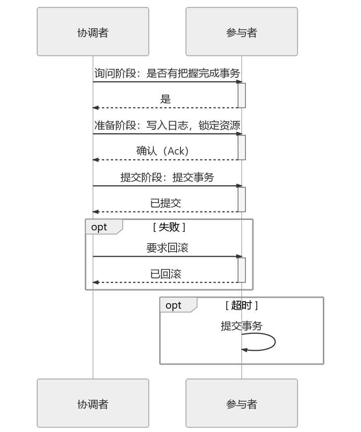
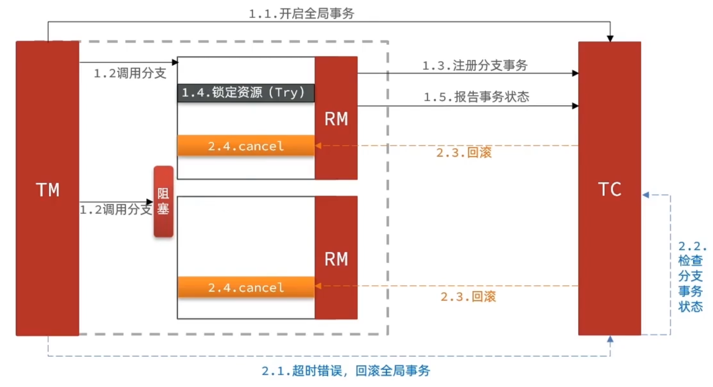
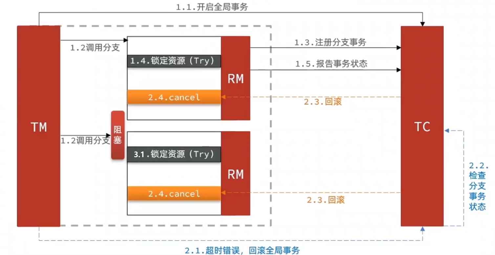

分布式事务是在分布式系统下绕不开的一个话题，它的概念是指：**在分布式系统下，一个业务跨多个服务或数据源，每个服务都是一个分支事务，要保证多个分支事务最终一致性，即为分布式事务**。本篇便是来介绍常见的几种分布式事务实现方案。

## 理论规范

先来了解下分布式领域的一些定理。

### CAP 定理

分布式系统的三个指标：在分布式系统中，最多只能实现其中的两点，由于网络硬件肯定会出现延迟丢包等问题，所以分区容错性是必须实现的，因此只能在一致性和可用性之间进行权衡。

- 一致性（Consistency）：用户访问分布式系统中的任意节点，得到的数据都是一致的
- 可用性（Availability）：分布式系统中任意健康节点在任何时候都可以读写
- 分区容错性（Partition tolerance）：在网络故障、某些节点不能通信的时候系统仍能继续工作
  - 分区（Partition）：因为网络故障或其它原因导致分布式系统中的部分节点与其它节点失去连接，形成独立分区
  - 容错（Tolerance）：在出现分区情况时，系统也要持续对外提供服务

| 组合    | 描述                                                         |
| :----: | :------------------------------------------------------: |
| CA   | 放弃分区容错性，加强一致性和可用性，传统单机数据库（MySQL、Oracle）的选择 |
| AP   | 放弃一致性（这里指强一致性），分布式系统设计常用选择，一旦分区发生，节点之间可能会失去联系， 为了高可用，每个节点只能用本地数据提供服务，如此会导致全局数据的不一致性 |
| CP   | 放弃可用性，追求一致性和分区容错性，网络故障问题会导致整个系统不可用，例如 Redis、HBase 等 |

### BASE 理论

BASE 理论是对 CAP 定理中 CA 的补充权衡，即使无法做到强一致性（Strong consistency），但每个应用都可以根据自身的业务特点，采用适当的方式来使系统达到最终一致性（Eventual consistency）。

- 基本可用（Basically Available）：是指分布式系统在出现不可预知故障的时候，允许损失部分可用性（即保证核心可用），但不等价于系统不可用
- 软状态（Soft state）：是指允许系统中的数据存在中间状态，并认为该中间状态的存在不会影响系统的整体可用性，即允许系统在不同节点的数据副本之间进行数据同步的过程存在延时
- 最终一致性（Eventually consistent）：是指系统中所有的数据副本，在经过一段时间的同步后，最终能够达到一致的状态

### XA 规范

X/Open 组织（即 Open Group）定义了分布式事务处理（DTP，Distributed Transaction Processing）模型，该模型包含以下四个组件：

- 应用程序（AP，Application Program）
- 事务管理器（TM，Transaction Manager）
- 资源管理器（RM，Resource Manager）
- 通信资源管理器（CRM，Communication Resource Manager）

本地事务一般指一个数据库内部的事务处理，如对多个表的操作；分布式事务处理的对象是全局事务，即分布式事务处理环境中，多个数据库可能需要共同完成一个工作，这个工作即是一个全局事务。

如：一个事务中可能更新几个不同的数据库，对数据库的操作发生在系统的各处但必须全部被提交或回滚；此时一个数据库对自己内部所做操作的提交不仅依赖本身操作是否成功，还要依赖与全局事务相关的其它数据库的操作是否成功，如果任一数据库的任一操作失败，则参与此事务的所有数据库所做的所有操作都必须回滚。

XA 即 X/Open DTP 定义的 TM 与数据库之间的接口规范（接口函数），TM 用于通知数据库事务的开始、结束及提交、回滚等，XA 接口函数由数据库厂商提供。

2PC/3PC 就是根据该思想而衍生，2PC 是实现 XA 分布式事务的关键，其保证了分布式事务的原子性。

## 2PC

> **二阶段提交（Two-phase Commit）**：是在计算机网络以及数据库领域内，为了使基于分布式系统架构下的所有节点在进行事务提交时保持一致性而设计的一种算法（也称协议）；当一个事务跨越多个节点时，为了保持事务的 ACID 特性，需要引入一个作为协调者的组件来统一掌控所有节点（称作参与者）的操作结果并最终指示这些节点是否要把操作结果进行真正的提交（如将更新后的数据写入磁盘等等）；可概括为：参与者将操作成败通知协调者，再由协调者根据所有参与者的反馈情报决定各参与者是否要提交操作还是中止操作。
>
> 下方将协调者简写为 C（Coordinator），参与者简写为 P（Participant）

两个阶段分别为：请求提交（投票）阶段、提交阶段。

### 请求提交阶段（Commit request (or voting) phase）

C 给 P 发送 Prepare 消息，P 要么返回失败，要么在本地执行事务，写本地的 redo 和 undo 日志，但不提交，然后返回成功。

### 提交阶段（Commit (or completion) phase）

- 成功
  - C 若收到所有 P 的响应结果都为成功时，则向所有 P 发送提交消息
  - P 正式完成操作，并释放在整个事务期间内占用的资源
  - P 向 C 发送完成消息
  - C 收到所有 P 的完成消息后，完成事务
- 失败
  - C 若收到 P 的失败响应或一阶段等待响应超时，则向所有 P 发送回滚消息
  - P 利用之前写入的 undo 信息执行回滚，并释放在整个事务期间内占用的资源
  - P 向 C 发送回滚完成消息
  - C 收到所有 P 的回滚完成消息后，取消结束事务

### 2PC 缺陷

1. 同步阻塞问题：执行过程中，所有参与节点都是事务阻塞型，当 P 占有公共资源时，其他第三方节点访问公共资源会处于阻塞状态；
2. 单点故障：当 C 发生故障时，P 会一直阻塞，尤其在二阶段，C 若发生故障，所有 P 都处于锁定资源状态，无法继续完成事务操作，即使 C 宕机后重新选举，依旧无法解决其宕机期间导致的 P 阻塞问题；
3. 数据不一致：二阶段过程中，当 C 向 P 发送提交请求后，发生局部网络异常或发送过程中宕机，会导致只有一部分 P 接收到提交请求，而这部分 P 收到请求后执行提交操作，但其余部分 P 未收到提交请求而无法执行事务提交，就导致了分布式系统出现数据不一致的现象；
4. 2PC 无法解决的问题：当 C 发出提交请求后宕机，而唯一接收到该请求的 P 也宕机了，即使经过重新选择产生了新的 C，该全局事务的状态也是不确定的，无法知道 P 事务是否已提交。

## 3PC

> **三阶段提交（Three-phase Commit）**：对 2PC 的一种更具故障恢复能力的改进。
>
> 下方将协调者简写为 C（Coordinator），参与者简写为 P（Participant）

相较 2PC，3PC 改动点如下：

1. 同时在 C 和 P 中引入超时机制；
2. 将 2PC 中的一阶段一分为二，分为准备阶段和预提交阶段，消除了 2PC 缺陷 4 中无法解决的问题。

三个阶段分别为：CanCommit、PreCommit、DoCommit

### CanCommit

- 事务询问：C 向 P 发送 CanCommit 请求，询问是否可以执行事务提交操作。
- 响应反馈：P 收到请求后，正常情况下，若其自身认为可顺利执行事务，则响应 Yes，否则反馈 No。

### PreCommit

C 根据一阶段的响应结果判断是否可以进行事务的 PreCommit 操作。

- 都为 Yes
  - C 向所有 P 发送 PreCommit 请求，进入 Prepare 状态
  - P 收到请求后，会执行事务操作，并将 undo 和 redo 信息记录到事务日志中
  - 若 P 成功执行了事务操作，则返回 ACK 响应
- 存在 No：有 P 返回了 No 或超时未响应
  - C 向所有 P 发送 abort 请求
  - P 收到请求后（或超时之后仍未接收到 C 的请求），执行事务中断

### DoCommit

进行真正的事务提交。

- 执行提交
  - 收到所有 P 的 ACK 后，C 向所有 P 发送 DoCommit 请求
  - P 收到请求后，执行事务提交，并在完成后释放所有事务资源，向 C 发送 ACK 响应
  - C 收到所有 P 的响应后，完成事务
- 中断事务
  - C 未收到 P 的 ACK 响应（可能是接受者发送的不是 ACK 响应，也可能响应超时），向所有 P 发送 abort 请求
  - P 收到请求后，利用其在二阶段记录的 undo 信息来执行事务的回滚操作，然后释放所有事务资源
  - P 完成回滚后，向 C 发送 ACK 消息
  - C 收到所有 P 的 ACK 后，执行事务中断

在 doCommit 阶段，如果参与者无法及时接收到来自协调者的 doCommit 或者 abort 请求时，会在等待超时之后，继续进行事务的提交。

其实这个应该是基于概率来决定的，当进入第三阶段时，说明参与者在第二阶段已经收到了 PreCommit 请求，那么协调者产生 PreCommit 请求的前提条件是他在第二阶段开始之前，收到所有参与者的 CanCommit 响应都是 Yes；一旦参与者收到了 PreCommit，意味它知道大家其实都同意修改了，简而言之，当进入第三阶段时，由于网络超时等原因，虽然参与者没有收到 commit 或者 abort 响应，但是它有理由相信：成功提交的几率很大。

### 3PC 优缺点

- 3PC 主要解决了 2PC 缺陷中的 1、2、4 问题；
- 3PC 同样会导致数据不一致：由于网络原因，C 发送的 abort 请求没有及时被 P 接收到，P 在等待超时之后执行了 commit 操作，这样就和其他接到 abort 命令并执行回滚的 P 之间存在数据不一致的情况；
- 性能问题：3PC 完成一次事务需要三次请求往返（即三个往返时间 RTT）；
- 无法保证原子性：3PC 假设网络具有有限的延迟和节点的响应时间有限；而在大多数具有无限网络延迟和进程暂停的实际系统中，它不能保证原子性。

## TCC

**TCC** 是 **Try**、**Confirm**、**Cancel** 三个词语的缩写，其主要实现最终一致性，且面向业务层面的事务控制，通过对业务逻辑（业务系统自己实现）的调度来实现分布式事务。

> 💡Tip：关于 **TCC（Try-Confirm-Cancel）** 的概念，最早是由 Pat Helland 于 2007 年发表的一篇名为《Life beyond Distributed Transactions: an Apostate's Opinion》的论文提出。在该论文中，TCC 还是以 **Tentative-Confirmation-Cancellation** 命名，正式以 **Try-Confirm-Cancel** 作为名称的是 Atomikos 公司。

### TCC 事务操作

- Try：完成所有业务检查（一致性），预留业务资源（隔离性）。
- Confirm：确认执行业务操作，不做任何业务检查，只使用 Try 阶段预留的业务资源。
- Cancel：取消 Try 阶段预留的业务资源（即回滚）。

### 详解

- Try 与后续的 Confirm 两个操作才能真正构成完整的业务逻辑。
- Confirm 阶段是做确认提交，Try 阶段所有分支事务执行成功后开始执行 Confirm；通常情况下，采用 TCC 则认为 Confirm 阶段是不会出错的，即 Try 成功后，Confirm 一定成功，若 Confirm 阶段真的出错，需引入重试机制（要保证幂等）或人工处理。
- Cancel 阶段是在业务执行错误需要回滚的状态下执行分支事务的业务取消，预留资源释放；该阶段也是默认不会出错，若出错同样需要引入重试机制或人工处理。

### 异常处理

- 空回滚

  

空回滚是指在没有调用 TCC 资源 Try 方法的情况下，调用了二阶段的 Cancel 方法，Cancel 方法需要识别出这是一个空回滚，然后直接返回成功。

出现原因：当一个分支事务所在服务宕机或网络异常，分支事务调用记录为失败，这个时候其实是没有执行 Try 阶段，当故障恢复后，分布式事务进行回滚则会调用二阶段的 Cancel 方法，从而形成空回滚。

解决思路：判断一阶段是否执行，有执行正常回滚，无执行则为空回滚；可额外增加一张分支事务记录表，保存分支事务的执行状态，一阶段 Try 方法向记录表插入一条记录，表示一阶段执行了，Cancel 接口里读取该记录，若记录存在则正常回滚（并删除记录），否则空回滚。

- 幂等

为了保证 TCC 二阶段提交重试机制不会引发数据不一致，要求 TCC 的二阶段 Confirm 和 Cancel 接口保证幂等，这样不会重复使用或者释放资源。如果幂等控制没有做好，可能导致数据不一致等问题。

解决思路：借助分支事务记录表，每次重试执行先查记录状态，判断是否执行操作。

- 业务悬挂

  

业务悬挂是指对于 TCC 分布式事务，其二阶段 Cancel 接口比 Try 接口先执行，即业务资源预留后无法继续处理。

出现原因：在 RPC 调用分支事务 Try 时，先注册分支事务，再执行 RPC 调用，若此时 RPC 调用的服务网络发生拥堵，通常 RPC 调用设有超时时间，RPC 超时以后，TM 就会通知 RM 回滚该分布式事务，可能回滚完成后，RPC 请求才到达参与者真正执行，而一个 Try 方法预留的业务资源，只有该分布式事务才能使用，所以第一阶段预留的业务资源就再也没能够处理了。

解决思路：若二阶段执行完成，则一阶段不能再继续执行，同样是借助分支事务记录表，在执行一阶段事务时判断在该全局事务下，表中是否已经有二阶段事务记录，如果有则不执行 Try。

### TCC 实现框架

- Seata TCC 模式（SpringCloud Alibaba）
- tcc-transaction
- hmily

## 参考资料

- [关于分布式事务、两阶段提交协议，三阶段提交协议](https://www.hollischuang.com/archives/681 "关于分布式事务、两阶段提交协议，三阶段提交协议")
- [终于有人把“TCC分布式事务”实现原理讲明白了！](https://www.cnblogs.com/jajian/p/10014145.html)
