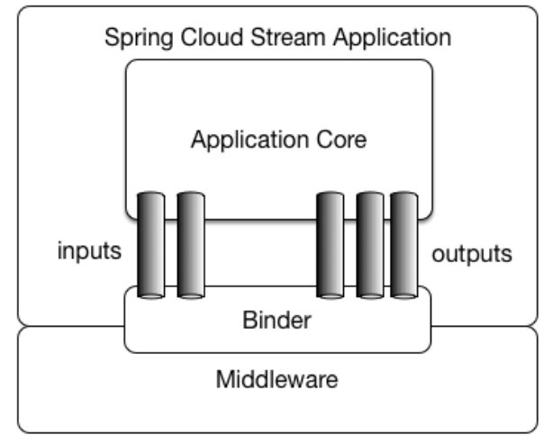
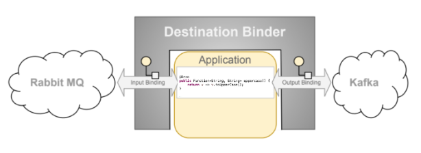
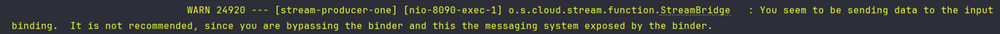

> **[Spring Cloud Stream](https://spring.io/projects/spring-cloud-stream#learn)**：是用于构建与共享消息传递系统连接的高度可扩展的事件驱动微服务，其提供一个灵活的编程模型，基于 Spring 习语来实现对各类常见的 MQ 系统的支持，如官方自己提供的 RabbitMQ Binder、Kafka Binder，还有其它 MQ 厂商自己提供的适配。其内部使用 Spring Integration 提供与 broker 的连接，并能够在同样的配置、代码下实现不同 MQ 产品的消息发布订阅、消费者组、持久化、分区等特性。

## 基础概念



Stream 程序由一个与中间件中立的核心组成，程序通过外部 Broker 暴露的目标与代码中的 input/output 参数之间建立**绑定**（**Bindings**）来实现通信，而建立绑定的 Broker 细节则由特定于中间件的 Binder 实现处理。

- **Binder**：负责提供必要的配置和实现，以促进与外部消息系统（MQ）的集成。
- **Bindings**：消息系统与 Stream 程序提供的消息生产者和使用者（由 Binder 创建）之间的桥梁，即 Producer/Consumer 与 MQ（队列、主题）之间的绑定关系。
- **Message**：Producer/Consumer 用于与 Binder（以及通过外部消息系统传递消息的其它程序）进行通讯的规范数据结构。



## Bindings 绑定{#BindingName}

```java
@SpringBootApplication
public class SampleApplication {
    
    @Bean
    public Consumer<Message<Object>> demoConsumer() {
        return msg -> System.out.println("消息消费：" + msg.getPayload());
    }
    
}
```

一个 Stream 程序在导入[依赖](#dependencies)后，使用上方代码即可实现消息的消息，它默认会创建以函数名称为 name 的绑定，例如 demoConsumer-in-0 。Stream 在绑定名称方面有默认的约定，在 Spring 上下文中，会检查 `Function`、`Supplier`、`Consumer` 这类 Bean 注册为消息处理器，这些消息处理器会触发绑定到所提供的 Binder 所公开的目的地（**destination**，即 Topic-Kafka、Exchange-RabbitMQ）。

绑定名称约定如下：

- input（输入绑定，即消费者）：`<functionName> + in + <index>`
- output（输出绑定，即生产者）：`<functionName> + out + <index>`

`functionName` 即定义的函数式处理器 Bean 名称，`in/out` 分别对应绑定类型（输入/输出），`index` 是绑定的索引，对于单输入/输出函数，它始终为 0，它仅与**具有多个输入/输出参数的函数**相关。

函数的作用：

- **Consumer**：表示消息的消费，只针对消息的输入
- **Supplier**：表示消息的生产，只针对消息的输出，该类型作为数据的源，对数据只生产不消费，它的执行可分为命令式或被动式
  - 命令式：Stream 提供了轮询机制，默认每隔 1s 执行函数，即每一秒发送一条消息到绑定的输出目标，配置参数[在这](https://docs.spring.io/spring-cloud-stream/reference/spring-cloud-stream/producing-and-consuming-messages.html#polling-configuration-properties)
  - 响应式：查看[官文](https://docs.spring.io/spring-cloud-stream/reference/spring-cloud-stream/producing-and-consuming-messages.html#suppliers-sources)，其实就是利用响应式编程风格（Project Reactor）来实现消息的生成，而不依赖轮询机制
- **Function**：表示消息的消费与生产，即输入与输出兼具
  - 当定义该类型时，应当有对应的输入和输出绑定
  - 在默认情况下，如果定义 Function 函数，如 `public Function<String,String> toUpperCase()`，会生成两个绑定 `toUpperCase-in-0` 和 `toUpperCase-out-0`

对于绑定的目的地，可在 `application.yml` 中配置：

```yaml
# 假设使用的消息系统是 RabbitMQ，此项配置会创建一个 'my-topic' 的 Exchange，以及一个 'my-topic.my-queue' 的 Queue
spring.cloud.stream.bindings.uppercase-in-0.destination: my-topic
spring.cloud.stream.bindings.uppercase-in-0.group: my-queue
```

## 消息输入/输出{#dynamic-destination}

**StreamBridge**：一个允许用户将数据发送到输出绑定的类，在 Stream 程序的常见场景中，消息是很少需要用户手动发送，即消息应当是在 Stream 程序上下文中产生并自动发送，而当数据源是在 Stream 程序之外（比如 REST 端点被调用后产生的数据要发送到目标绑定），则可使用该类进行手动发送。

```java
@RestController
@RequestMapping("/send")
public class SendController {

    @Resource
    private StreamBridge streamBridge;

    @GetMapping("/test")
    public void test(String name) {
        // 构建消息
        Message<String> msg = MessageBuilder.withPayload(name).build();
        // 向指定的目的地发送消息
        streamBridge.send("demoConsumer-out-0", msg, MimeType.valueOf("application/json"));
    }

}
```

首先需要说明一点，在微服务架构下，生产者和消费者一般不会在同一个服务里，因此，正常情况是会将输入绑定放在消费者服务，而在生产者服务里配置中添加一个输出绑定，并指定相应的 `destination`，如下配置。这样在生产者服务中使用 `StreamBridge` 发送消息时就指定输出绑定名称即可，会自动寻找到对应的 `destination` 进行消息路由。

```yaml
# 生产者服务
spring:
  cloud:
    stream:
      bindings:
        demoConsumer-out-0:
          destination: consumer-topic
# 消费者服务
spring:
  cloud:
    stream:
      bindings:
        demoConsumer-in-0:
          destination: consumer-topic
          group: consumer-queue
```

当然你依然可以不配置输出绑定，直接向输入绑定发送消息，只是这样子，你将会在 IDEA 控制台看到一条警告日志：



这是 Stream 源码里打印的日志，意思就是说不推荐直接向输入绑定发送消息，因为这绕过了 Binder 的某些功能和机制，可能会引发一些问题或限制。这些问题可能包括：

- **缺乏一致性配置管理**：Binder 提供了集中化的配置管理，允许通过配置文件统一管理消息通道的配置。绕过 Binder 意味着开发者需要手动管理这些配置，可能导致配置不一致的问题；
- **失去某些特性**：绑定器提供了很多高级特性，如消息转换、错误处理、重试机制等。绕过绑定器意味着可能无法利用这些特性，必须自己实现类似的功能；
- **可维护性和可读性降低**：使用 Binder 可以让代码结构更加清晰和一致，方便维护和阅读，绕过 Binder 可能会让代码变得更加复杂和难以理解。

简单说，就是输入、输出绑定都会有各自的配置，而直接向输入绑定发送消息，那么输出绑定的配置就不会被检测执行，这一点在本篇下面提到的[交换机路由键配置](#routing-key-config)后发送消息会有体现，而在[第二篇](./spring_cloud_stream_two.md)介绍的死信、延迟队列消息发送与消费也是如此。

还有一种 **动态目的地** 方式，那就是在省去生产者的输出绑定配置后，使用 StreamBridge 发送消息时不指定绑定名称，而是直接指定 `destination`，如：`streamBridge.send("consumer-topic", msg);`，它的本质是在没有检测对应的绑定名称时，会根据指定的 `destination` 动态创建输入/输出绑定，而由于消费者服务已经有该 `destination` 的输入绑定，那么发送至该 `destination` 的消息自然就会被消费者消费了。

### 通道拦截器

- **MessageChannel**：StreamBridge 内部本质是使用了 MessageChannel 进行输出绑定的建立和消息的发送，MessageChannel 接口定义消息的发送，它的子类实现则扩展了它的功能，包括拦截器等
- **@GlobalChannelInterceptor**：该注解为 StreamBridge 注入了拦截器，其属性 `patterns` 定义了哪些绑定通道在发送消息时会被拦截，默认 `*` 匹配全部，可实现前置、后置拦截

```java
@Component
public class CustomChannelInterceptor {

    @Bean
    @GlobalChannelInterceptor(patterns = "foo-*")  // 表示 foo- 开头的绑定在发送消息时会被拦截
    public ChannelInterceptor consumerChannelInterceptor() {
        return new ChannelInterceptor() {
            
            @Override
            public Message<?> preSend(Message<?> message, MessageChannel channel) {
                System.out.println("消息发送前输出内容：" + message.getPayload());
                // 如果返回 null 则不会真正发送消息
                return message;
            }

            @Override
            public void afterSendCompletion(Message<?> msg, MessageChannel channel, boolean sent, Exception ex) {
                System.out.println("消息发送后输出内容：" + msg.getPayload());
            }
        };
    }
}
```

### 三种函数基础示例{#dependencies}

```xml
<!-- Maven 依赖，由 Spring Cloud 官方提供，按需导入即可 -->
<dependency>
    <groupId>org.springframework.cloud</groupId>
    <artifactId>spring-cloud-starter-stream-rabbit</artifactId>
</dependency>

<dependency>
    <groupId>org.springframework.cloud</groupId>
    <artifactId>spring-cloud-starter-stream-kafka</artifactId>
</dependency>
```

```yaml
spring:
  cloud:
    stream:
      bindings:
        demoConsumer-in-0:
          destination: consumer-topic
          group: consumer-queue # 此项在 RabbitMQ 表示队列，Kafka 表示消费者组
        # 表示 supplier 生产消息会发往目的 consumer-topic，也就是交由上面的消费者处理
        demoSupplier-out-0:
          destination: consumer-topic
        # function 类型需要配置输入、输出绑定，表示向 function-topic 发送消息后经过函数处理会再发送给 consumer-topic
        demoFunction-in-0:
          destination: function-topic
          group: function-queue # 指定交换机绑定的队列
        demoFunction-out-0:
          destination: consumer-topic
```

```java
@Component
public class MQHandler {
    
    // 消费消息
    @Bean
    public Consumer<Message<Object>> demoConsumer() {
        return msg -> System.out.println("消息消费：" + msg.getPayload());
    }
    
    // 生产消息
    @Bean
    public Supplier<Message<Object>> demoSupplier() {
        return () -> MessageBuilder.withPayload("Hello, Spring Cloud Stream!").build();
    }
    
    // 消费并生产消息，此处作用式将输入的字符串消息转为大写再输出
    @Bean
    public Function<Message<String>, Message<Object>> demoFunction() {
        return String::toUpperCase;
    }
    
}

@RestController
@RequestMapping("/demo")
public class DemoController {
    
    @Resource
    private StreamBridge streamBridge;
    
    @GetMapping("/test")
    public void test() {
        // 构建消息
        Message<String> msg = MessageBuilder.withPayload("Hello World!").build();
        // 向指定的输入绑定发送消息
        streamBridge.send("demoConsumer-in-0", msg, MimeType.valueOf("application/json"));
        streamBridge.send("demoFunction-in-0", msg, MimeType.valueOf("application/json"));
    }
    
}
```

按照上方配置和代码，当启动服务后（为方便演示，上方代码皆在同一服务），无论使用的是 RabbitMQ 还是 Kakfa，Stream 都会映射 `destination`、`group` 到对应 MQ 系统中的概念，比如在 RabbitMQ 就分别代表着 `Exchange`、`Queue`，在 Kafka 中则是 `Topic`、`ConsumerGroup`。

至于为什么没有配置 MQ 服务环境地址，是因为 Stream 依赖包含了 RabbitMQ、Kafka 在 Spring Boot 中的集成，所以缺省环境配置时，会使用 Spring Boot 自带的默认值去连接 Broker。当然想指定环境的话，就如同 Spring Boot 集成 MQ 时所做的配置一样。

```yaml
spring:
  kafka:
   bootstrap-servers: localhost:9092
  rabbitmq:
    # 确认机制需要依靠 Spring AMQP 实现，Stream 并不提供，Binder 本身使用的也是 Spring Boot 的 Connection Factory，
    # Stream 支持 Spring AMQP 的所有配置
    publisher-returns: true
    publisher-confirm-type: simple
    host: localhost
    username: admin
    password: admin123
    port: 5672
```

## 其它重要配置

**PS**：以下所有配置以 RabbitMQ 为例，Kafka 也是类似，不清楚的配置只需要看官文即可，很详细。

### 指定注册的消息处理器

上面提到 Stream 启动会检测 `Function`、`Supplier`、`Consumer` 三种类型函数 Bean 作为消息处理器，但在实际中也并非所有的函数式 Bean 都是用于 Stream 的消息处理，因此可以用以下配置指定需要注册的函数 Bean 的名称：

```yaml
spring:
  cloud:
    function:
      definition: demoConsumer;demoSupplier;demoFunction
```

使用分号进行分割，注意不要出现空格或其它符号，因为该字符串属性分割的源码是调用的 `String.split(";")`，会将其它符号也当作 Bean 名称的一部分。**注意**：当存在多个相同类型的函数 Bean 时，比如有两个 `Consumer` Bean，也必须指定该配置，因为 Stream 默认是依赖应用上下文来确定哪个是消费者，并不会依赖绑定名称确定。

除此之外还可用管道符（`|`）连接多个函数：

```yaml
spring:
  cloud:
    function:
      definition: demoFunctionOne|demoFunctionTwo
```

`demoFunctionOne|demoFunctionTwo` 的意思是连接两个 `Function` 函数（假设已声明）组合成一个新的函数，并且 `demoFunctionOne` 生产的消息将直接作为 `demoFunctionTwo` 的输入，而在指定该组合函数的输入/输出绑定时，也应该使用这个组合名称，如 `demoFunctionOne|demoFunctionTwo-in-0`、`demoFunctionOne|demoFunctionTwo-out-0`。显然这很冗长，Stream 也考虑到这点，并提供了为绑定声明别名的方式：

```yaml
spring:
  cloud:
    function:
      definition: demoFunctionOne|demoFunctionTwo
    stream:
      function:
        bindings: 
          # 属性指定输入/输出绑定名称，值则为别名
          demoFunctionOne|demoFunctionTwo-in-0: FunctionCompositionIn
          demoFunctionOne|demoFunctionTwo-out-0: FunctionCompositionOut
      bindings:
        # 直接使用别名
        FunctionCompositionIn:
          destination: sf-exchange
          group: sf-queue
        FunctionCompositionOut:
          destination: consumer-exchange 
        
```

### Supplier 轮询配置

Supplier 默认是 1s 执行一次生产消息，既然是默认，那么就肯定有动态配置方式，如下：

```yaml
spring:
  # Supplier 全局消息发送轮询配置
  integration:
    poller:
      cron: 1 * * * * ?          # CRON 表达式
      fixed-delay: 5s            # 固定延迟，与 fixed-rate、cron 互斥
      fixed-rate: 2s             # 固定频率，与 fixed-delay、cron 互斥
      initial-delay: 5           # 初始延迟，应用于 fixed-delay、fixed-rate，对 cron 无效
      max-messages-per-poll: 2   # 每次轮询的最大消息条数
      receive-timeout: 5s        # 接收超时时间
  could:
    function:
      definition: demoSupplier
	stream:
	  bindings:
	    demoSupplier-out-0:
	      destination: consumer-exchange
	      # 指定当前绑定的生产者配置
	      producer:
	        # 预先创建的队列，Stream 关于队列默认是消费者服务启动时才创建，即只有生产者存在时并不会创建队列并绑定交换机
            # 若不配置此项，那么当消费者服务未启动时，发送到此绑定的所有消息将丢失（也就是只有交换机，而没有绑定队列）
            required-groups:
              - prepare-queue
            # 只针对当前 Supplier 输出绑定的轮询配置
	        poller:
              fixed-delay: 1m             # 发送间隔，默认 1s
              initial-delay: 1s           # 初始发送延迟时间，默认 0s，其下 units 属性可控制时间单位
              max-messages-per-poll: 1    # 每次轮询发送的消息条数，默认 1 条
              cron: 0/1 * * * * ?         # CRON 表达式指定发送周期，比 fixed-delay 优先级更高
```

### 交换机类型、路由键配置{#routing-key-config}

Stream 根据绑定信息所创建的交换机默认都为 `Topic`，且路由键匹配规则为 `#`，也就是匹配全部，若想指定自己的路由键（一个交换机绑定多个队列时），则按如下方式：

```yaml
# 生产者配置
spring:
  could:
    stream:
	  bindings:
        demoConsumer-out-0:
          destination: consumer-exchange
      rabbit:
        bindings:
          demoConsumer-out-0:
            producer:
              # 指定固定的路由键，routing-key 在 3.2.x 版本不可用，只是提前暴露了属性配置而已
              # 4.x 才可用，还是优先推荐用 routing-key-expression，两者互斥
              routing-key: string-consumer-key
              # 指定路由键表达式 SpEL，这里的意思是 Message 的 Headers 属性 type 表示路由键
              # 通过此来实现动态路由，常用于一个交换机有多个队列且路由键不同时
              # 默认为 {destination}，也就是取交换机的名称作为路由键
              routing-key-expression: headers.type

# 消费者配置
spring:
  could:
    function:
      definition: demoConsumer
	stream:
	  bindings:
	    # 放在消费者服务里的配置
	    demoConsumer-in-0:
          destination: consumer-exchange
          group: consumer-queue             # 指定交换机绑定队列的名称
          # producer: 生产者配置 
          # consumer: 消费者配置
      # 在这里配置的是 RabbitMQ Binder 针对 RabbitMQ 生产者/消费者的属性
      # 跟在绑定中的 producer/consumer 的配置是有些重叠的，可理解为后者是 Stream 提供的对所有 Binder 的生产与消费的适配配置
      rabbit:
        bindings:
          # 放在消费者服务里的配置
          demoConsumer-in-0: # 注意名称要跟 bindings 中的一致
            consumer:
              # 设置交换机类型，默认 topic，可填 direct、fanout、headers
              exchange-type: direct
              # 队列绑定交换机的路由键
              binding-routing-key: string-consumer-key,string-consumer-key-two
              # binding-routing-key 指定了多个路由键时的分隔符，默认 null
              binding-routing-key-delimiter: ","
              # 绑定未指定 group 时创建的匿名队列前缀，默认 anonymous，即 {destination}.anonymous.{base64 of UUID}
              anonymous-group-prefix: ephemeral
              # 只用 group 作为队列名，默认 {destination}.{group}
              queue-name-group-only: true
```

如果使用 `routing-key` 属性，那么通过 `StreamBridge ` 发送消息后会自动根据路由键寻找绑定的队列，而使用 `routing-key-expression` 的话，则要配合指定的 SpEL 表达式进行操作，比如上方指定 `headers.type`，那么就需要在消息 Header 中指定 `type` 属性以确定路由键。

```java
@RestController
@RequestMapping("demo")
public class DemoController {
    
    @Resource
    private StreamBridge streamBridge;
    @GetMapping("/send")
    public void send() {
        Message<String> msg = MessageBuilder.withPayload(name)
                .setHeader("type", "string-consumer-key").build();
        // 记得是向输出绑定发送消息哦，直接向输入绑定发送消息是不会携带路由键的
        streamBridge.send("demoConsumer-out-0", msg, MimeType.valueOf("application/json"));
    }
    
}
```

### 消费者多线程并发消费

```properties
# 消息消费的并发线程数，默认 1，交换机类型为 direct 时不可用，线程名称：{group}-{1..count}
spring.cloud.stream.bindings.{function-name}.consumer.concurrency: 2
```

在执行函数中可以通过打印线程名称看到效果。

## 小结

Spring Cloud Stream 系列的第一篇就到此结束，先理解 Stream 的概念和基础使用方式，后续的文章再继续讲解关于死信、延迟、多 Binder 等的配置与使用。
