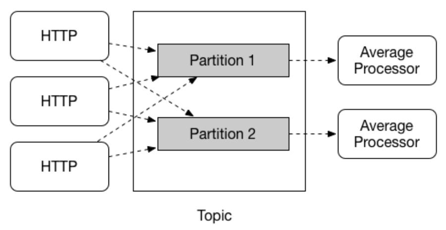
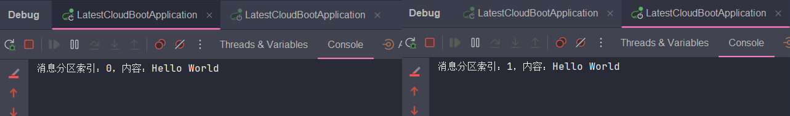
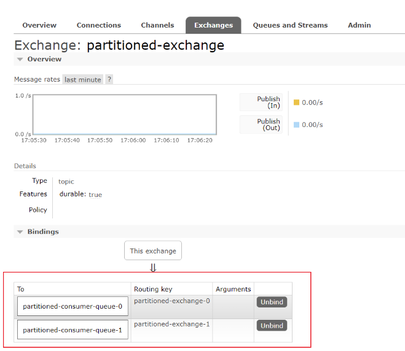
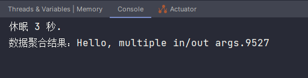

## 分区

Spring Cloud Stream 提供对给定应用程序的多个实例之间的数据分区的支持。在分区场景中，物理通信介质（例如 Broker 的 Topic）被视为由多个分区组成。一个或多个生产者应用程序实例将数据发送到多个消费者应用程序实例，并确保以共同特征标识的数据由同一消费者实例处理。

Spring Cloud Stream 提供了一个通用抽象，用于以统一的方式实现分区处理用例。因此，无论 MQ 本身是否自然分区（如 Kafka）或不自然分区（如 RabbitMQ），都可以使用分区。



### 分区配置

对于分区的使用，在生产者和消费者之间都需要进行配置，属性不多就几个：

```yaml
spring:
  cloud:
    stream:
      # 表示分区数量与当前实例的索取索引，在这里配置跟在下面的消费者中配置是一样的效果
      # 只不过这是全局配置，而下面是只针对绑定，比如两个绑定有不同的分区配置
      # instance-count: 2
      # instance-index: 0
      bindings:
        partitionedConsumer-in-0:
          destination: partitioned-exchange
          group: partitioned-consumer-queue
          consumer:
            # 是否从分区生产者获取消息，使用该属性表示消费者开启分区功能
            partitioned: true
            # 指定应用实例部署的数量
            # 创建的队列也会有两个，默认名称：{destination}.{group}-{index}，默认路由键：{partitioned}-{index}
            instance-count: 2
            # 该属性指示当前实例的索引（也叫分区 ID），生产者发送消息时计算所得的分区索引与此相同，则消息会被此实例的消费者消费
            instance-index: 0
        partitionedConsumer-out-0:
          destination: partitioned-exchange
          producer:
            # 分区数量，生产者是否开启分区是根据 partition-key-expression 或 partition-key-extractor-name 是否有值确定
            partition-count: 2
            # 分区键，通过该 Key 决定路由的分区，分区计算方式默认是：{SpEL 计算结果 % partition-count}
            partition-key-expression: headers
            # 分区 ID 选择 SpEL，与分区键搭配使用
            partition-selector-expression: index
```

重点讲述下 `partition-key-expression` 和 `partition-selector-expression` 两个配置：

- 单独使用 `partition-key-expression` 时，该属性表达式解析的结果就直接充当了分区键，分区索引的计算是直接取分区键的哈希值取模分区数量得到；
- 两个都使用时，`partition-selector-expression` 属性的 SpEL 表达式在解析时会取 `partition-key-expression` 的 SpEL 表达式解析结果作为**根对象**，简单说就是前者会在后者的解析结果上再进一步解析，这里涉及到 SpEL 表达式是如何解析的原理，说起来繁琐，也不在本篇内容范围，网上有诸多资料，感兴趣的读者可以自行查阅。最后也是拿解析结果的哈希值取模计算得到分区索引。

上面的配置中关于两者配置意思是：`partition-key-expression` SpEL 表达式解析后会拿到 `Message#MessageHeaders`，而 `partition-selector-expression` 则表示从 `Message#MessageHeaders` 中拿到 `index` 属性。如果只想用 `partition-key-expression`，那么可如下指定：

```properties
spring.cloud.stream.bindings.partitionedConsumer-out-0.producer.partition-key-expression=headers.index
```

以上就表达了直接取消息属性中的 `index` 作为分区键去计算分区索引。

虽然两个属性搭配看起来有多余，一个 SpEL 表达式貌似就能满足分区选择的需求。但其实 `partition-key-expression` 主要用于指定分区键的计算逻辑，它可以是一个复杂的 SpEL 表达式，可以根据消息的头信息、 payload 等信息来计算分区键，而 `partition-selector-expression` 则是用于从前者计算出的结果中选择最终的分区键，这个属性通常用于简单地选择或转换分区键，而不需要复杂的计算逻辑。

比如说：在 MQ 服务中，每个消息都包含一个头信息 `customerType`，该头信息可以取值为 `VIP`、`NORMAL` 或 `GUEST`。我们想要根据 `customerType` 将消息分区到不同的队列中，但是也想要根据 `VIP` 类型的消息的 `priority` 属性来进一步分区。在这种情况下，就可以使用 `partition-key-expression` 来计算出一个对象，该对象包含 `customerType` 和 `priority` 属性，然后使用 `partition-selector-expression` 进一步选择该对象中的某个属性作为最终的分区键。

说完配置，再写上消费者代码：

```java
@Component
public class MQHandler {
	
    // 自增对象，用于测试消息路由分区
    @Bean
    public AtomicInteger index() {
        return new AtomicInteger(0);
    }
    
    @Bean
    public Consumer<Message<String>> partitionedConsumer() {
        return msg -> {
            int index = (int) msg.getHeaders().get("selector") % 2;
            System.out.println("消息分区索引：" + index + "，内容：" + msg.getPayload());
        };
    }

}

@RestController
@RequestMapping("/send")
public class SendController {

    @Resource
    private AtomicInteger index;
    @Resource
    private StreamBridge streamBridge;

    @GetMapping("demo")
    public void demo() {
        Message<String> msg = MessageBuilder.withPayload("Hello World")
                .setHeader("index", index.incrementAndGet()).build();
        streamBridge.send("partitionedConsumer-out-0", msg);
    }

}
```

因为是要测试分区效果，所以就需要启动多个实例，还记得上面为实例配置的 `instance-index` 分区索引吗？当启动第二个实例时，记得修改它：

```properties
# 上面是 0，这里改为 1，分区索引从 0 开始
spring.cloud.stream.bindings.partitionedConsumer-in-0.consumer.instance-index=1
```

当两个服务实例都启动后，发送消息就可以看到效果，分区索引 0 都发到第一个实例，分区索引 1 都发到第二个实例了：



在 GUI 平台上也可以看到交换机绑定了两个队列：



### 自定义分区策略

如果不想依赖 SpEL 表达式来实现分区选择，那么也可以实现接口来自定义分区策略。

相关属性如下：

```properties
# 自定义分区 Key 提取策略，填写接口实现的 Bean 名称，目的跟 partition-key-expression 相同
spring.cloud.stream.bindings.{binding-name}.producer.partition-key-extractor-name=customKeyExtractorStrategy
# 自定义分区索引选择策略，填写接口实现的 Bean 名称
spring.cloud.stream.bindings.{binding-name}.producer.partition-selector-name=customSelectorStrategy
# 以上两者跟 partition-key-expression 属性互斥
```

分别对应的接口实现：

```java
@Configuration
public class StreamConfig {
    
    /**
     * 自定义分区键提取策略
     * @return PartitionKeyExtractorStrategy
     */
    @Bean
    public PartitionKeyExtractorStrategy customKeyExtractorStrategy() {
        // 这里简单演示，比如提取消息 headers 属性作为分区键，使用时根据实际情况编写分区键计算逻辑即可
        return message -> message.getHeaders().get("partition-index");
    }

    /**
     * 自定义分区索引选择策略，计算出最终的分区索引
     * @return PartitionSelectorStrategy
     */
    @Bean
    public PartitionSelectorStrategy customSelectorStrategy() {
        return (key, partitionCount) -> {
            // key 是分区键提取策略返回的分片键，partitionCount 自然就是分区数量了
            System.out.println("分区键：" + key);
            return key.hashCode() % partitionCount;
        };
    }
    
}
```

两个策略的使用都比较简单，效果就不作展示，读者可自行实践。

## 多输入/输出参数的函数

在介绍 Stream 程序的消息消费函数 `Consumer`、`Function` 时，可以看到它们都是只接收一个消息，也就是只有一个输入，并且消息生产 `Supplier`、`Function` 两者也是只有一个输出。

但从 Stream 3.0 版本开始，就支持具有多个输入或输出参数的函数，它的实现是为了应对以下类似的场景：

- 大数据场景：需要处理的数据源无组织，并且包含各类数据元素，而开发者需要对其进行整理
- 数据聚合：将多个数据源的数据进行合并计算

也就是说，可以使用单个函数来接受或生成多个数据流。该功能的实现依赖于 **Project Reactor** 提供的抽象（即 `Flux` 和 `Mono`）来封装消息，并且另一个重要的点是，Java 中虽然提供了多种抽象（数组、集合、队列等）来表示多个事物，但是这些抽象都并非能同时具有数量信息、多类型存储的特征，比如集合或者数组，只允许存储单种类型的多个元素，或者将所有元素都向上转化为 Object 类型，这就无法达到 Stream 所想要的效果，影响了其透明类型转换的功能。因此，Stream 引入了 **Project Reactor** 提供的另一个抽象概念 - **元组（Tuple）**。

元组这玩意儿想来大多数 Javaer 还是知道的，不过这里还是可以简单说下，元组就相当于以个容器，可以存储多个元素以及指定各自的类型，并且可以按照设置元素的顺序来获取数据，类源码如下：

```java
// 这是一个存储两个元素的元组
public class Tuple2<T1, T2> implements Iterable<Object>, Serializable {

    @NonNull
    final T1 t1;
    @NonNull
    final T2 t2;

    Tuple2(T1 t1, T2 t2) {
        this.t1 = Objects.requireNonNull(t1, "t1");
        this.t2 = Objects.requireNonNull(t2, "t2");
    }
    
    // ...Ignore other code
}

// 这是一个存储三个元素的元组，直接继承 Tuple2 实现，...后续增加存储元素数量的 Tuple 对象也是如此递推
public class Tuple3<T1, T2, T3> extends Tuple2<T1, T2> {

    @NonNull
    final T3 t3;

    Tuple3(T1 t1, T2 t2, T3 t3) {
        super(t1, t2);
        this.t3 = Objects.requireNonNull(t3, "t3");
    }
    
    // ...Ignore other code
}
```

OK，介绍完概念，就该来看看代码实操了，我们构造一个例子，生产两条消息进行消费，然后合并为一条进行输出，也就是数据聚合操作。

函数定义如下：

```java
@Compenent
public class MQHandler {
    
    // 该函数表示接受两个输入（一个 String，一个 Integer）和一个输出（String）
    @Bean
    public Function<Tuple2<Flux<String>, Flux<Integer>>, Flux<String>> multipleInput() {
        return tuple -> {
            Flux<String> t1 = tuple.getT1();
            Flux<Integer> t2 = tuple.getT2();
            // 将两个通道的数据连接在一起
            // Flux 与 Mono 两者的方法较多，可查看对象源码或 Project Reactor 文档获取相应信息进一步了解。
            return Flux.combineLatest(t1, t2, (k1, k2) -> k1 + k2.toString());
        };
    }
    
    // 该函数用于消费数据聚合的结果
    @Bean
    public Consumer<Message<String>> gatherConsumer() {
        return msg -> System.out.println("数据聚合结果：" + msg.getPayload());
    }
    
}
```

> **NOTE**：multipleInput 函数在服务启动时便会执行一次，是因为 Bean 注册之后会调用一遍将 Function 结果转为 Flux 对象，后续就不会再走这个函数，而是通过 Flux 对象进行数据处理了，想理解原理还是要优先了解 Project Reactor 中 Flux 的使用。

可以看到上面函数定义的输入输出是 `Tuple2<Flux<String>, Flux<Integer>>, Flux<String>>`，这样会直接取到消息的内容，如果有需要拿到消息头，可以定义成 `Tuple2<Flux<Message<String>>, Flux<Message<Integer>>>, Flux<String>>`。

在第一篇中介绍[绑定名称的规则](./spring_cloud_stream_one.md#BindingName)时，就有提到 `index` 是绑定的索引，只用于多输入/输出参数的函数，它从 0 开始，有多少个输入/输出参数，就配置多少个绑定，上面函数只定义了两个输入参数和一个输出参数，因此配置应当如下：

```yaml
spring:
  cloud:
    stream:
      bindings:
      	# 向该绑定发送的消息就代表输入参数一
        multipleInput-in-0:
          destination: multiple-input-exchange
          group: input-queue
        # 向该绑定发送的消息就代表输入参数二
        multipleInput-in-1:
          destination: multiple-input-exchange
          group: input-queue
        # 代表输出参数
        multipleInput-out-0:
          destination: gather-consumer-exchange
        # 消费数据聚合结果的绑定
        gatherConsumer-in-0:
          destination: gather-consumer-exchange
          group: gather-consumer-queue
```

StreamBridge 发送消息时，则是必须向两个输入绑定都发送消息，才能触发函数执行：

```java
@RestController
@RequestMapping("/demo")
public class DemoController {

	@GetMapping("/send")
    public void multipleInput() {
        Message<String> msg1 = MessageBuilder.withPayload("Hello, multiple in/out args.").build();
        Message<Integer> msg2 = MessageBuilder.withPayload(9527).build();
        // 使用多输入通道时，需要向所有输入绑定都发送了消息才会被消费者函数处理
        streamBridge.send("multipleInput-in-0", msg1);
        try {
            // 休眠期间第一条消息不会实际触达，而是要等到两个消息都发出
            System.out.println("休眠 3 秒.");
            TimeUnit.SECONDS.sleep(3);
        } catch (InterruptedException e) {
            throw new RuntimeException(e);
        }
        streamBridge.send("multipleInput-in-1", msg2);
    }
    
}
```

执行结果如下，两条消息内容合并了：



至于多输出参数的函数定义使用，官方文档也已有[示例](https://docs.spring.io/spring-cloud-stream/reference/spring-cloud-stream/producing-and-consuming-messages.html#functions-with-multiple-input-and-output-arguments)，就不再演示，读者可以自己耍耍。

## 总结

关于 Spring Cloud Stream 的概念、功能、使用就介绍到这，相信系列三篇文章看下来大家对 Spring Cloud Stream 的使用也就没有大问题了。在如今的生产项目中，微服务架构、分布式系统大行其道，MQ 的使用早已是家常便饭，而能有这么一款框架适配了如此之多的主流消息中间件，建立统一抽象，简化使用方式，并提供新功能，无疑是给开发者带来颇多帮助，提升了 MQ 使用效率。

当然，Spring Cloud Stream 对于各个消息中间件的适配，最终原理还是基于 Spring 本身对消息中间件的支持与集成，所以还是要求大家对使用的消息中间件本身有一定的理解和使用经验。

OVER!😄

## 参考资料

- 官方文档：[分区](https://docs.spring.io/spring-cloud-stream/reference/spring-cloud-stream/overview-partitioning.html)

- 官方文档：[具有多输入/输出参数的函数](https://docs.spring.io/spring-cloud-stream/reference/spring-cloud-stream/producing-and-consuming-messages.html#functions-with-multiple-input-and-output-arguments)

  
