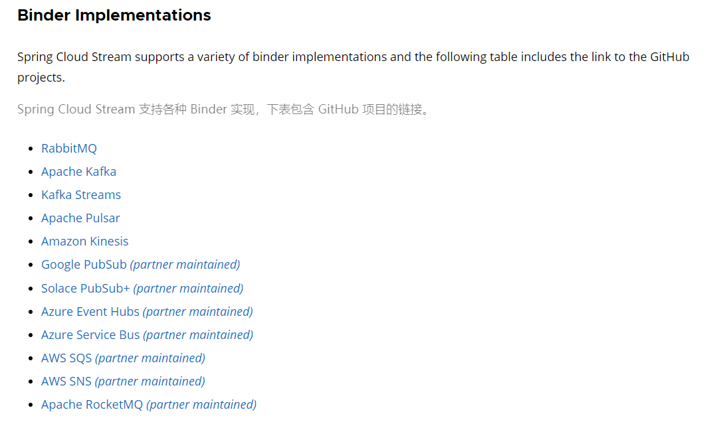
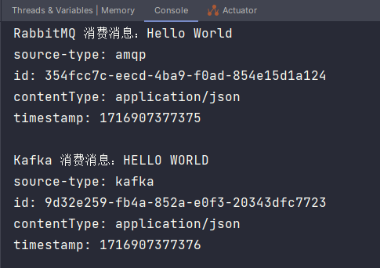
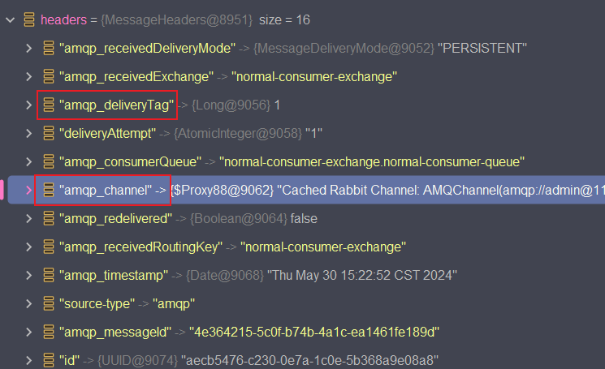
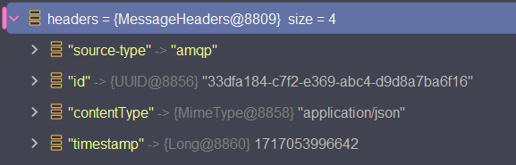
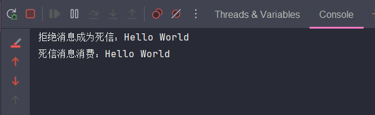
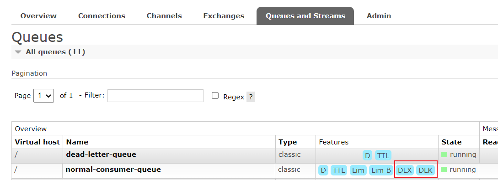
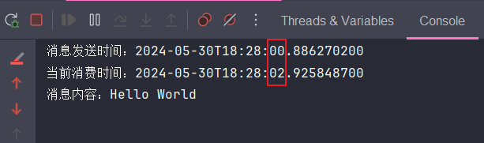

[上篇](./spring_cloud_stream_one.md)主要讲了 Spring Cloud Stream 的基础用法以及对 RabbitMQ 的配置使用，但若只看这点，那么跟 Spring Boot 集成 MQ 的方式比起来并没有什么突出的地方。Spring Cloud Stream 强大之处是在于隐藏了各类 MQ 不同且（可能）繁琐的配置和代码操作，提供了统一的概念（Binder、Binding、Message）、配置（输入/输出绑定、生产/消费）、消息收发 API 以及函数定义，用一套做法就完成对不同 MQ 系统的使用。这听起来是不是很熟悉~~~？其实这就是门面（或外观）模式的体现，类似 SLF4J 日志、Spring 的 ApplicationContext 等，隐藏了背后依赖库、框架或其它对象的复杂实现，提供一个简单的门面接口来使用。

## Binder

Binder 作为与各个 MQ 系统集成的核心，Stream 采用 Spring Boot 进行配置（也就是具体的 MQ 服务环境配置、连接跟 Spring Boot 集成 MQ 一致），Binder 抽象使 Stream 应用程序能够灵活地连接中间件，如可以在运行时动态选择外部目标（如 Kafka-Topic 或 RabbitMQ-Excahnge）与消息处理程序的输入和输出（例如函数的输入参数及其返回参数）之间的映射。同时 Binder 抽象也是 Stream 的扩展点，这意味着开发人员可根据需求实现自己的 Binder，官网对此已有[说明](https://docs.spring.io/spring-cloud-stream/reference/spring-cloud-stream/overview-binder-abstraction.html)。

Stream 本身提供了多个 MQ 的 Binder 实现，如下图（标有 *partner maintain* 说明并非 Spring Cloud Stream 官方提供而是由 MQ 厂商自己开发接入）。



### 多 Binder 实例配置

```yaml
spring:
  cloud:
    stream:
      # 当配置多个 Binder 时，此项必须配置，否则启动报错 
      default-binder: rabbit1
      binders:
        # binder 自定义名称
        rabbit1:
          # 可填 rabbit、kafka，其它 Binder 实现有自己的环境配置方式，查看对应的 Binder 官文即可 
          type: rabbit
          environment:
            spring:
              rabbitmq:
                host: 127.0.0.1
                username: admin
                password: admin123
                port: 5672
        rabbit2:
          type: rabbit
          environment:
            spring:
              rabbitmq:
                host: 127.0.0.2
                username: admin
                password: admin123
                port: 5672
```

以上便是对 RabbitMQ Binder 的多实例环境配置，若同时配置了 `spring.rabbitmq.*` 的环境配置，那么后者优先级会更高，要注意。

随后只需要在绑定中声明使用的 Binder 即可，不指定则使用默认 Binder：

```yaml
spring:
  cloud:
    stream:
      bindings:
        demoConsumer-in-0:
          destination: demo-consumer-topic
          binder: rabbit2
```

### 不同 MQ 的互动

在异构系统中，接入不同 MQ 系统是有可能的，比如 A 系统通过 RabbitMQ 生产消息，经过消息处理服务后会流转至 B 系统，而 B 系统使用的是 Kafka，那么这个消息处理服务自然就要同时接入 RabbitMQ、Kafka 了。虽然说依靠 Spring Boot 对 RabbitMQ、Kafka 的集成也能是能达到目的，但是在此种方式下，各类 MQ 不同的配置、API 操作混合使用会为系统带来复杂性，提高了维护成本，而这时选择 Stream 来统一 MQ 的操作则是一个很好的方案。

在上方的配置中只是使用了 RabbitMQ，现在再补充一下 Kafka，也很简单，如下（记得引入 `stream-kafka` 依赖）：

```yaml
spring:
  cloud:
    stream:
      binders:
        # 自定义 Binder 名称
        kafka1:
          # 类型填 Kafka
          type: kafka
          environment:
            spring:
              cloud:
                stream:
                  kafka:
                    binder:
                      brokers: localhost:9092
                      auto-create-topics: true   # 自动创建 Topic
                      auto-add-partitions: true  # 自动添加分区
                      min-partition-count: 3     # 创建的主题最小分区数，默认 1，必须上面两个属性都为 true
```

上述配置看起来有点冗余，但配置需求便是如此😂。同样会跟 Spring 集成 Kafka 时使用的 `spring.kafka.bootstrap-servers` 环境配置冲突，后者优先级高。

接下来演示下一个简单示例：向 RabbitMQ 发送消息后，经过消费处理再路由至 Kafka 消费。直接上代码：

```yaml
# 此处省略 Binder 配置，按照上面配置即可
spring:
  cloud:
  	function:
  	  definition: rabbitConsumer;kafkaConsumer
    stream:
      bindings:
        # 分别配置两个 MQ 的输入绑定，注意 binder 选择
        rabbitConsumer-in-0:
          destination: rabbit-exchange
          group: rabbit-queue
          binder: rabbit1
        kafkaConsumer-in-0:
          destination: kafka-topic
          group: kafka-group
          binder: kafka1
```

```java
@Component
public class MQHandler {
    
    @Resource
    private StreamBridge streamBridge;

    @Bean
    public Consumer<Message<String>> rabbitConsumer() {
        return msg -> {
            System.out.println("RabbitMQ 消费消息：" + msg.getPayload());
            msg.getHeaders().forEach((k, v) -> System.out.println(k + ": " + v));

            // 将字符串转为大写后再发往 Kafka
            msg = MessageBuilder.withPayload(msg.getPayload().toUpperCase()).build();
            streamBridge.send("kafkaConsumer-in-0", msg);
        };
    }

    @Bean
    public Consumer<Message<String>> kafkaConsumer() {
        return msg -> {
            System.out.println("Kafka 消费消息：" + msg.getPayload());
            msg.getHeaders().forEach((k, v) -> System.out.println(k + ": " + v));
        };
    }
}

@RestController
@RequestMapping("/send")
public class DemoController {
    
    @Resource
    private StreamBridge streamBridge;
    
    @GetMapping("/demo")
    public void demo() {
        Message<String> msg = MessageBuilder.withPayload("Hello World").build();
        streamBridge.send("rabbitConsumer-in-0", msg);
    }
    
}
```



## 死信队列

接下来展示 Stream 如何实现 MQ 的死信队列，基本上也是依靠配置就完成了，同样以 Rabbit MQ 为例。

在此先跟大家回顾一遍，RabbitMQ 中消息成为死信的三种情况：

- 当消息被拒绝 ACK，并且不重回队列
- 消息生存时间（TTL）过期
- 队列达到最大长度无法再容纳消息

先看下消息 TTL 和队列长度的配置，只要分别配置对应的属性即可：

```properties
# 指定队列消息的超时时间
spring.cloud.stream.rabbit.bindings.<binding-name>.consumer.ttl=5000
# 指定队列的最大消息数
spring.cloud.stream.rabbit.bindings.<binding-name>.consumer.max-length=10
# 指定队列所有消息的最大总字节数
spring.cloud.stream.rabbit.bindings.<binding-name>.consumer.max-length-bytes=1024
```

再来说说消息拒绝，这就涉及到了消息接收后的 ACK，在原来的 Spring 集成 RabbitMQ 中，需要在消息监听器中通过 Channel 对象才能进行操作：

```java
@Component
public class MQHandler {

    @RabbitListener(queues = "queueName")
    public void process(String content, Message message, Channel channel) throws IOException {
        // do something...
        channel.basicAck(message.getMessageProperties().getDeliveryTag(), false);
    }
    
}
```

上面代码的消息监听方法中 Spring 会帮助我们传入 Channel 对象，但 Stream 程序中都是依靠 **Consumer**、**Function** 进行消息处理并自动完成 ACK，出入参都只有 `Message`，那么该怎么获取 Channel 对象呢？其实答案就在消息的 `MessageHeaders` 中。

首先设置绑定为手动 ACK：

```properties
spring.cloud.stream.rabbit.bindings.<binding-name>.consumer.acknowledge-mode=manual
```

之后在消息消费时，就可以从消息的 MessageHeaders 属性中取到 Channel 对象进行操作：

```java
@Component
public class MQHandler {

    @Bean
    public Consumer<Message<String>> stringConsumer() {
        return msg -> {
            System.out.println("消息消费：" + msg.getPayload());
            MessageHeaders headers = msg.getHeaders();
            headers.forEach((k, v) -> System.out.println(k + ": " + v));
            
            // 取到 Channel 通道
            Channel amqpChannel = headers.get(AmqpHeaders.CHANNEL, Channel.class);
            Long amqpDeliveryTag = headers.get(AmqpHeaders.DELIVERY_TAG, Long.class);

            try {
                assert amqpChannel != null;
                
                // 拒绝 ACK 消息，并且不重回队列（参数三）
                amqpChannel.basicNack(Optional.ofNullable(amqpDeliveryTag).orElse(1L), false, false);
                // ACK 确认消息
                amqpChannel.basicAck(Optional.ofNullable(amqpDeliveryTag).orElse(1L), false);
            } catch (IOException e) {
                throw new RuntimeException(e);
            }
        };
    }
}
```



这里有两个需要特别注意的点：

- 首先必须设置 `acknowledge-mode=manual`，才能在 `MessageHeader` 中获取到 `amqp_channel` 属性信息；
- 其次，使用 **StreamBridge** 发送消息时不能指定输入绑定去发送消息，必须指定其输出绑定或者采用[动态目的地](./spring_cloud_stream_one.md#dynamic-destination)的方式，否则获取到的 `MessageHeaders` 将只包含基础信息而已。

```java
// 无法生效
StreamBridge.send("demoConsumer-in-0", msg);

// 正常使用
StreamBridge.send("demoConsumer-out-0", msg);
// 指定输入绑定的 destination
StreamBridge.send("demoConsumer-exchange", msg);
```



OK，说完消息成为死信的操作，我们回到死信队列如何使用的主线上，先上配置：

```yaml
spring:
  cloud:
    function:
      definition: normalConsumer;deadLetterConsumer
    stream:
      rabbit:
        bindings:
          normalConsumer-in-0:
            consumer:
              queue-name-group-only: true
              acknowledge-mode: manual
              ttl: 5000
              max-length: 10
              max-length-bytes: 1024
              # 是否绑定 DLQ 到死信交换机，默认 false，若未指定下面的 DLQ/DLX，则自动生成的
              # 死信交换机名称为 prefix + DLX（direct），死信队列为 {group}.dlq，路由键为 {group}
              auto-bind-dlq: true
              # 自定义死信交换机及其队列
              dead-letter-exchange: dead-letter-exchange
              dead-letter-exchange-type: direct
              dead-letter-queue-name: dead-letter-queue
              dead-letter-routing-key: dead-letter-key
              dlq-ttl: 5000
              # 超过重试次数依旧失败后，消息会发入 DLQ，默认 true，会将错误堆栈信息放在消息 header 中
              republish-to-dlq: true
              # 指示除了错误堆栈信息外，消息其它 header 所能占用的字节大小，默认 20000
              frame-max-headroom: 20000
          # 消费死信队列数据的输入绑定配置，要完全跟上面死信信息的配置一致
          deadLetterConsumer-in-0:
            consumer:
              exchange-type: direct
              queue-name-group-only: true
              binding-routing-key: dead-letter-key
              ttl: 5000
      bindings:
        normalConsumer-out-0:
          destination: normal-consumer-exchange
        normalConsumer-in-0:
          destination: normal-consumer-exchange
          group: normal-consumer-queue
          consumer:
          	# 消费重试次数，默认 3 次，搭配 republish-to-dlq，若是消费逻辑本身有错误，重试失败也可将消息发往 DLQ
            max-attempts: 3
        deadLetterConsumer-in-0:
          destination: dead-letter-exchange
          group: dead-letter-queue
```

上述代码的重点除了 `normalConsumer-in-0` 的 **DLX/DLQ** 配置之外，还有 `deadLetterConsumer-in-0` 的配置，死信消息一般都需要进行额外处理，`deadLetterConsumer-in-0` 便是实现这个作用，但对于它来说其实根本不知道有死信消息这回事，它只会监听是否已有绑定的交换机和队列（有则匹配，无则创建），以及队列是否有消息可进行消费，所以 `deadLetterConsumer-in-0` 的配置就得跟 `normalConsumer-in-0` **DLX** 的配置一致，否则就会提示预期的配置信息与已存在的交换机（或队列）不一致，从而导致死信队列的消息无法被正常消费。

接下来是代码，拒绝 ACK 并且不重回队列来构造死信：

```java
@Component
public class MQHandler {

    /**
     * 普通消息消费函数，手动拒绝 ACK 让消息进入 DLQ
     */
    @Bean
    public Consumer<Message<String>> normalConsumer() {
        return msg -> {
            System.out.println("拒绝消息成为死信：" + msg.getPayload());
            MessageHeaders headers = msg.getHeaders();
            Channel amqpChannel = headers.get(AmqpHeaders.CHANNEL, Channel.class);
            Long amqpDeliveryTag = headers.get(AmqpHeaders.DELIVERY_TAG, Long.class);
			
            // do something... 消息消费错误进行拒绝
            try {
                assert amqpChannel != null;
                // 拒绝 ack 且不重入队列，构造死信消息
                amqpChannel.basicNack(Optional.ofNullable(amqpDeliveryTag).orElse(1L), false, false);
            } catch (IOException e) {
                throw new RuntimeException(e);
            }

        };
    }

    /**
     * 死信消息消费函数
     */
    @Bean
    public Consumer<Message<String>> deadLetterConsumer() {
        return msg -> System.out.println("死信消息消费：" + msg.getPayload());
    }

}

@RestController
@RequestMapping("/send")
public class SendController {

    @Resource
    private StreamBridge streamBridge;

    @GetMapping("demo")
    public void demo2() {
        Message msg = MessageBuilder.withBody("Hello World".getBytes(StandardCharsets.UTF_8)).build();
        streamBridge.send("normalConsumer-out-0", msg);
    }

}
```

当启动服务后调用接口就会看到控制台打印如下：



查看 RabbitMQ GUI 也能看到队列已绑定 DLX：



## 延迟队列

RabbitMQ 延迟队列使用需要插件 `rabbitmq_delayed_message_exchange` 的支持，关于插件如何查看、安装、启用，网上已有众多资料，就不在此赘述，我们重点看 Stream 程序中的应用就行，比起死信队列的配置和使用，延迟队列就更加简单了。

```yaml
spring:
  cloud:
    stream:
      rabbit:
        bindings:
          demoConsumer-out-0:
            producer:
              delayed-exchange: true
              # 用 SpEL 表达式指定消息的延迟时间获取，若不想指定表达式，可在消息头添加 x-delay 属性指定延迟时长，单位 ms
              delay-expression: "headers['first'] == 1 ? 2000 : 3000"
          demoConsumer-in-0:
            consumer:
              queue-name-group-only: true
              # 启用延迟交换机，会根据该值判断是否在创建交换机时添加属性 x-delayed-type
              delayed-exchange: true
      bindings:
        demoConsumer-in-0:
          destination: delay-consumer-exchange
          group: delay-consumer-queue
        demoConsumer-out-0:
          destination: delay-consumer-exchange
```

```java
@Component
public class MQHandler {

    @Bean
    public Consumer<Message<String>> demoConsumer() {
        return msg -> {
            System.out.println("当前消费时间：" + LocalDateTime.now());
            System.out.println("消息内容：" + msg.getPayload());
        };
    }

}

@RestController
@RequestMapping("/send")
public class SendController {

    @Resource
    private StreamBridge streamBridge;

    @GetMapping("demo")
    public void demo2() {
        Message<String> msg = MessageBuilder.withPayload("Hello World")
            // 延迟时间的固定属性是 x-delay，但没有配置 delay-expression 时可用
            // .setHeader("x-delay", 3000)
            .setHeader("first", 1)
            .build();
        System.out.println("消息发送时间：" + LocalDateTime.now());
        streamBridge.send("demoConsumer-out-0", msg);
    }

}
```



同样需要注意，StreamBridge 发送消息时要指定输出绑定或者动态目的地，而不能是输入绑定，否则延迟功能失效。

## 小结

本篇所描述的 Binder、RabbitMQ 死信/延迟队列的配置使用其实都不难理解。而对于向死信、延迟队列发送消息时不能指定输入绑定的问题，若读者对原因感兴趣，可以追踪源码，看看 `StreamBridge#send` 方法的流程都做了些什么事情，并且 Stream 也为 Kafka 提供了 DLX 配置，这些功能都帮助开发者简化了 MQ 的日常使用和配置，实属一大利器。

系列第一、二篇都是讲述 Stream 如何简化配置、使用 MQ 本身所拥有的功能，下一篇将介绍 Stream 自己所实现的功能特性：分区与多输入/输出参数函数实现。


