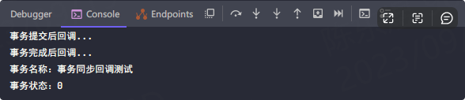
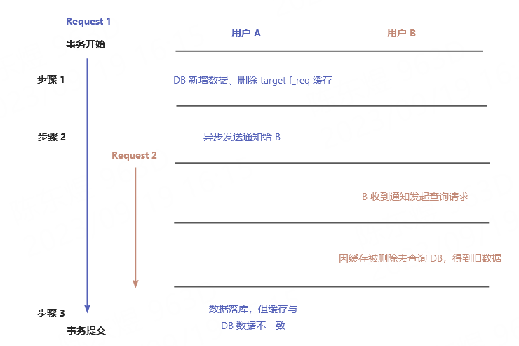

## 前言

事务功能在日常开发中使用并不少，本质上是为了保证一次业务请求处理过程中涉及多次 DB 数据操作时的原子性。**而本篇主要讲述的事务功能是实现在事务执行的某个阶段去做某些事，即事务同步**。在常规的 Web 应用中，大多是直接使用`@Transactional`注解方法来完成事务操作，但也有一些特殊情况，需要在事务提交前、提交后等情况下执行某些操作，如资源准备、清理、自定义操作等。

## 事务同步接口

事务同步回调接口是`TransactionSynchronization`，其抽象实现`TransactionSynchronizationAdapter`源码如下：
```java
public abstract class TransactionSynchronizationAdapter implements TransactionSynchronization, Ordered {

    // 事务同步回调顺序，当存在多个事务同步且有顺序要去时可指定
	@Override
	public int getOrder() {
		return Ordered.LOWEST_PRECEDENCE;
	}
    // 事务挂起
	@Override
	public void suspend() { }
    // 事务回复
	@Override
	public void resume() { }
    // 底层数据会话刷新，需要事务管理器有刷新概念，否则无操作
	@Override
	public void flush() { }
    // 事务提交前
	@Override
	public void beforeCommit(boolean readOnly) { }
    // 事务完成前（包括异常回滚）
	@Override
	public void beforeCompletion() { }
    // 事务提交后
	@Override
	public void afterCommit() { }
    // 事务完成后（包括异常回滚）
	@Override
	public void afterCompletion(int status) { }
}
```
从源码可看到事务同步作用就是在事务执行的各个阶段进行方法回调，并可通过`Ordered`接口控制多个事务同步的执行顺序，在下方事务同步的两种使用方式本质都是利用了该抽象类来实现。
在`afterCompletion`方法的入参`status`有三种状态（在`TransactionSynchronization`接口有定义）：

- 0：事务完成
- 1：事务回滚
- 2：未知错误
## 使用方式

### 基于接口

1. 需要继承`TransactionSynchronizationAdapte`抽象类，在相应的事务阶段回调方法中实现业务逻辑
2. 在事务方法中通过`TransactionSynchronizationManager`事务同步管理器注册事务同步
```java
// 创建
public class TxSyncDemo extends TransactionSynchronizationAdapter {
    
    private String txName;
    public TxSyncDemo(String txName) {
        this.txName = txName;
    }
    
    @Override
	public void afterCommit() {
       System.out.println("事务提交后回调...")
    }
    
    @Override
	public void afterCompletion(int status) {
        System.out.println("事务完成后回调...")
        System.out.println("事务名称：" + txName);
        System.out.println("事务状态：" + status);
    }
}

// 事务接口方法
@RestController
public class TxController {
    @GetMapping("txDemo")
    @Transactional(rollbackFor = Exception.class)
    public void txDemo() {
        // 模拟 DB 操作：更新和新增
        update();
        save();
        // 注册事务同步对象
        TransactionSynchronizationManager.registerSynchronization(new TxSyncDemo("事务同步测试"));
    }
}
```
之后调用事务接口，即可看到如下结果：



### 基于注解

注解方式需要通过`@TransactionalEventListener`与`ApplicationEvent`事件对象两者搭配使用，先看看注解的源码，如下：
```java
@Target({ElementType.METHOD, ElementType.ANNOTATION_TYPE})
@Retention(RetentionPolicy.RUNTIME)
@Documented
@EventListener
public @interface TransactionalEventListener {
    
    // 指定事务阶段
	TransactionPhase phase() default TransactionPhase.AFTER_COMMIT;
    // 不存在事务时，注解的方法是否依然被调用，true 则表示只要事件发布了就回调
	boolean fallbackExecution() default false;
    // ...
	@AliasFor(annotation = EventListener.class, attribute = "classes")
	Class[] value() default { };
    // 指定感兴趣的事件类名
	@AliasFor(annotation = EventListener.class, attribute = "classes")
	Class[] classes() default { };
    // 事务回调的条件，可通过 SpEL 进行编写
	String condition() default "";
}

```
实现步骤：

1. 创建事件对象
2. 使用注解标记方法，并通过注解属性指定回调时的事务阶段和感兴趣的事件
3. 在事务接口方法里，发布相应的事件
```java
// 步骤 1：创建事件类
// 可在这个事件类里注入其它依赖或声明业务逻辑，因此事务同步回调时可获取该事件的信息
public class TxSyncEvent extends ApplicationEvent {
    public TxSyncEvent(Object source) {
        super(source);
    }
}

// 步骤 2：使用事务注解
@Component
public class TxSyncDemo {
    @TransactionalEventListener(phase = TransactionPhase.AFTER_COMMIT, classes = TxSyncEvent.class)
    public void afterCommit() {
        System.out.println("事务提交后回调...");
    }
}

// 步骤 3：事务方法里发布事件
@RestController
public class TxController {
    @Resource
    private ApplicationEventPublisher publisher;
    
    @GetMapping("txDemo")
    @Transactional(rollbackFor = Exception.class)
    public void txDemo() {
        // 模拟 DB 操作：更新和新增
        update();
        save();
        // 发布事件
        publisher.publishEvent(new TxSyncEvent("source"));
    }
}
```
之后调用事务接口，即可看到注解方法内的内容输出，过于简单不再展示结果图片。

## 注意事项

### 注解方式方法入参问题

按`@TransactionalEventListener`注解`classes`属性是否有指定值分情况说明：

- 无值
   1. 方法入参只能为 0 或 1 个（任意类型）
   2. 若方法入参为事件类型，则代表是感兴趣的事件，等同于`classes`指定了该事件
   3. 若方法入参为空或不为事件类型，则表示方法不关心任何事件，任何时候都不会被回调
- 有值
   1. 只有一个值时，入参必须为该值对应的事件类型，否则抛出参数类型错误异常
   2. 多个值时，则入参不需要指定

经过实际测试，`classes`指定多个值时，入参依然可指定为某个事件类型，若事务方法发布的事件刚好与参数的事件类型一致，则可以正确回调。比如`classes={A.class, B.class}`，方法入参类型为 A，发布 A 事件时可正确执行，而发布 B 事件则会抛出异常。因此还是推荐不设置参数。
#### afterCommit / afterCompletion 事务范围问题
这两个方法在 javadoc 上的描述是：在回调时事务资源可能仍然处于活跃状态并可访问。
经过实际测试，在这两个方法中执行 DB 数据操作，那么操作依旧会参与原事务，会等到方法执行完清理事务资源后，才会真正提交到数据库。可通过`TransactionSynchronizationManager.isActualTransactionActive()`来判断当前方法是否处于活跃事务中。

## 实际场景

举个在我司 IM 系统中的例子，如添加好友，该请求处理步骤如下：

1. 数据库 f_req（好友请求） 表添加记录数据，删除目标好友（target）的 f_req 缓存（Redis）
2. 发送通知给 target，让其拉取最新好友请求记录（通过 Netty 异步发送通知）
3. 事务提交，数据真正落库，返回请求处理结果（success / fail）

由于步骤 2 通过 Netty 的 Channel 异步发送通知，因此不受 Spring 事务管理。若只是使用事务注解标记整个处理流程，那么当执行到步骤 2 时，由于事务未提交（DB 数据未更新），当 target 收到通知后重新来查询 f_req，就只会查到旧数据（即缺少最新的请求记录），下图展示过程：假设 A + B 为好友



结合上图梳理流程如下：

1. A 发起好友请求（Request 1），服务端开启事务，DB 新增数据，删除 B 的 f_req 缓存
2. 服务端发送通知给 B，通知 B 来查询最新的 f_req 数据
3. 当服务端接收 B 的查询请求（Request 2）后，先查询缓存，由于缓存被删除，则查询 DB；因为 Request 1 的事务未提交，所以肯定只会查到旧的 f_req 记录，即 A 发送的 f_req 没了
4. Request 1 的请求处理完成，事务提交，所有数据落库

从 B 的视角来看，虽然被通知要拉取 f_req，但拿到的却都是旧数据，根本就没有 A 发出的 f_req，属实是“虚空好友请求”了。更糟糕的是，由于旧数据的查询，缓存重新被添加回来，导致图中步骤 1 的缓存删了等于没删，出现缓存与 DB 数据不一致情况，并且至少得等到下一次有用户对 B 发起 f_req，才能将本次的 f_req 数据刷新到缓存。

为避免出现这种情况，就需要保证 B 发起查询请求时，A 的添加好友请求已处理完毕，数据已落库；因此便可利用事务同步来控制步骤 2 在事务完成后执行。

（**PS**：可能读者会有疑惑，添加请求在流程中明明只有一次 DB 操作，为何还要加事务？原因是流程做了简化，添加好友的流程除了处理好友请求记录外，还会判断用户好友历史记录是否添加过目标用户，若有也会去修改 DB 数据。）

## 思考题

1. 上方说到事务同步注解方式若`classes`指定了多个值，方法入参推荐不指定，那么在方法体里如果获取本次事务监听的事件信息呢？
2. `afterCommit`/`afterCompletion`方法回调时若有 DB 数据操作，在事务明明已经提交的情况下，为何还会参与原始事务，并且得等到清理资源时才提交？

（**PS**：想想再看答案，也可以先带着问题去阅读下源码）

### 问题一

第一个问题比较简单，由于事件类都需要继承`ApplicationEvent`作为父类，因此方法参数指定为`ApplicationEvent`类型即可，然后通过`instanceof`或`Class.isAssignableForm()`判断类型，再搭配上策略模式优雅代码。

```java
@TransactionalEventListener(phase = TransactionPhase.AFTER_COMMIT, 
                            classes = {AEvent.class, BEvent.class})
public void afterCommit(ApplicationEvent event) {
    if (event instanceof AEvent) {
        // do something...
    } else if (event instanceof BEvent) {
        // do something...
    }
    // 觉得多重 if 丑陋就使用策略模式
}
```

### 问题二

之所以事务提交还会参与原始事务，是跟 Spring 的事务机制有关，Spring 事务的本质是获取到 DB 的连接（`Connection`）后修改连接的自动提交`autoCommit`为`false`（默认是`true`），然后由 Spring 自己控制提交的时机，从而实现事务的功能。

既然修改了连接的`autoCommit`，那么事务执行完后就得将连接恢复到初始状态，即修改`autoCommit=true`。而偏偏这个操作，是在执行事务回调完成后，清理资源时才会去执行，也就导致了事务回调期间的 DB 操作都没有被提交，最后只能依赖连接的`autoCommit`恢复后，由连接本身去做提交操作（因为 Spring 不会再有提交操作）。

连接获取后`autoCommit`的修改源码如下：

```java
@Override
protected void doBegin(Object transaction, TransactionDefinition definition) {
    // 省略其它代码...
    Connection con = null;
    // 这里是从连接池获取连接的操作
    try {
        if (!txObject.hasConnectionHolder() ||
                txObject.getConnectionHolder().isSynchronizedWithTransaction()) {
            // 这一步从数据库连接池里获取连接
            Connection newCon = obtainDataSource().getConnection();
            if (logger.isDebugEnabled()) {
                logger.debug("Acquired Connection [" + newCon + "] for JDBC transaction");
            }
            // 保存连接在 ConnectionHolder 对象中
            txObject.setConnectionHolder(new ConnectionHolder(newCon), true);
        }

        txObject.getConnectionHolder().setSynchronizedWithTransaction(true);
        con = txObject.getConnectionHolder().getConnection();

        // 隔离级别与只读设置
        Integer previousIsolationLevel = DataSourceUtils.prepareConnectionForTransaction(con, definition);
        txObject.setPreviousIsolationLevel(previousIsolationLevel);
        txObject.setReadOnly(definition.isReadOnly());

        // Switch to manual commit if necessary. This is very expensive in some JDBC drivers,
        // so we don't want to do it unnecessarily (for example if we've explicitly
        // configured the connection pool to set it already).
        // 当连接默认为自动提交时，才设置为手动提交
        if (con.getAutoCommit()) {
            // mustRestoreAutoCommit 这个变量后面恢复连接自动提交时会用到
            txObject.setMustRestoreAutoCommit(true);
            if (logger.isDebugEnabled()) {
                logger.debug("Switching JDBC Connection [" + con + "] to manual commit");
            }
            con.setAutoCommit(false);
        }
    } catch (Throwable ex) {
        // 省略...
    }
}
```

事务完成后连接`autoCommit`修改源码如下：

```java
@Override
protected void doCleanupAfterCompletion(Object transaction) {
    DataSourceTransactionObject txObject = (DataSourceTransactionObject) transaction;

    // Remove the connection holder from the thread, if exposed.
    // 解绑资源
    if (txObject.isNewConnectionHolder()) {
        TransactionSynchronizationManager.unbindResource(obtainDataSource());
    }

    // 获取连接进行重置
    Connection con = txObject.getConnectionHolder().getConnection();
    try {
        // mustRestoreAutoCommit 变量在修改 autoCommit 为 false 时便设置为 true
        if (txObject.isMustRestoreAutoCommit()) {
            // 恢复为自动提交，执行完这一步，事务回调中的 DB 操作就会提交
            con.setAutoCommit(true);
        }
        DataSourceUtils.resetConnectionAfterTransaction(
                con, txObject.getPreviousIsolationLevel(), txObject.isReadOnly());
    }
    catch (Throwable ex) {
        logger.debug("Could not reset JDBC Connection after transaction", ex);
    }

    if (txObject.isNewConnectionHolder()) {
        if (logger.isDebugEnabled()) {
            logger.debug("Releasing JDBC Connection [" + con + "] after transaction");
        }
        // 释放连接，将连接回收到数据库连接池
        DataSourceUtils.releaseConnection(con, this.dataSource);
    }

    txObject.getConnectionHolder().clear();
}
```

如上即为连接获取后`autoCommit`的修改操作。

注意其中事务完成后释放连接这一步（`DataSourceUtils.releaseConnection`），Spring 同样会持有 DB 连接直到事务回调执行完成后清理资源才释放，所以尽量不要在事务回调中执行耗时较久的操作，否则可能导致 DB 连接无意义占用而引发连接池溢出。

## 总结

Spring 事务在日常开发中应用不少，对事务的特性和使用需有所理解，避免因使用不当而带来开发问题。并且利用事务同步功能，也可达到缩小事务范围的效果。同时在事务回调中，尽量不要有 DB 操作和执行耗时较长的操作。若有必要，就新开事务执行 DB 操作，若只是代码执行耗时，则善用线程池异步处理。
