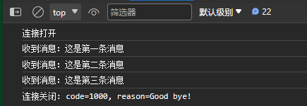
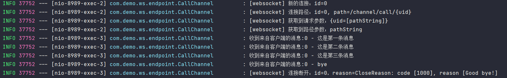

## 介绍

**WebSocket 协议** 是基于 TCP 协议的全双工通信协议，是通过单个 TCP 连接在客户端和服务器之间建立全双工、双向通信通道，可让客户端与服务端建立持久连接，并实时互传数据。它与 HTTP 同为应用层协议，但相比于 HTTP 的请求 - 响应模型，WebSocket 则提供了实时、低延迟的数据传输能力和长连接功能，旨在解决 HTTP 协议在实时通信方面的局限性，如请求 - 响应模式的单向性以及频繁的连接、断开开销。WebSocket 的特性，使得其在即时通讯、游戏同步、IOT 设备实时监控等应用场景大放异彩，已成为现代 Web 应用中常用的通讯协议之一。

在 Spring Boot 中整合 WebSocket 方式有两种：

1. 使用 Jakarta EE 规范提供的 API
2. 使用 Spring 本身提供的模块依赖

本篇是 Spring Boot 整合 WebSocket 系列的第一篇，介绍第一种方式（若对 Spring WebSocket 模块感兴趣，可直跳 [WebSocket 集成（二）](./spring_websocket_two.md)）。

> **题外话**：Jakarta EE 前身是 Java EE，因为后者在 2017 年被 Oracle 公司捐赠给了 Eclipse Foundation，之后 2018 年 Eclipse 基金会便发布了 Jakarta EE 9，之所以改名，是因为「**Java**」这个名字的商标归 Oracle 所有，Eclipse 基金会无法继续使用 `javax.*`、`java.*`等名称，因此将其改为「**Jakarta（雅加达）**」，而 Spring Boot 从 3.x 开始便从 Java EE 切换到了 Jakarta EE。值得一提的是，**Jakarta**（雅加达）是 **Java** 岛（爪洼岛）上最大的城市，也是印度尼西亚的首都，而 Apache 软件基金会也有名为 Jakarta 的项目，但两者没有任何关系。

## 集成 Jakarta WebSocket 

### 项目依赖

首先创建 Spring Boot 项目，笔者使用的版本：`3.2.2`，然后在`pom.xml`添加如下依赖：

```xml
<dependency>
    <groupId>org.springframework.boot</groupId>
    <artifactId>spring-boot-starter-websocket</artifactId>
</dependency>
```

### 端点

根据 Jakarta WebSocket 规范（见[参考资料 1](#参考资料)），服务器端点的创建有两种方式：一是实现规范所提供的接口，如`Endpoint`，并实现其相关方法来处理新连接建立、消息接收、连接断开等时间；二是通过注解，较为便捷与灵活。接下来的所有代码示例也是基于注解方式实现。

首先创建一个服务器端点，如下：

```java
@ServerEndpoint(value = "/channel/call/{uid}")
public class CallChannel {
    
	private static final Logger LOGGER = LoggerFactory.getLogger(CallChannel.class);
    private Session session;
    // 存储客户端连接
    private static final Map<String, CallChannel> wsMap = new ConcurrentHashMap<>();
	
    @OnMessage(maxMessageSize = 1000)
    public void onMessage(String message, boolean last) throws IOException { 
				// ID 是标识连接的唯一字符，每个连接仅此一个，Tomcat 下是从 0 递增，undertow 则为类似 UUID 的字符串
        LOGGER.info("收到来自客户端的消息:{} - {}", this.session.getId(), message);
        // 发送消息给客户端，此处使用异步发送
        this.session.getAsyncRemote().sendText(message);
        // 这个是同步发送，会阻塞至消息发送成功
        // RemoteEndpoint.Basic basicRemote = this.session.getBasicRemote();
        if (last) {
            // do something...
        }
        
        // 发送 bye 则关闭连接
        if ("bye".equalsIgnoreCase(message)) {
            this.session.close(new CloseReason(CloseReason.CloseCodes.NORMAL_CLOSURE, "Bye"))
        }
    }
    
    @OnOpen
    public void onOpen(Session session, @PathParam("uid") String uid, EndpointConfig endpointConfig) {
    		// 保存在实例变量中，Jakarta WS 每建立一个连接便会创建一个端点，因此该变量是线程安全的
        this.session = session;
        LOGGER.info("新的连接：id={}", this.session.getId());
				// session 可获取连接请求的查询参数，路径参数则需要在 WS 的端点路径上（@ServerEndpoint）配置
        Map<String, List<String>> requestParameterMap = session.getRequestParameterMap();
        LOGGER.info("获取到请求参数：{}", requestParameterMap);
        LOGGER.info("获取到路径参数：{}", uid);
        
        // 配置信息
        PojoMethodMapping mapping = (PojoMethodMapping) endpointConfig.getUserProperties().get("org.apache.tomcat.websocket.pojo.PojoEndpoint.methodMapping");
        LOGGER.info("[websocket] 连接路径：id={}, path={}", this.session.getId(), mapping.getWsPath());
    }
    
    @OnClose
    public void onClose(CloseReason reason) {
        LOGGER.info("连接断开：id={}，reason={}", this.session.getId(), reason);
    }
    
    @OnError
    public void onError(Throwable throwable) throws IOException {
        LOGGER.info("连接异常：id={}，throwable={}", this.session.getId(), throwable.getMessage());
        // 关闭连接。状态码为 UNEXPECTED_CONDITION（非预期异常）
        this.session.close(new CloseReason(CloseReason.CloseCodes.UNEXPECTED_CONDITION, throwable.getMessage()));
    }
    
    public int clientSize() {
        return wsMap.size();
    }
}
```

`@ServerEndpoint`注解用于声明此类是一个 WebSocket 端点，value 属性必填，其表明了 WebSocket 连接路由，注解还包括`subprotocols`、`decoders`、`encoders`等属性可以定义子协议、数据编解码器等。

#### @OnOpen

`@OnOpen`注解的方法会监听客户端的连接事件，方法参数一`session`必填，表示连接对象（其实所有方法都支持使用 session 作为参数）。而`uid`是通过端点路径配置的路径参数。想必大家也能意识到，通过端点路径是可以传递查询参数或路径参数的，如代码所示去获取参数即可。

**每当有新的客户端连接接入时，服务器便会创建一个新的端点实例**，所以 session 的获取是线程安全的，同时也可以在端点类中声明静态缓存（如代码示例中的`wsMap`），用于存储所有的客户端连接。

最后一个参数则为端点配置信息对象，可获取当前 WebSocket 端点的信息，通过 Debug 可得到其属性 Key 从而获取数据。

#### @OnClose

`@OnClose`注解的方法则用于监听连接的关闭，并且方法带有一个`CloseReason`对象，封装了连接关闭原因、状态码等。

#### @OnError

`@OnError`方法则用于处理异常事件，该方法必须要有一个`Throwable`对象来表示发生的异常，否则启动服务时会提示该方法缺少`Throwable`参数对象。根据异常可针对性的执行某些操作。也可在此对 session 进行关闭，关闭需要传递`CloseReason`对象，而`CloseReason.CloseCodes`也已定义了一些常见的枚举原因，可直接使用。

#### @OnMessage

`@OnMessage`方法自然是用来接收客户端消息，通过字符串类型的 message 接收，但 WebSocket 本身也是支持二进制消息的，参数类型可以是`String、byte[]`或`Reader、InputStream`。并且该注解还提供了属性`maxMessageSize`用于控制接收的消息大小，若超出则会断开连接，默认 -1 无限制。

参数二`last`用于判断获取到的消息是否为数据的最后一部分，当数据内容过大，WebSocket 会将其分割为多份传递。

### 配置端点扫描

定义好 WebSocket 端点后，需要创建`ServerEndpointExporter`对`@ServerEndpoint`注解的端点进行扫描注册。

```java
@Configuration
public class WebSocketConfig implements ServletContextInitializer {

    /**
     * 创建 ServerEndpointExporter 实例，扫描 WS 端点，
     * ServerEndpointExporter 用于检测带有 @ServerEndpoint 注解的类，并为其注册一个 WebSocket 运行时
     * @return ServerEndpointExporter
     */
    @Bean
    public ServerEndpointExporter serverEndpointExporter() {
        // 显式注册应该在启动时注册的带注释的端点类型
        // exporter.setAnnotatedEndpointClasses(CallChannel.class);
        
        // 实际只需在端点类上加 @Component 注解，因为 exporter 会扫描带有 @ServerEndpoint 注解的 Bean
        // 详细可见 ServerEndpointExporter#afterSingletonsInstantiated 方法
        return new ServerEndpointExporter();
    }
}
```

### JS 连接测试

在项目中的`src/main/resources`下创建`public`目录，并创建文件`index.html`，Spring Boot 默认将此作为应用主页，如下：

```html
<!DOCTYPE html>
<html lang="">
<head>
    <meta charset="UTF-8">
    <title>WebSocket</title>
</head>
<body>
<script type="text/javascript">
    let websocket = new WebSocket("ws://localhost:8080/channel/call/9527");

    // 连接断开
    websocket.onclose = e => {
        console.log(`连接关闭: code=${e.code}, reason=${e.reason}`)
    }
    // 收到消息
    websocket.onmessage = e => {
        console.log(`收到消息：${e.data}`);
    }
    // 异常
    websocket.onerror = e => {
        console.log("连接异常")
        console.error(e)
    }
    // 连接打开
    websocket.onopen = e => {
        console.log("连接打开");

        // 创建连接后，往服务器连续写入 3 条消息
        websocket.send("这是第一条消息");
        websocket.send("这是第二条消息");
        websocket.send("这是第三条消息");

        // 最后发送 bye，由服务器断开连接
        websocket.send("bye");

        // 也可以由客户端主动断开
        // websocket.close();
    }
</script>
</body>
</html>
```

1. 首先与服务端点建立 webSocket 连接：`ws://localhost:8080/channel/call/9527`，`9527`是路径参数
2. 连接接入后，在`onopen`函数中打印日志并向服务端发送三条数据，最后发送`bye`给服务端关闭连接
3. 连接关闭后，`onclose`方法也能得到回调并输出日志
4. `onmessage`自然是接收服务端推送的内容，实际应用中也是在此处根据消息来执行业务逻辑

然后启动服务，在浏览器访问应用地址即可，记得打开浏览器控制台：





### 在端点中注入 Bean

在端点中注入 Spring Bean，并不能直接通过`@Autowired`等注解注入依赖，因为端点并非由 Spring 创建，而是由服务器（Spring Boot 默认是 Tomcat）创建。因此，在端点上添加`@Component`注解只是表示会由 Spring IOC 管理而已，所以可通过`ApplicationContextAware`接口得到`ApplicationContext`来获取 Bean。

```java
@ServerEndpoint(value = "/channel/call/{uid}")
@Component
public class CallChannel implements ApplicationContextAware {
    
	private static ApplicationContext springContext;
	private UserService userService;  // 假设 UserService 是其它 Bean 依赖
    
    @Override
    public void setApplicationContext(ApplicationContext applicationContext) throws BeansException {
        springContext = applicationContext;
    }
    
    @OnOpen
    public void onOpen(Session session, @PathParam("uid") String uid, EndpointConfig endpointConfig){
        this.session = session;
        // 注入 Bean 对象
        this.userService = springContext.getBean(UserService.class);
    }
    
}
```

由于`@OnOpen`方法在整个连接的生命周期中，只会执行一次，所以该方式不会带来性能损耗。

### 关于 onMessage 方法的 last 参数

上方提到`@OnMessage`方法的`last`参数是 WebSocket 自动根据消息内容大小从而确定是否分割数据传递，若分为多份，那么没拿到最后一份数据时，`last`自然为`false`。其实这里正确来说，是否将数据分割，是根据 Tomcat 系统配置参数来决定的，即：`org.apache.tomcat.websocket.DEFAULT_BUFFER_SIZE`，默认`8*1024`字节。

Tomcat 服务器下的 WebSocket 在读取数据时，会用到三个`Buffer`，分别是：

- `ByteBuffer readBuffer`：读缓冲区，用于读取传递的数据，作为中间缓冲区暂存数据，该区默认大小即为`DEFAULT_BUFFER_SIZE`
- `ByteBuffer messageBufferBinary`：字节缓冲区，大小默认`8*1024`字节
- `CharBuffer messageBufferText`：文本缓冲区,大小默认`8*1024`字节

假设客户端此时发送了一条数据，那么会由`messageBufferBinary`接收，没错，WebSocket 默认将所有数据都用字节缓冲区接收，再根据`@OnMessage`方法的参数类型来决定是否转化为对应类型。而由字节缓冲区接收后，会利用`readBuffer`读取数据，从而判断数据是否超出了缓冲区大小，决定是否需要对数据进行切分。也就是说，若传递数据超过`8*1024`字节，那么当回调`@OnMessage`方法时，便能看到`last`参数为`false`，具体源码可以看：`WsFrameBase.java`类下的`processDataText()`与`processDataBinary()`方法。

至于上述三个缓冲区的大小设置方式，如下：

```java
@SpringBootApplication
public class WsSummaryApplication {

    public static void main(String[] args) {
        // 设置 Tomcat 关于 WebSocket readBuffer 缓存区的大小，默认是 8*1024，单位：byte
        System.setProperty("org.apache.tomcat.websocket.DEFAULT_BUFFER_SIZE", "32");
        SpringApplication.run(WsSummaryApplication.class, args);
    }
}

@Configuration
public class WebSocketConfig implements ServletContextInitializer {
    @Override
    public void onStartup(ServletContext servletContext) throws ServletException {
        servletContext.addListener(WebAppRootListener.class);
        servletContext.setInitParameter("org.apache.tomcat.websocket.textBufferSize","1024");
        servletContext.setInitParameter("org.apache.tomcat.websocket.binaryBufferSize","1024");
    }
}
```

### 关于心跳

Jakarta WebSocket 关于 ping/pong 有对应的规范描述，不过在实际应用中，前后端可约定好`ping`发送的消息内容，这样服务端可通过`@OnMessage`来做对应的处理，并不麻烦。或者由服务端开启定时任务主动发送`ping`消息给客户端也是可以的。网上参考资料不少，在此就不多赘述。

## 后续

此篇内容大量借鉴于参考资料 2 的博客内容，因对 WebSocket 较有兴趣，便学习了一番，不过在查看了其博客站点，发现只是介绍了 Jakarta WebSocket 的整合方式，也没有深入讲解原理。因此笔者在此记录并做了补充，后续再补充 Spring 自身提供的 WebSocket 整合实现。

## 参考资料

1. [Jakarta WebSocket 2.0 规范](https://jakarta.ee/specifications/websocket/2.0/websocket-spec-2.0#introduction)

2. [在 Spring Boot 中整合、使用 WebSocket](https://springdoc.cn/spring-boot-websocket/)

