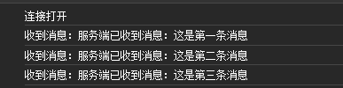
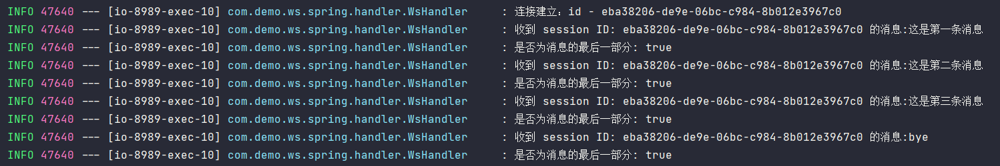
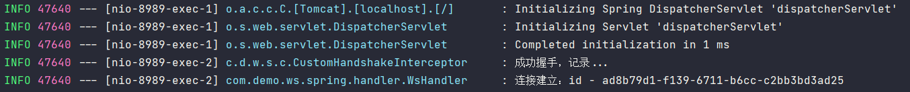

本篇介绍 Spring 集成 WebSocket 的第二种方式：使用 Spring 本身的 WebSocket 模块，先从基础开始。

## 依赖

使用的 Spring Boot 版本为`3.2.2`，添加依赖如下：

```xml
<dependency>
    <groupId>org.springframework.boot</groupId>
    <artifactId>spring-boot-starter-websocket</artifactId>
</dependency>
```

## 创建 WebSocketHandler

`WebSocketHandler`是由 WebSocket 模块提供的接口，作为处理 WebSocket 消息和生命周期事件的处理程序，其包含如下方法：

```java
public interface WebSocketHandler {
	/**
	 * 连接建立后调用，session 即为连接会话
	 */
    void afterConnectionEstablished(WebSocketSession session) throws Exception;
    /**
	 * 消息接收时调用
	 */
	void handleMessage(WebSocketSession session, WebSocketMessage<?> message) throws Exception;
    /**
	 * 传输错误时调用
	 */
	void handleTransportError(WebSocketSession session, Throwable exception) throws Exception;
	/**
	 * 连接被任何一方关闭后或发生传输错误后调用
	 */
    void afterConnectionClosed(WebSocketSession session, CloseStatus closeStatus) throws Exception;
	/**
	 * 是否支持处理部分消息
	 * 如果为 true，并且底层 WebSocket 服务器支持部分消息，那么大消息，或者一个未知大小的消息
	 * 可能会被分割，并且可能通过多次调用handleMessage 方法来接收
	 */
    boolean supportsPartialMessages();
}
```

如上所示，包含了连接建立、消息接收、连接关闭等方法。所以第一步便是创建自己的`WebSocketHandler`：

```java
public class WsHandler implements WebSocketHandler {

    private static final Logger LOGGER = LoggerFactory.getLogger(WsHandler.class);

    @Override
    public void afterConnectionEstablished(WebSocketSession session) throws Exception {
        LOGGER.info("连接建立：id - {}", session.getId());
    }

    @Override
    public void handleMessage(WebSocketSession session, WebSocketMessage<?> message) throws Exception {
        LOGGER.info("收到 session ID: {} 的消息:{}", session.getId(), message.getPayload());
        LOGGER.info("是否为消息的最后一部分: {}",message.isLast());

        // 发回消息
        sesion.sendMessage(new TextMessage("服务端已收到消息：" + message.getPayload()));
    }

    @Override
    public void handleTransportError(WebSocketSession session, Throwable exception) throws Exception {
        LOGGER.error("发生异常：{}", exception.getMessage());
        session.close(CloseStatus.SERVER_ERROR);
    }

    @Override
    public void afterConnectionClosed(WebSocketSession session, CloseStatus closeStatus) throws Exception {
        LOGGER.warn("连接被关闭，session ID: {}，关闭原因: {}", session.getId(), closeStatus);
    }

    @Override
    public boolean supportsPartialMessages() {
        return false;
    }

}
```

说明下方法出现的参数：

- `WebSocketSession`：表示 WebSocket 会话，可用来发送消息与关闭连接
- `WebSocketMessage<T>`：发送或接收的消息，类型包括`TextMessage`、`BinaryMessage`、`PingMessage`、`PongMessage`四种

- `CloseStatus`：封装了一些预定义的错误代码，当连接关闭、传输出错时可使用，`1000`状态码表示连接正常关闭

如果说不想要每个方法都自定义实现，可以通过继承`AbstractWebSocketHandler`来自由选择要实现的方法，该抽象类实现了`WebSocketHandler`接口，对接口方法都做了空实现。而若是客户端与服务端已约定好发送的消息类型是文本或二进制，则可更进一步的继承`TextWebSocketHandler`和`BinaryWebSocketHandler`两者来实现 WebSocket 处理程序，这两个类都互相对另一方的消息做了不支持接收的操作。

## 注册 WebSocketHandler

`WebSocketHandler`创建后则需要对其进行注册，创建一个`Configuration`类继承`WebSocketConfigurer`：

```java
@EnableWebSocket
@Configuration
public class WsConfig implements WebSocketConfigurer {

    /**
     * 注册 WebSocketHandler 处理器
     * @param registry 提供配置 WebSocketHandler 请求映射的方法，也就是为握手请求提供处理映射
     */
    @Override
    public void registerWebSocketHandlers(WebSocketHandlerRegistry registry) {
        // path 参数是指 WS 握手路径，可以添加多个 WS 处理器
        // setAllowedOrigins 是 CORS 配置
        registry.addHandler(wsHandler(), "/ws").setAllowedOrigins("*");
    }

    @Bean
    public WsHandler wsHandler() {
        return new WsHandler();
    }
}
```

`WebSocketConfigurer`用来注册`WebSocketHandler`，其配合`@EnableWebSocket`注解开启 WebSocket 功能，以配置对 WebSocket 请求的处理。

通过`WebSocketHandlerRegistry`注册写好的`WebSocketHandlr`，并指定`path`，该路径即为客户端 WebSocket 连接路由。到这里，服务端 WebSocket 的构建就已经完成，非常简单。

## 测试

测试方面使用 [WebSocket 集成（一）](./spring_websocket_one.md)中的 JS 代码，只需将 WebSocket 连接地址改为上方配置的地址即可：

```html
<script type="text/javascript">
    let websocket = new WebSocket("ws://localhost:8080/ws");
    // ...
</script>
```

启动服务，打开浏览器，打开浏览器控制台，访问服务即可看到如下信息：





看过第一篇 Jakarta WebSocket 实现的同学可以发现，Spring WebSocket 模块生成的 Session ID 有别于 Jakarta WebSocket API 的自增式 Session ID，是类似 UUID 的长字符串。 

## 握手拦截器

握手拦截器`HandshakeInterceptor`是用于拦截握手请求，检查握手请求和响应，以及将属性传递给目标`WebSocketHandler`。拦截器内部提供了`beforeHandshake()`和`afterHandshake`两个方法，对应握手请求的前后拦截。我们可以自定义实现拦截器，也可以直接使用 Spring 提供的拦截器实现`HttpSessionHandshakeInterceptor`：

```java
public class CustomHandshakeInterceptor extends HttpSessionHandshakeInterceptor {

    private static final Logger LOGGER = LoggerFactory.getLogger(CustomHandshakeInterceptor.class);

    @Override
    public void afterHandshake(ServerHttpRequest request, ServerHttpResponse response, 
                               WebSocketHandler wsHandler, Exception ex) {
        LOGGER.info("成功握手，记录...");
    }
}

@Configuration
@EnableWebSocket
public class WsConfig implements WebSocketConfigurer {
    @Override
    public void registerWebSocketHandlers(WebSocketHandlerRegistry registry) {
        registry.addHandler(wsHandler(), "/ws").setAllowedOrigins("*")
                .addInterceptors(new CustomHandshakeInterceptor()); // 添加拦截器
    }
}
```

重新启动服务后，浏览器进行连接，输出结果如下：



**注意**：`afterHandshake()`方法的调用要先于`WebSocketHandler#afterConnectionEstablished`方法

## WebSocketSession 并发修饰器

`WebSocketSession`本身是针对单线程场景而设计的，这意味着在多线程场景下会带来线程安全问题。比如多个线程同时使用一个`WebSocketSession`发送消息（并发写入）会引起数据竞争，因为发送消息的方法并没有同步机制来保证并发写入的原子性，结果可能是导致消息丢失。

不过 WebSocket 模块本身提供了另一个修饰类`ConcurrentWebSocketSessionDecorator`来包装`WebSocketSession`，从名字上就可以看出它是为了弥补`WebSocketSession`在多线程场景的缺陷。

包装的方式很简单，只需要新建`ConcurrentWebSocketSessionDecorator`并传递`WebsocketSession`，后续使用`WebSocketSession`时，则换成使用`ConcurrentWebSocketSessionDecorator`即可，它同样也支持发送消息、连接关闭。

```java
public class WsHandler implements WebSocketHandler {
    
	private ConcurrentWebSocketSessionDecorator decorator;
    
	@Override
    public void afterConnectionEstablished(WebSocketSession session) throws Exception {
        // 参数二是消息发送超时时间，单位：ms；参数三是要发送的消息缓冲区大小，单位：byte
    	this.decorator = new ConcurrentWebSocketSessionDecorator(session, 1000, 8*1024);
    }
    
    @Override
    public void handleMessage(WebSocketSession session, WebSocketMessage<?> message) throws Exception {
    	this.decorator.sendMessage(new TextMessage("服务端已收到消息：" + message.getPayload()));
    }
    
    @Override
    public void handleTransportError(WebSocketSession session, Throwable exception) throws Exception {
        this.decorator.close(CloseStatus.SERVER_ERROR);
    }
    // ...
}
```

`ConcurrentWebSocketSessionDecorator`在内部里提供了两个锁：

- `Lock flushLock = new ReentrantLock()`：发消息时使用
- `Lock closeLock = new ReentrantLock()`：连接关闭时使用

这两个锁便是该修饰器增强`WebSocketSession`并发功能的关键点，消息发送、连接关闭都需要先获取锁。当多个线程使用同一个 WebSocketSession 发送消息时，修饰器会通过锁来保证同步发送，避免资源竞用。同时在一些（耗时）异步操作下，保证`WebSocketSession`连接的活跃性（接收新消息、防止其它线程修改 `WebSocketSession`的属性）。

## 额外补充

实际项目中大多有使用 Nginx 服务器作为代理来转发请求到内网，但 Nginx 默认情况下不会处理`Connect`请求以及在反向代理情况下，Nginx 不会转发请求 Header 中的`Upgrade`标头给被代理服务器，只会当作普通的 HTTP 请求。当然，Nginx 官方文档已给出相关的解决方案，[戳这里看吧](https://nginx.org/en/docs/http/websocket.html)。

## 参考资料

- [Spring 官方文档：WebSockets](https://docs.spring.io/spring-framework/reference/web/websocket.html)
