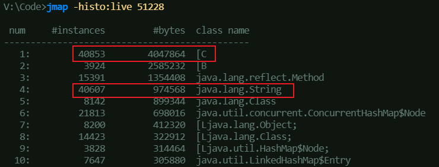
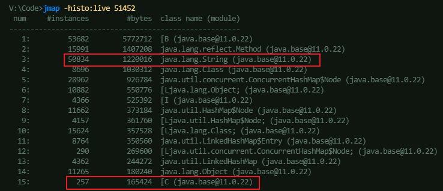
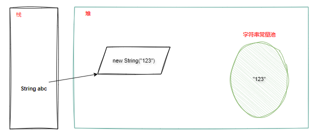
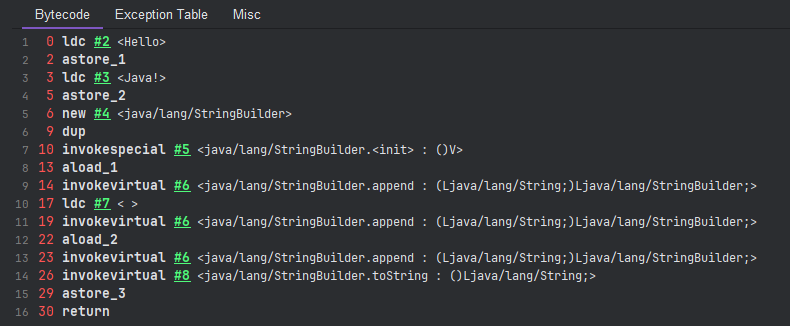
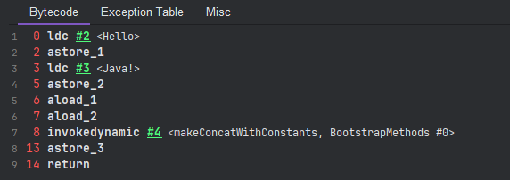

## 引子

相信每个 Javaer 都遇到过这个问题：`String abc = new String("123");` 创建了几个对象？其作为八股文已是老生常谈，考究的是大伙对对象创建以及字符串在 JVM 中的存储理解。本篇文章就来深入探讨下 String 方方面面的问题。

## String 内部结构

### char[] -> byte[]

String 内部原本使用一个 `char[] value` 存储字符，若不是”版本任你更，我用 Java 8“ 的钉子户，应该能发现从 JDK 9 开始，它就变成了 `byte[] value`。这么做的目的主要是为了**减少字符串占用的内存，减少 GC 次数**。（详见参考资料[JEP 254](#参考资料)）

以下是笔者在本地启动的同一 Java 服务在 JDK 8/11 两个版本的堆内存统计情况，能看到 String 的实例数量和内存占用均名列前茅。并且在 JDK 8 版本中，由于 String 还是使用 `char[]` 存储内容，`char[]` 内存占用高居第一，而到了 JDK 11 优化为 `byte[]` 后，`char[]` 的内存占用就被打下去了，优化效果一目了然。





我们都清楚在 UTF-16 编码下，Java 的 `char` 类型每个字符占据两个字节。然而在多数实际场景中，String 存储的主要是 [Latin-1](https://zh.wikipedia.org/wiki/ISO/IEC_8859-1) 字符集的内容，仅需占用 1 个字节。所以，将原本 1 字节的字符按照 2 字节存储时，内部的 `char` 数组会有一半空间闲置，这无疑是一种资源浪费。自 JDK 9 起，String 会判断字符串是否全为 ASCII 字符，若满足条件则采用 Latin-1 字符集编码（Latin-1 涵盖了 ASCII 的所有字符），每个字符以一个字节存储，此时 `char[]` 不再适用，进而调整为 `byte[]`。

这里贴出 JDK 8/9 的 String 构造函数源码，方便读者理解：

```java
// JDK 8
/** The value is used for character storage. */
private final char value[];

public String(char value[], int offset, int count) {
    if (offset < 0) {
        throw new StringIndexOutOfBoundsException(offset);
    }
    if (count <= 0) {
        if (count < 0) {
            throw new StringIndexOutOfBoundsException(count);
        }
        if (offset <= value.length) {
            this.value = "".value;
            return;
        }
    }
    // Note: offset or count might be near -1>>>1.
    if (offset > value.length - count) {
        throw new StringIndexOutOfBoundsException(offset + count);
    }
    this.value = Arrays.copyOfRange(value, offset, offset+count);
}

// JDK 9
// char[] 换成 byte[]
private final byte[] value;

// 添加了该字段，是用于对 value 中的字节进行编码的编码标识符，此实现中支持的值为 LATIN1、UTF16
private final byte coder;

public String(int[] codePoints, int offset, int count) {
    checkBoundsOffCount(offset, count, codePoints.length);
    if (count == 0) {
        this.value = "".value;
        this.coder = "".coder;  // 通过 coder 指示该字符串用何种编码方式
        return;
    }
    if (COMPACT_STRINGS) {
        // 检测是否都为 Latin-1 字符
        byte[] val = StringLatin1.toBytes(codePoints, offset, count);
        if (val != null) {
            this.coder = LATIN1;
            this.value = val;
            return;
        }
    }
    // 不是则使用 UTF-16
    this.coder = UTF16;
    this.value = StringUTF16.toBytes(codePoints, offset, count);
}
```

### UTF-8？UTF-16？

再来说说为什么 Java 采用的是 UTF-16 而不是 UTF-8。

由于 Java 原来使用 `char[]` 保存内容，可以看到像 `charAt()`、`subString()` 等多数方法都是返回的 `char`，也就是说 String 是按 `char` 2 字节来划分字符串的，这就摁死了字符的编码不能采用变长的字符编码方式，因为 String 有随机访问的需求。看到这读者可能就立马有疑惑了：可是 UTF-8 和 UTF-16 都是变长的啊？

勿急，且听笔者细细说来。我们先来说明下两种编码的区别，答案就不言而喻了。

- **UTF-8**：是针对 Unicode 的可变长度字符编码，编码后的长度为 1~4 字节，可编码范围是 U+0000 ~ U+10FFFF；
- **UTF-16**：同样是针对 Unicode 的可变长度字符编码，但不同的是，其字符编码后的长度只会是 2 或 4 字节，因为 UTF-16 的[码元](https://developer.mozilla.org/zh-CN/docs/Glossary/Code_unit)是 16 位。
  - 若是 [BMP](https://baike.baidu.com/item/%E5%9F%BA%E6%9C%AC%E5%A4%9A%E6%96%87%E7%A7%8D%E5%B9%B3%E9%9D%A2/10788078) 字符（U+0000 ~ U+FFFF），则采用 2 字节存储；
  - 若是 [SMP](https://baike.c114.com.cn/view.asp?id=14684-33AB06D6) 字符（U+10000～U+1FFFD），则采用 4 字节存储。对于此类字符，UTF-16 采用代理对来表示，代理对由两个 16 位的码元组成，分为高代理项（U+D800 ~ U+DBFF）和低代理项（U+DC00 ~ U+DFFF），两者共同组成一个 20 位的值，就可以表示 SMP 的 Unicode 码点。

所以 UTF-16 虽然是变长，但固定为 2、4 字节，刚好符合 Java 1~2 个 `char` 所占用的长度，也就相当于是定长了，自然也能匹配 String 各种 API 的读取返回。

关于 Java 字符编码也可看看参考资料的 [stack overflow 问题](#参考资料)。

### String 真的不可变？

String 的不可变主要依据于其类与属性的声明，如下：

```java
// JDK 8 源码
public final class String implements java.io.Serializable, Comparable<String>, CharSequence {
    private final char value[];
}
```

`final` 已经限制了 String 不可被继承，并且 value 数组也是采用 `final` 修饰，说明 value 的引用地址不可变。到这里都没什么问题，符合大家一贯的理解，但细心的读者会发现，笔者所说的是 **value 的引用地址不可变**。

我们知道，Java 中 final 修饰一个引用变量时，虽然引用地址不可变，但引用的对象内容是可以更改的。既然如此，我们可以用什么方法修改 value 数组的内容呢？答案呼之欲出，那就是反射了。来看一个例子：

```java
public static void main(String[] args) throws NoSuchFieldException, IllegalAccessException {
    String s1 = "Hello World";
    System.out.println(s1 + " - " + System.identityHashCode(s1)); // Hello World - 166239592

    Field field = String.class.getDeclaredField("value");
    field.setAccessible(true);
    char[] value = (char[]) field.get(s1);
    value[6] = 'J';
    value[7] = 'a';
    value[8] = 'v';
    value[9] = 'a';
    value[10] = '!';

    System.out.println(s1 + " - " + System.identityHashCode(s1)); // Hello Java! - 166239592
}
```

可以看到，通过反射修改了 s1 的 value 引用数组的内容，对于生成的哈希码没有发生变化，`System.identityHashCode()` 的作用是为给定对象返回与默认方法 `hashCode()` 返回的哈希码相同的哈希码，无论给定对象的类是否覆盖 `hashCode()`。

所以通过反射是切切实实地改变了 String 的内容，但反射行为违背了 String 的设计初衷。String 不可变的设计目的是为了让不可变对象可以安全地在多个线程中共享，而不需要同步，并且能够重用相同的字符串常量，减少内存损耗。而反射修改内容则违背了 String 的设计原则，是一种破坏封装和安全性的行为。换句话说就是，当使用了反射，就已经默认是放弃了 String 本身设计带来的不可变保证，毕竟 String 本身可没有提供任何的 API 或其它手段让开发者能够去修改它，不是吗？

上述内容主要基于 JDK 8，那么 JDK 9 开始换成的 `byte[]` 该怎么修改呢？如法炮制吗？勤奋的读者或许已经动手尝试了，但是应该会收一个异常：

```
Exception in thread "main" java.lang.reflect.InaccessibleObjectException: 
	Unable to make field private final byte[] java.lang.String.value accessible: 
		module java.base does not "opens java.lang" to unnamed module @7c469c48
```

该异常的出现是由 `field.setAccessible(true);` 触发，是因为 JDK 9 引入的[平台模块系统](https://openjdk.org/projects/jigsaw/spec/sotms/)引起的，特别是其强封装的实现，其限制了 Java 不同模块不同包的访问性，反射自然也受其影响。对于不同包的类型之间的访问，要具备两个条件：

- 类型是 public
- 模块导出该类型的包（即控制该包对外可见可访问）

由于 value 是 `private` 修饰，不满足上述条件，所以需要通过添加 VM 参数来改变可见性，在启动程序时，添加配置参数：

- `--add-opens {module name}/{package name}=ALL-UNNAMED`

`ALL-UNNAMED` 是指向所有未命名模块开放访问，如果反射代码处于命名模块，可以替换为真实的模块名。我们这里是要访问 String.class，位于 `java.base/java.lang` 之下，所以完整的参数就是：

- `--add-opens java.base/java.lang=ALL-UNNAMED`

添加参数后再执行代码，就会看到预期的结果了，这里也贴下修改后的代码：

```java
public static void main(String[] args) throws NoSuchFieldException, IllegalAccessException {
    String s1 = "Hello World";
    System.out.println(s1 + " - " + System.identityHashCode(s1)); // Hello World - 400136488

    Field field = String.class.getDeclaredField("value");
    field.setAccessible(true);
    byte[] value = (byte[]) field.get(s1);
    value[6] = 74;  // J
    value[7] = 97;  // a
    value[8] = 118; // v
    value[9] = 97;  // a
    value[10] = 33; // !

    System.out.println(s1 + " - " + System.identityHashCode(s1)); // Hello Java! - 400136488
}
```

### String 是否线程安全？

毫无疑问，String 肯定是线程安全的。或许大家会联想到 `StringBuilder` 和 `StringBuffer` 关于线程安全的说法，进而产生一些关于 String 线程安全的疑惑。事实上，`StringBuilder` 和 `StringBuffer` 的线程安全与否是针对它们自身而言，与 String 并无关系。

`StringBuilder`、`StringBuffer` 都继承了 `AbstractStringBuilder` 这个抽象类，在创建这两个对象时，其实都调用了父类的构造函数，如下：

```java
abstract class AbstractStringBuilder implements Appendable, CharSequence {
    
    byte[] value;
    byte coder;
    
    AbstractStringBuilder(int capacity) {
        if (COMPACT_STRINGS) {
            value = new byte[capacity];
            coder = LATIN1;
        } else {
            value = StringUTF16.newBytesFor(capacity);
            coder = UTF16;
        }
    }
}
```

而重点在于 `AbstractStringBuilder` 中的 **value** 是由它自身定义的。如上所示，它并非像 String 中一样是用 `private final` 修饰，所以说它是可变的，既然可变，自然就有线程共享的安全问题。而 `StringBuffer` 则是因为在很多方法上添加了 `synchronized` 关键字修饰，才保证了线程安全。

## String 在 JVM 中的存储方式

### String 对象创建

回顾下老知识，Java 从版本 8 开始用「**元空间**」完全替代了「**永久代**」，并且「**字符串常量池**」也挪到了堆中。字符串常量池专门用于存储字符串字面量，它的作用是避免重复创建相同内容的字符串对象，达到内存复用的目的。而所谓的字符串字面量，即代码中直接使用双引号包裹的字符串值，如：`String str = "abc";`。

让我们回到文章开头提出的问题：`String abc = new String("123");` 创建了几个对象？答案是一个或两个。首先代码执行时，会判断 `123` 这个字符串字面量在字符串常量池是否存在，无则创建，注意这个对象是存于字符串常量池中；接着执行 `new String("123")` 这一步去创建新的 String 实例对象，将常量池中的 `123` 的引用复制给 String 对象，注意该新对象是存于堆中。如下图所示：



再说回字符串常量池，它主要是依赖「**StringTable**」进行存储管理。**StringTable** 是 JVM 中的一个哈希表结构，用于存储已经加入到字符串常量池中的字符串对象（比如定义的字符串字面量或通过 `String.intern()` 创建的字符串），它的主要目的是为了高效管理和查找字符串常量池中的字符串，确保相同内容的字符串只存在一个实例。

而结构既然是哈希表，大小当然也至关重要，有两个相关的 JVM 参数如下：

- `-XX:+PrintStringTableStatistics`：打印字符串常量池的统计信息
- `-XX:StringTableSize`：设置 StringTable 的长度

在 JDK 6 及之前的版本，**StringTable** 大小无法调整，默认为 1009，这个值相对较小，在需要大量字符串的情况下，容易造成哈希冲突，影响性能。从 7 开始就允许通过 `-XX:StringTableSize` 来调整大小，但默认值不变。从 8 开始默认值调整为 60013，从 9 开始默认值进一步增加到 65536，并且也都支持通过参数调整大小。

### String.intern()

理解了 String 创建时 JVM 内对象的分配后，再进一步的来看看 `String.intern()` 这个方法，贴下 javadoc 的描述：

```java
/**
 * 返回字符串对象的规范表示。字符串池最初是空的，由 String 类私有维护。
 * 当调用 intern 方法时，如果池中已包含由 equals(Object) 方法确定的等于此 String 对象的字符串，则返回池中的字符串。
 * 否则，将此 String 对象添加到池中，并返回对此 String 对象的引用。
 * 由此可见，对于任意两个字符串 s 和 t，当且仅当 s.equals(t) 为 true 时，s.intern() == t.intern() 才为 true。
 * 所有文字字符串和字符串值常量表达式都被保留。字符串文字在 Java™ 语言规范的第 3.10.5 节中定义。
 * 返回：与此字符串具有相同内容的字符串，但保证来自唯一字符串池。
 */ 
public native String intern();
```

`intern()` 是 **native** 方法，调用后会从常量池中查找是否存在一个等于当前 String 对象的字符串，由 `equals()` 方法确定，存在则返回池中的字符串引用地址，否则将 String 对象添加到池中并返回该 String 对象的引用。因此，当两个字符串 `equals()` 相等，两者的 `intern()` 才会相等。

来看个例子：

```java
public static void main(String[] args) {
		String s1 = "abc";
    String s2 = new String("abc");
    
    System.out.println(s1 == s2);           // false
    System.out.println(s1 == s2.intern());  // true
}
```

首先 s1 定义了字面量 `abc`，那么在字符串常量池中也就创建了该字符串对象，并持有引用，而 s2 持有的是 String 在堆中的实例对象引用地址。因此直接 `==` 比较两者则为 `false`。当 s2 调用 `intern()` 后会尝试在常量池中创建 `abc`，由于池中已经有该字符串，所以直接返回 `abc` 的引用，因此第二个输出则为 `true`。

## StringBuilder 与 String

### 字符追加与创建

**StringBuilder** 是字符的可变对象，用于高效地拼接和操作字符串，它提供与 StringBuffer 兼容的 API，只是不支持同步，是 StringBuffer 在单线程下的替代，速度要比 StringBuffer 快。

在这里提到 StringBuilder 是因为其创建字符的方式与 String 有所区别，相信大家用的最多的就是 `append()` 和 `toString()` 方法。这里也是要着重讲解下这两个函数，先看下 `append()` 的源码：

```java
// 注意：以下源码来自 JDK 8，从 9 开始只是换成了 byte[] 并且增加了编码方式的区分操作，本质逻辑是一致的。
public class StringBuilder extends AbstractStringBuilder implements java.io.Serializable, CharSequence {
    // 追加字符串
    public StringBuilder append(String str) {
        super.append(str);
        return this;
    }
}

// 父类 append 字符追加实现
public class AbstractStringBuilder {
    public AbstractStringBuilder append(String str) {
        if (str == null)
            return appendNull();
        int len = str.length();
        ensureCapacityInternal(count + len);
        str.getChars(0, len, value, count);
        count += len;
        return this;
    }
}

public class String {
    // 字符串追加
    public void getChars(int srcBegin, int srcEnd, char dst[], int dstBegin) {
        if (srcBegin < 0) {
            throw new StringIndexOutOfBoundsException(srcBegin);
        }
        if (srcEnd > value.length) {
            throw new StringIndexOutOfBoundsException(srcEnd);
        }
        if (srcBegin > srcEnd) {
            throw new StringIndexOutOfBoundsException(srcEnd - srcBegin);
        }
        // 内容复制
        System.arraycopy(value, srcBegin, dst, dstBegin, srcEnd - srcBegin);
    }
}
```

`append()` 方法的重点就看最后的 `String.getChars()` 里的 `System.arraycopy()` 这一行，它直接表明了 `append()` 方法并不会往字符串常量池里添加字符串对象，而仅仅是把字符串内容复制到 `StringBuilder#value` 数组里。

再看看 `toString()` 方法：

```java
// 同样基于 JDK 8
public class StringBuilder extends AbstractStringBuilder implements java.io.Serializable, CharSequence {
    // 重写 toString()
    @Override
    public String toString() {
        // Create a copy, don't share the array
        return new String(value, 0, count);
    }
}

public final class String implements java.io.Serializable, Comparable<String>, CharSequence {
    // String 构造函数
    public String(char value[], int offset, int count) {
        if (offset < 0) {
            throw new StringIndexOutOfBoundsException(offset);
        }
        if (count <= 0) {
            if (count < 0) {
                throw new StringIndexOutOfBoundsException(count);
            }
            if (offset <= value.length) {
                this.value = "".value;
                return;
            }
        }
        // Note: offset or count might be near -1>>>1.
        if (offset > value.length - count) {
            throw new StringIndexOutOfBoundsException(offset + count);
        }
        // 数组复制
        this.value = Arrays.copyOfRange(value, offset, offset+count);
    }
}
```

重点同样是最后 String 构造函数调用的 `Arrays.copyOfRange` 方法，它只是复制了 `StringBuilder#value` 的内容来创建一个新的数组，并赋值给了 `String#value` 属性，它并没有真正在字符串常量池中创建字符串对象。

明白了上面两个方法的实际作用后，来看看下面的代码：

```java
public static void main(String[] args) {
    StringBuilder sb = new StringBuilder();
    String str = sb.append("hello").append("java").toString();
    System.out.println(str.intern() == str);
}
```

按照对 `intern()、append()、toString()` 三个方法的理解，这里输出应该是 `false`？emmm...只能说答案是对的，但只对了一半，因为这个问题要分版本来说明。

其实，`intern()` 方法有个**首次遇到**原则，在 JDK 6 及之前，该方法会将首次遇到的字符串实例复制到永久代的字符串常量池中存储，返回的也是永久代里该字符串实例的引用；而到了 JDK 7 之后，由于字符串常量池迁移到堆中，就无需再进行复制，只需要在常量池中记录一下首次出现的实例引用即可。

重新理解 `intern()` 后，再看上面的代码去思考，如果在 JDK 6，因为 `intern()` 确实往常量池中复制了字符串对象，所以返回的引用自然就跟 `str` 这个在堆中的引用不同，输出 `false`。而在 JDK 7 及之后，输出的将会是 `true`，因为常量池在堆中，记录的仅仅是首次遇到的字符串实例引用，即堆中的 String 实例引用。

如果往上面的代码再加上一行代码，变成下面这个样子，读者可思考输出的结果会是什么：

```java
public static void main(String[] args) {
    StringBuilder sb = new StringBuilder();
    String str = sb.append("hello").append("java").toString();
    String str2 = "hellojava";
    System.out.println(str.intern() == str);
}
```

先说答案，是 `false`。原因很简单，这是因为 `srt2` 对字符串字面量先进行了定义，因此该字符串被放入了常量池中，那么 `intern()` 方法在调用后优先取到的就是池中的字符串引用，与 `str` 这个堆中的引用比较自然是不同的。如果把 `str2` 变量的定义放到 `println()` 语句之后，就会发现输出结果还是 `true`，读者可自行尝试。

> **TIPS**：如果是 `sb.append("java").toString()`，那么 `sb.intern() == sb` 得到结果只会是 `false`，原因是 `java` 在 JDK 源码中已被使用定义，所以要注意是否使用了某些 JDK 内部已声明定义的常量。

### 字符串拼接

对于使用 **+** 来拼接的字符串，Java 会分情况来确定是否使用 StringBuilder 进行拼接。像这种：`String s = "Hello" + " " + "Java!"`，那么编译后会直接拼成 **Hello Java!** 后再放入字符串常量池中。而如果是以下这种情况，就会使用 StringBuilder 了：

```java
public static void main(String[] args) {
    String a = "Hello";
    String b = "Java!";
    String str = a + " " + b;
}
```

编译后的字节码如下：



可以看到是新建了一个 StringBuilder 并通过 `append()` 追加字符，最后通过 `toString()` 来生成 String 对象。因此如果调用 `str.intern()` 方法，得到的也是跟 `str` 一样的引用地址。而如果使用 `final` 修饰 `a、b` 两个变量，那么也会直接作为字面量拼接在一起，而不是通过 StringBuilder 拼接。

至于为何使用的是 StringBuilder 而不是 StringBuffer，也是因为前者比起后者性能更好，并且字符串的拼接也大多是在单线程场景下，自然选择最优的方式实现。如果遇到的是多线程环境，开发者也可自行使用 StringBuffer 进行拼接。

关于字符串的拼接，其实也存在版本上的区分，上述代码编译后的字节码截图是基于 JDK 8，而在 JDK 9 及之后，是如下这样子：



拼接已经不再需要 StringBuilder，可以看到 `invokedynamic` 指令调度的是 `makeConcatWithConstants` 方法。`makeConcatWithConstants` 是在 JDK 9 引入，目的是为了优化字符串的拼接性能，否则在大量字符串拼接上，每次都要去创建 StringBuilder 调用 `append()` 方法，效率并不理想。

`makeConcatWithConstants` 针对常量字符串，可以在编译时就将这些字符串进行优化处理，避免运行时的额外拼接开销；对于动态字符串拼接，则会在运行时动态生成拼接逻辑。这比直接使用 StringBuilder 生成更加灵活，并且减少了对象创建，JVM 可以根据实际的运行时情况优化拼接代码。但也要注意该方法最后也是生成的字符串副本，并没有将字符串放入到常量池中。

### 最后的问题

`String s = new String("a") + new String("b");` 共创建了几个对象？

<details>
    <summary>思考下再看答案哦~</summary>

- 在 JDK 8 及之前：共创建了 6 个，堆中一个 StringBuilder 对象、两个 new 创建的 String 对象，常量池中 `a` 和 `b` 两个字符串对象，以及最后 `StringBuilder#toString` 创建的字符数组副本

- 9 之后：共创建了 5 个，堆中两个 new 创建的 String 对象，常量池中 `a` 和 `b` 两个字符串对象，以及 `makeConcatWithConstants` 创建的字符串副本
</details>

## 参考资料

- JEP：[JEP 254：Compact Strings](https://openjdk.org/jeps/254)
- Java 语言规范（se23）：[String Literals（字符串字面量 ）](https://docs.oracle.com/javase/specs/jls/se23/html/jls-3.html#jls-3.10.5)
- stack overflow 关于 Java String 编码及特性相关讨论：
  - [Java Unicode encoding](https://stackoverflow.com/questions/2533097/java-unicode-encoding/2639931#2639931)
  - [Why does java char use UTF-16？](https://stackoverflow.com/questions/36236364/why-does-java-char-use-utf-16)
  - [Is a Java string really immutable?](https://stackoverflow.com/questions/20945049/is-a-java-string-really-immutable)
  - [How to solve InaccessibleObjectException ("Unable to make {member} accessible: module {A} does not 'opens {package}' to {B}") on Java 9?](https://stackoverflow.com/questions/41265266/how-to-solve-inaccessibleobjectexception-unable-to-make-member-accessible-m)
- [周志明.深入理解Java虚拟机（第3版）](https://book.douban.com/subject/34907497/).机械工业出版社，2019. 第二部分第二章 2.4.3
- 微信公众号「阿里云开发者」：[是什么让一段20行代码的性能提升了10倍](https://mp.weixin.qq.com/s/MAszOfaRMinhTbLFmxDacQ)（理解 `StringBuilder` 与 `String#replace` 在使用性能上的区别）