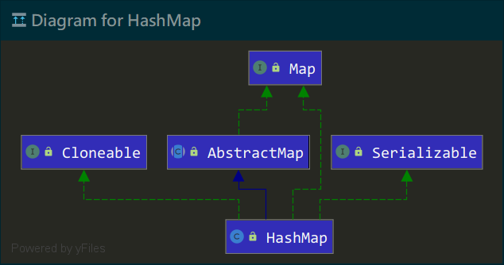
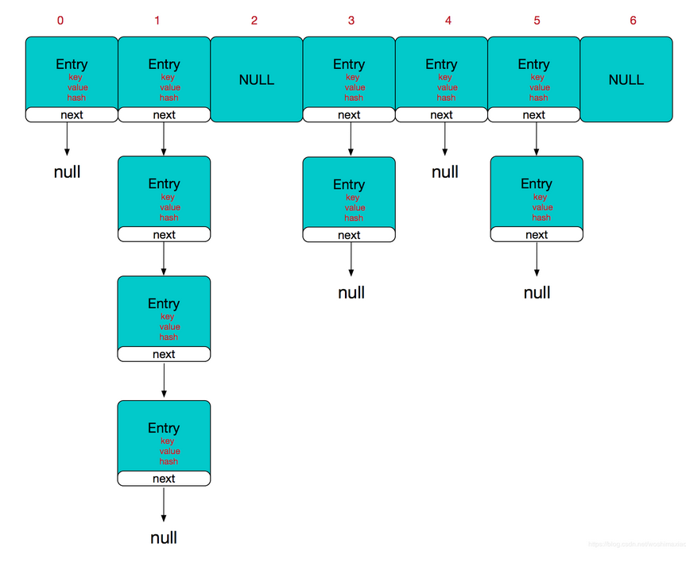

## 前言

Map，Java 三大集合框架之一，JDK1.2 时便已存在，是一个`Key-Value`键值对映射的接口，即一个`Key`对应一个`Value`。在日常开发使用中，我们常见的 Map 实现类有：HashMap、Hashtable、TreeMap、LinkedHashMap 等，用以应对不同业务情况下的数据存储与使用。而本篇的主角是 HashMap，让我们来粗浅的聊聊它吧。（注意：本篇 HashMap 的源码和原理讲解全部基于 JDK1.7）

## 基础

HashMap 是基于哈希表（Hashtable）的 Map 实现类，以`Key-Value`形式保存数据，`Key`唯一，`Value`可重复，并采用 Hash 算法确定`Key-Value`的存储位置从而保证其进行数据快速存取。类图如下：



### 结构

HashMap 的底层结构是 **数组+链表**，是通过计算`key`的`hash`值来确定数组下标位置，然后将`key`和`value`作为`Entry<K,V>`对象进行存储。这里需要注意，是作为 **Entry<K,V>** 对象存储，而不是通过`key`确定数组下标后直接存放值。`Entry<K,V>` 是 Map 的内部接口，本质上是一个映射（键值对），HashMap 类中对它有一个静态实现，如下：

```java
static class Entry<K,V> implements Map.Entry<K,V> {
    final K key;
    V value;
    Entry<K,V> next;  //链表节点中的下一个 Entry<K,V> 对象
    int hash;         //当前 Entry 对象的 hash 值
    //构造函数
    Entry(int h, K k, V v, Entry<K,V> n) {
        value = v;
        next = n;
        key = k;
        hash = h;
    }
    //其它代码省略 ...
}
```

从源码可以看出，`Entry<K,V>`对象保存了`key`、`value`、`hash值`，还保存了当前`Entry<K,V>`对象的下一个`Entry<K,V>`对象：`Entry<K,V> next`。这也是为什么 HasHMap 结构是数组+链表，数组其实就是`Entry<K,V>`类型数组，而链表则是单向的，每个节点都是一个`Entry<K,V>`对象，并保存了下一个`Entry<K,V>`节点的数据，通过一张图来简单理解下：



### 属性

HashMap 内部定义的几个主要属性如下：

- `transient Entry[] table`：`Entry<K,V>`对象数组，长度始终保持为 2 的幂次方
- `transient int size`：HashMap 已存储的元素数量
- `final float loadFactor`：负载因子，默认是 0.75，扩容时使用
- `static final int DEFAULT_INITIAL_CAPACITY`：HashMap 的默认初始容量
- `int threshold`：阈值，当 HashMap 存储的元素数量达到该值，则会触发扩容操作
- `transient int modCount`：记录 HashMap 结构修改的次数，如修改值、重新扩容等

HashMap 阈值大小计算为： **capacity(容量) \* loadFactor(负载因子) = threshold(阈值)** ，`capacity`也就是构建 HashMap 时指定的容量大小（不指定则默认为 16）。一旦 HashMap 的`size`超过阈值，就会进行扩容操作，重新调整 HashMap 的大小以便存放更多的元素。

### 常用方法

- `public int size()`：返回 HashMap 的元素数量
- `public boolean isEmpty()`：判断 HashMap 是否为空
- `public V put(K key, V value)`：存放键值对，即数据元素
- `public V get(Object key)`：通过`key`获取Value`
- `public V remove(Object key)`：通过`key`删除元素
- `public void clear()`：清空 HashMap
- `public boolean containsKey(Object key)`：判断传递的`key`在 HashMap 中是否已存在
- `public boolean containsValue(Object value)`：判断传递的`value`是否已有`key`进行映射
- `public Set keySet()`：获取所有`key`的 Set 集合
- `public Set> entrySet()`：获取所有`Entry<K,V>`的 Set 集合，可以用来遍历 HashMap

## 方法原理

接下来我们具体看看 HashMap 设值、取值、扩容、复制数据等方法的具体实现是怎么样的。

### put 方法实现

```java
public V put(K key, V value) {
    if (key == null)
        return putForNullKey(value);  //1.判断 key 是否为 Null，为 Null 直接存放在数组下标 0 的位置
    int hash = hash(key);  //2.计算 key 的 hash 值
    int i = indexFor(hash, table.length);  //3.通过 hash 值计算数组下标 index
    for (Entry<K,V> e = table[i]; e != null; e = e.next) {
        Object k;
        //4.判断 hash 值和 key 值是否相同，相同则覆盖并返回旧值
        if (e.hash == hash && ((k = e.key) == key || key.equals(k))) {
            V oldValue = e.value;
            e.value = value;
            e.recordAccess(this);
            return oldValue;
        }
    }
    modCount++;  //5.修改次数 +1
    addEntry(hash, key, value, i);  //6.将 key-value 封装为 Entry 对象并添加，
    return null;
}
static int indexFor(int h, int length) {
    return h & (length-1);  // 数组长度-1，按位与计算出下标
}
void addEntry(int hash, K key, V value, int bucketIndex) {
    //如果加入新元素超过阈值，则扩容为原来的2倍大小
    if ((size >= threshold) && (null != table[bucketIndex])) {
        resize(2 * table.length);
        hash = (null != key) ? hash(key) : 0;
        bucketIndex = indexFor(hash, table.length);
    }
    createEntry(hash, key, value, bucketIndex);  // 创建 Entry
}
void createEntry(int hash, K key, V value, int bucketIndex) {
    Entry<K,V> e = table[bucketIndex];
    //若 e 不为空，则说明发生 hash 碰撞，将 Entry 插入到链表头，将原有节点(e)作为下一个节点
    table[bucketIndex] = new Entry<>(hash, key, value, e);
    size++; //HashMap 元素数量 +1
}
```

根据上方源码总结下步骤：

1. 判断`key`是否为`null`，为`null`则直接存放到数组下标为 0 的位置；
2. 计算`key`的 hash 值并通过该值确定数组下标位置；
3. 判断`key`是否重复，重复则覆盖并返回旧值；
4. 在`addEntry()`方法判断是否需要扩容，最后将`key-value`封装为`Entry<K,V>`对象保存。

### get 方法实现

理解了`put()`方法后，`get()`方法就简单多了，直接上源码：

```java
public V get(Object key) {
    if (key == null)
        return getForNullKey();  //1.判断 key 是否 Null，为空直接获取数组下标为 0 的元素
    Entry<K,V> entry = getEntry(key);
    return null == entry ? null : entry.getValue();  //三目表达式判断
}
final Entry<K,V> getEntry(Object key) {
    int hash = (key == null) ? 0 : hash(key);  //计算 key 的 hash 值
    //2.indexFor() 计算数组下标并循环遍历该下标处的链表节点
    for (Entry<K,V> e = table[indexFor(hash, table.length)]; e != null;e = e.next) {
        Object k;
        //3.判断是否 hash 值和 key 值是否相同且不为 null，不匹配则循环判断下一节点
        if (e.hash == hash && ((k = e.key) == key || (key != null && key.equals(k))))
            return e;
    }
    return null;
}
```

步骤如下：

1. 判断`key`是否 `null`，为 `null` 直接取数组下标为 0 的元素；
2. 在`getEntry()`方法里计算`key`的`hash`值找到下标然后循环遍历判断`key`的值，存在返回值，不存在则返回`null`。

### resize/transfer 方法实现

这两个方法主要是数组扩容和数据复制，在 HashMap 中，这个过程称为 **rehashing**。源码如下：

```java
void resize(int newCapacity) {
    Entry[] oldTable = table;
    int oldCapacity = oldTable.length;  //1.获取旧数组长度
    //MAXIMUM_CAPACITY 的值为 1<<30，是 Integer.MAX_VALUE 的一半减1，已经大的夸张，基本不存在扩容情况
    //所以重新设置阈值后直接返回
    if (oldCapacity == MAXIMUM_CAPACITY) { 
        threshold = Integer.MAX_VALUE;
        return;
    }
    //2.创建一个新的数组，大小为原来的2倍
    Entry[] newTable = new Entry[newCapacity];
    //3.获取是否需要重新计算 hash
    boolean oldAltHashing = useAltHashing;
    useAltHashing |= sun.misc.VM.isBooted() &&
        (newCapacity >= Holder.ALTERNATIVE_HASHING_THRESHOLD);
    boolean rehash = oldAltHashing ^ useAltHashing;
    //4.扩容的关键方法，旧数组数据复制到新数组
    transfer(newTable, rehash);
    table = newTable;
    //5.重新计算阈值
    threshold = (int)Math.min(newCapacity * loadFactor, MAXIMUM_CAPACITY + 1);
}
void transfer(Entry[] newTable, boolean rehash) {
    int newCapacity = newTable.length;
    //遍历旧数组
    for (Entry<K,V> e : table) {
        //遍历当前节点的链表
        while(null != e) {
            Entry<K,V> next = e.next;
            //判断是否需要重新计算 hash
            if (rehash) {
                e.hash = null == e.key ? 0 : hash(e.key);
            }
            int i = indexFor(e.hash, newCapacity);  //计算数组下标
            e.next = newTable[i];  //头插法，链表头部插入，已有的节点往后移作为 next 节点
            newTable[i] = e;  //头部插入
            e = next;
        }
    }
}
```

过程理解起来也不难：

1. 创建大小为原来 2 倍的新数组；
2. 在`transfer()`方法将旧数组数据循环遍历复制到新数组（关键）；
3. 将新数组赋值给 HashMap 的`table`变量，并重新计算阈值。

理解清楚 HashMap 的设值、取值、扩容复制原理后，基本上其它方法实现都可以很容易理解了，这里就不多赘述。

## 补充

### 与 Hashtable 的区别

| HashMap   | key 允许为 Null（唯一） | 线程不安全 | 效率较高 | 继承于 AbstractMap<K,V> |
| --------- | ----------------------- | ---------- | -------- | ----------------------- |
| Hashtable | key 不为空              | 线程安全   | 效率较低 | 继承于 Dictionary<K,V>  |

Hashtable 的`key`不能为空，是因为`put()`方法里作了判断，为空直接抛出 NPE 异常；而它之所以是线程安全，通过源码可知是因为内部方法都加上了 `Synchronize`同步锁，但`Synchronize`是重量级锁，容易引起线程上下文切换而带来线程调度的开销，因此在多线程并发应用中使用是比较少的，推荐使用 ConcurrentHashMap，其采用的是分段锁，效率比 Hashtable 要高出许多。

### HashMap 死链问题

HashMap 死链是指在 Java 并发情况下，多线程操作 HashMap 产生 Race Condition(竞用条件)，而此时 HashMap 刚好需要扩容，导致旧数据复制到新数组产生死循环。简单讲就是链表中 A(Entry) 的 next 属性指向 B(Entry)，而 B 的 next 属性又指向 A。

关于死链具体情况，在[左耳朵耗子-陈皓的《疫苗：Java HashMap的死循环》](https://coolshell.cn/articles/9606.html)这篇里讲解的非常清楚，很清晰易懂。并且死链情况在 Java 8 中已经得到解决，在 Java 8 版本开始，HashMap 的结构就变为了 **数组+链表+红黑树**，后续新篇章也会对 Java 8 的 HashMap 作下介绍讲解。

## 总结

最后来概括下 HashMap 的工作原理：当通过`put()`方法存值时会调用`key.hashCode()`计算哈希值从而获取数组下标，并将`Key-Value`作为 Entry<K,V> 对象进行存储，调用`get()`方法时同样计算`key`的哈希值然后获取数组下标，然后通过 `key.equals()`判断值是否相同，最终返回结果。当存值时若元素数量大于阈值`threshold`则进行扩容，大小为原来的2倍。

Java 8 前的 HashMap 原理并不复杂，至于其它的一些细枝末节，在理解了上面的内容后，自己去查看源码学习，就会很轻松了。
