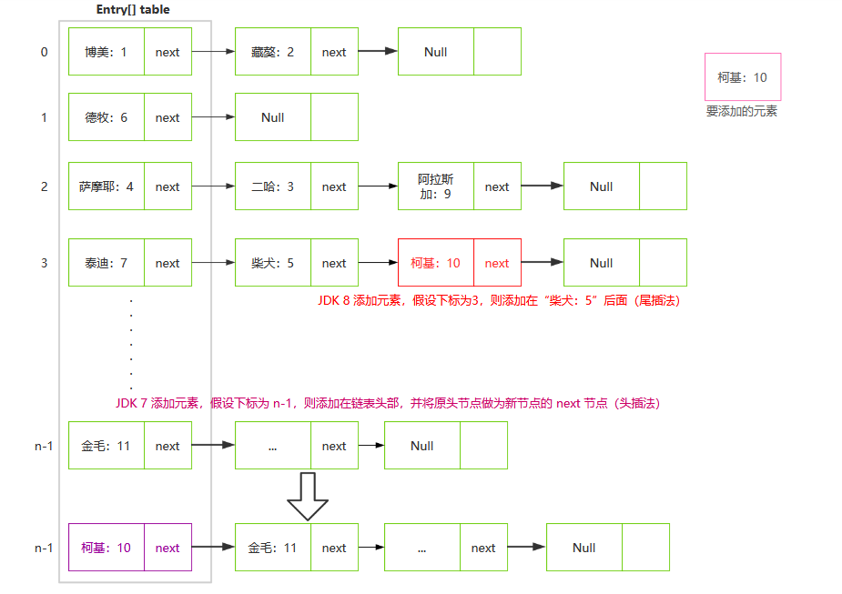
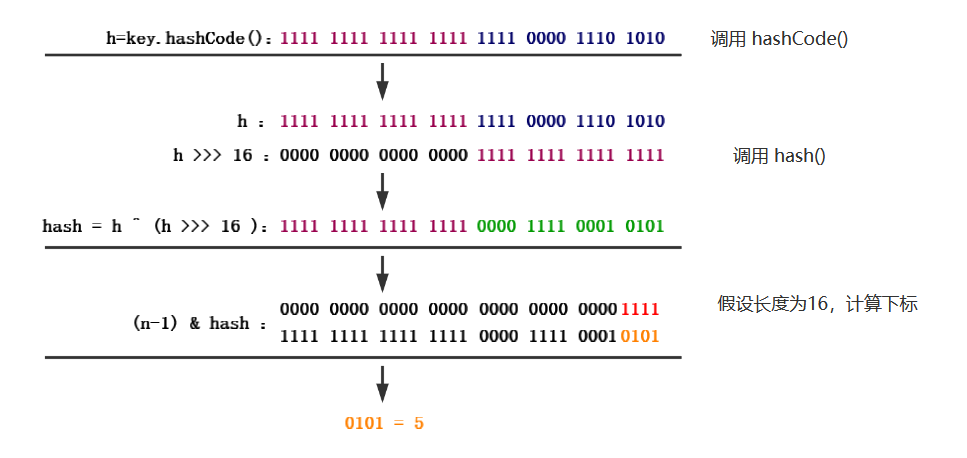
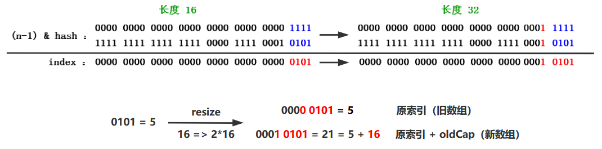
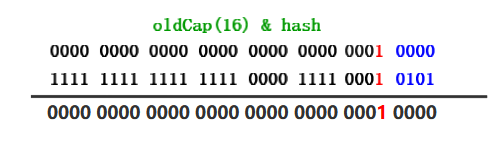

## 前言

在[聊聊 HashMap 篇](./jdk7-HashMap.md)中，通过 JDK1.7 的 HashMap 的几个方法：`put()、get()、resize()/transfer()`讲解了其原理，在最后简单描述了 HashMap 死链问题。引出了在 Java 8 中，HashMap 底层结构变化为 **数组+链表+红黑树**，提高了查询效率，并解决了死链问题。我们就以此作为切入点，来看看 HashMap 在 Java 8 版本有了哪些变化。

## 死链原因和解决方法

Java 8 之前的 HashMap 并发扩容出现死链，原因之一是链表节点的存储方式引起，即 **头插法**。每当添加新元素时，都是放在链表头节点，原头节点就变成新节点的 next 节点。这就导致了并发扩容时，若链表元素 rehash 后依旧在同一个数组下标位置，则链表元素会出现逆序（或翻转），即 A-B-C 变成 C-B-A。另一个是因为复制数据是在 while 循环里遍历一个节点就插入到新的数组位置，假设有两个线程，线程一获取到 A 节点以及下一节点 B 后就被阻塞，而线程二直接完成了扩容操作，链表变成 C-B-A，当线程一恢复运行后，B 的下一节点又变成 A，死链就出现了。

再次贴上复制数据的方法源码，方便大家回顾：

```java
// JDK 7 源码
void transfer(Entry[] newTable, boolean rehash) {
    int newCapacity = newTable.length;
    for (Entry<K,V> e : table) {
        while(null != e) {
            Entry<K,V> next = e.next;
            if (rehash) {
                e.hash = null == e.key ? 0 : hash(e.key);
            }
            int i = indexFor(e.hash, newCapacity); 
            e.next = newTable[i];
            newTable[i] = e;
            e = next;
        }
    }
}
```

而在 Java 8 中则更改为 **尾插法**，即添加的新元素会放在链表尾节点，这样在扩容时就不会出现元素逆序的情况，并且在扩容方法的 while 循环复制数据中，是将索引下标处的链表节点全部遍历获取后，再存入到新数组中，这样就避免了死链问题。关于其逻辑实现在下面会讲到，可以先看下图简单对比头插法和尾插法：



## 结构变化

Java 8 中，HashMap 底层结构变为 **数组+链表+红黑树**，显著提高了查询效率。在 HashMap 中，获取元素可以简单分为以下两步：

- 根据`key.hashCode()`获取 hash 值，然后确定数组下标 index；
- 若数组下标位置节点`key`不匹配，则遍历链表，通过`key.equals()`查找。

在 Java 8 之前只是用链表解决冲突问题，在发生碰撞问题时，这两步获取元素的时间复杂度为 O(1)+O(n)。因此，当碰撞频率高时 n 变大，查询速度就会受到影响。在 Java 8 中则利用红黑树替代链表，而红黑树是一种自平衡的二叉查找树，如此一来，获取元素的时间复杂度就变为 O(1)+O(log n)，在 n 变大时，能够理想地解决查询效率变低的问题。

### 链表与红黑树转换时机

当发生哈希碰撞时，首先用链表存储，当链表节点数量大于等于 8 时，就会转换为红黑树，而一旦节点数量小于等于 6，红黑树又会转换为链表。当节点数量达到 8 时，红黑树的平均查找时间为 3(log 8)，而链表则为 4(8/2)，这才有了转换的必要。而选择 6 和 8，中间存在差值 7，是假设当链表长度大于小于 8 时，红黑树和链表就互相转换，若 HashMap 存储的元素数量在 8 徘徊，频繁增删，红黑树和链表就会频繁转换，效率将会降低。

```java
static final int TREEIFY_THRESHOLD = 8;   //HashMap 默认的转换为红黑树的节点阈值
static final int UNTREEIFY_THRESHOLD = 6; // 默认的转换为链表的节点阈值
```

## 原理解析

### Node<K,V> 和 TreeNode<K,V>

在 Java 8 之前，`key-value`是用`Entry<K,V>`对象保存，Java 8 中则变为`Node<K,V>`，但其内部方法实现基本相同，依旧实现`Map.Entry<K,V>`接口，下面是源码：

```java
static class Node<K,V> implements Map.Entry<K,V> {
    final int hash;
    final K key;
    V value;
    Node<K,V> next;
    Node(int hash, K key, V value, Node<K,V> next) {
        this.hash = hash;
        this.key = key;
        this.value = value;
        this.next = next;
    }
    // ...其它代码省略...
}
```

重要的是内部静态类增加了`TreeNode<K,V>`，该类也就是红黑树节点对象，在下面源码中，`TreeNode<K,V>`类是继承`LinkedHashMap.Entry<K,V>`类，而进入该类，可以看到其实也是继承`HashMap.Node<K,V>`类，并含有`before、after`两个属性，但`TreeNode<K,V>`本身并没有直接使用到这两个属性，只是维护了双向链表的应用，便于在红黑树和链表之间进行转换：

```java
static final class TreeNode<K,V> extends LinkedHashMap.Entry<K,V> {
    TreeNode<K,V> parent;  // 红黑树根节点
    TreeNode<K,V> left;    // 左节点
    TreeNode<K,V> right;   // 右节点
    TreeNode<K,V> prev;    // 当前节点的前一节点
    boolean red;           // 是否为红色节点
    TreeNode(int hash, K key, V val, Node<K,V> next) {
        super(hash, key, val, next);  // 调用父类的构造方法
    }
    // ...其它代码省略...
}
// LinkedHashMap.Entry<K,V> 的实现
static class Entry<K,V> extends HashMap.Node<K,V> {
    Entry<K,V> before, after;
    Entry(int hash, K key, V value, Node<K,V> next) {
        super(hash, key, value, next);  // 调用父类 HashMap.Node<K,V> 的构造方法
    }
}
```

### put 方法

依旧是从`put()`方法开始，直接上源码：

```java
public V put(K key, V value) {
    // 1、获取 key 的 Hash 值
    return putVal(hash(key), key, value, false, true);  
}
final V putVal(int hash, K key, V value, boolean onlyIfAbsent,boolean evict) {
    Node<K,V>[] tab; Node<K,V> p; int n, i;
    // 2、判断 table 是否为空，为空则创建
    if ((tab = table) == null || (n = tab.length) == 0)  
        n = (tab = resize()).length;
    // 3、计算数组下标，判断该位置是否为空，为空直接添加
    if ((p = tab[i = (n - 1) & hash]) == null)  
        tab[i] = newNode(hash, key, value, null);
    else {
        Node<K,V> e; K k;
        // 4、判断 hash 值和 key 是否相同，相同赋值给 e
        if (p.hash == hash && ((k = p.key) == key || (key != null && key.equals(k))))
            e = p;
        // 5、若为树节点，执行 putTreeVal() 添加
        else if (p instanceof TreeNode)  
            e = ((TreeNode<K,V>)p).putTreeVal(this, tab, hash, key, value);
        else {
            // 6、遍历链表，尾插法
            for (int binCount = 0; ; ++binCount) {
                // 6.1、next 节点为空直接添加
                if ((e = p.next) == null) {  
                    p.next = newNode(hash, key, value, null); 
                    // 6.2、当链表节点数量 >= 8 则转换为红黑树
                    if (binCount >= TREEIFY_THRESHOLD - 1) // -1 for 1st
                        treeifyBin(tab, hash);  
                    break;
                }
                // 6.3、next 节点不为空，则判断是否与当前遍历节点相同
                if (e.hash == hash && 
                    ((k = e.key) == key || (key != null && key.equals(k))))
                    break;
                p = e;  
            }
        }
        // 7、e 不为空则进行覆盖并返回旧值
        if (e != null) { // existing mapping for key
            V oldValue = e.value;
            // 7.1、onlyIfAbsent 表示是否覆盖已存在的值
            // put()默认传递 false 覆盖， putIfAbsent()传递 true 不覆盖
            if (!onlyIfAbsent || oldValue == null)
                e.value = value;
            afterNodeAccess(e);
            return oldValue;
        }
    }
    ++modCount;
    if (++size > threshold)   // 8、判断是否超过阈值，超过则扩容 
        resize();
    afterNodeInsertion(evict);
    return null;
}
```

总结下步骤：

1. 获取`key`的 hash 值，然后进入`putVal()`方法，若 table 为空则先创建；
2. 计算数组下标，判断下标处元素，若为空直接新增，不为空先判断`key.equals(k)`；
3. 不同说明发生碰撞，判断是否为树节点，是则调用`putTreeVal()`新增树节点；
4. 若是链表节点，则遍历到链表尾部判断，当节点不存在则新增（尾插法）；
5. 如果链表长度大于等于`TREEIFY_THRESHOLD`，就将链表转换为红黑树；
6. 若节点已经存在,则替换旧值`oldValue`并返回；
7. 最后判断容量若大于阈值，就进行扩容`resize()`。

### get 方法

```java
public V get(Object key) {
    Node<K,V> e;
    return (e = getNode(hash(key), key)) == null ? null : e.value;
}
final Node<K,V> getNode(int hash, Object key) {
    Node<K,V>[] tab; Node<K,V> first, e; int n; K k;
    // 1、获取数组下标位置第一个节点，命中则直接返回
    if ((tab = table) != null && (n = tab.length) > 0 &&
        (first = tab[(n - 1) & hash]) != null) {
        if (first.hash == hash && // always check first node
            ((k = first.key) == key || (key != null && key.equals(k))))
            return first;
        // 2、若为树节点则调用 getTreeNode() 去获取
        if ((e = first.next) != null) {
            if (first instanceof TreeNode)
                return ((TreeNode<K,V>)first).getTreeNode(hash, key);
            // 4、若为链表则遍历判断
            do {  
                if (e.hash == hash &&
                    ((k = e.key) == key || (key != null && key.equals(k))))
                    return e;
            } while ((e = e.next) != null);
        }
    }
    return null;
}
```

获取元素的逻辑还是比较简单，步骤如下：

1. 计算`key`的 hash 值找到数组下标，若下标处第一个节点匹配则返回；
2. 若有冲突，判断是树节点还是链表节点，然后通过`key.equals(k)`查找匹配的节点。

### Hash 方法

在新增和获取过程中，计算下标时，先对 key 的哈希值进行 hash 操作，再进一步计算下标，如下图所示：



对`key.hashCode()`的 hash 操作实现如下：

```java
static final int hash(Object key) {
    int h;
    return (key == null) ? 0 : (h = key.hashCode()) ^ (h >>> 16);
}
// 计算下标方式：(n-1) & hash
```

在 Java 8 之前原本是直接 & 运算获取下标，但一般情况下 HashMap 长度都小于 2^16，这就导致 & 运算的一直是哈希值的低 16 位甚至更低，假设长度为 16，则下标运算的结果取决于哈希值的低 4 位（即长度为 2 的 n 次方，位运算结果取决于低 n 位）。为了让哈希值的低 16 位更随机，便让哈希值与高 16 位（h >>> 16）进行异或运算，以让低 16 位更随机散列，减少碰撞。

### resize 方法

在`resize()`方法上有这么一段注释：

> Initializes or doubles table size. If null, allocates in accord with initial capacity target held in field threshold. Otherwise, because we are using power-of-two expansion, the elements from each bin must either stay at same index, or move with a power of two offset in the new table.

其意思大概就是初始化或增加数组大小，如果数组本就为空，则按默认值进行初始化，否则，因为使用的是 2 次幂扩展（即原来大小的 2 倍），元素存放在新数组要么是原位置，要么是原位置加上 2 次幂。搭配一张图来看就会很好理解：



因为扩容为`n << 1`，即 2 倍，所以 n-1 就是在高位多 1 bit（红色），若多出的高位 bit 经过 & 运算为 1，则元素 index 变为 **原索引+原数组容量(即 2 次幂)，为 0 则不需要变化**。因此扩容时不需要重新计算 hash 值，只需要在 **原 hash 值跟原数组长度 & 运算** 后判断是否等于 0 来确定是否需要移动即可。举个例子，假设数组长度原本是 16，`n(16) -1 = 0000 1111，n(16) = 0001 0000`，因为扩容后 `n(32)-1 = 0001 1111`，高位多 1 bit ，所以直接同 16 进行 & 运算效果相当于只跟高位 bit 进行位运算，如下图：



来看下`resize()`方法的源码，在 6.3 处就体现了上面说的元素是否需要移动的判断：

```java
final Node<K,V>[] resize() {
    Node<K,V>[] oldTab = table;
    int oldCap = (oldTab == null) ? 0 : oldTab.length;
    int oldThr = threshold;
    int newCap, newThr = 0;
    if (oldCap > 0) {
        // 1、若是超过最大值，则不扩容，任由其碰撞了
        if (oldCap >= MAXIMUM_CAPACITY) {
            threshold = Integer.MAX_VALUE;
            return oldTab;
        }
        // 2、不超过最大值则扩容为原来的 2 倍
        else if ((newCap = oldCap << 1) < MAXIMUM_CAPACITY 
                 && oldCap >= DEFAULT_INITIAL_CAPACITY)
            newThr = oldThr << 1; // double threshold
    }
    // 3、若无数据，则用初始化阈值赋值
    else if (oldThr > 0) // initial capacity was placed in threshold
        newCap = oldThr;
    // 4、若无数据并且阈值为 0，则使用默认值设置
    else {               // zero initial threshold signifies using defaults
        newCap = DEFAULT_INITIAL_CAPACITY;
        newThr = (int)(DEFAULT_LOAD_FACTOR * DEFAULT_INITIAL_CAPACITY);
    }
    // 5、若新数组未设置阈值，则进入此处计算新的 threshold
    if (newThr == 0) {
        float ft = (float)newCap * loadFactor;
        newThr = (newCap < MAXIMUM_CAPACITY && 
                  ft < (float)MAXIMUM_CAPACITY ? (int)ft : Integer.MAX_VALUE);
    }
    threshold = newThr;
    @SuppressWarnings({"rawtypes","unchecked"})
    Node<K,V>[] newTab = (Node<K,V>[])new Node[newCap];
    table = newTab;
    if (oldTab != null) {
        // 6、遍历旧数组复制数据
        for (int j = 0; j < oldCap; ++j) {
            Node<K,V> e;
            if ((e = oldTab[j]) != null) {
                oldTab[j] = null;
                // 6.1、若当前节点没有冲突，则计算新的数组下标直接存值
                if (e.next == null)
                    newTab[e.hash & (newCap - 1)] = e;
                // 6.2、若为树节点，则调用 TreeNode.split()
                else if (e instanceof TreeNode)
                    ((TreeNode<K,V>)e).split(this, newTab, j, oldCap);
                else { // preserve order
                    // 6.3、以下部分是遍历链表节点进行复制，并判断节点在新数组的位置
                    // loHead：不需要改变位置的链表头节点，hiHead：需要改变位置的链表头节点
                    // loTail 和 hiTail 则是对应链表尾节点
                    Node<K,V> loHead = null, loTail = null; 
                    Node<K,V> hiHead = null, hiTail = null; 
                    Node<K,V> next;
                    do {
                        next = e.next;
                        // 6.3.1、为 0 说明原索引位置存值
                        if ((e.hash & oldCap) == 0) {
                            if (loTail == null)
                                // 6.3.2、尾节点为空，则链表为空，头节点指向当前遍历节点 e(仅第一次)
                                loHead = e;  
                            else
                                // 6.3.3、尾节点不为空，则链表存在，将尾节点指向当前遍历节点 e
                                loTail.next = e;  
                            // 6.3.4、将尾节点指向当前遍历节点 e
                            loTail = e; 
                        }
                        // 6.3.5、不为 0 说明新位置是原索引 + oldCap(旧容量)
                        else {
                            // 与上面同理
                            if (hiTail == null)
                                hiHead = e;
                            else
                                hiTail.next = e;
                            hiTail = e;
                        }
                    } while ((e = next) != null);
                    // 6.3.6、判断两个尾节点，不为空说明链表存在，将头节点保存在相应位置
                    if (loTail != null) {
                        loTail.next = null;
                        newTab[j] = loHead;
                    }
                    if (hiTail != null) {
                        hiTail.next = null;
                        newTab[j + oldCap] = hiHead;
                    }
                }
            }
        }
    }
    return newTab;
}
```

扩容方法实现逻辑重点在于复制数据的 for 循环中，简单分为以下几步：

1. 若当前遍历的节点元素位置没有冲突，则直接计算新的数组下标存值；
2. 若为树节点，调用`TreeNode.split()`方法进行具体操作；
3. 若为链表节点则进行遍历，通过元素原 hash 值与旧数组长度 & 运算判断位置是否需要移动，采用两个头节点和两个尾节点保存元素构成链表，再将链表头节点存放到新数组的相应位置。

### 关于红黑树

在上面内容中，基本侧重于 HashMap 整体的实现逻辑描述，而红黑树相关的内容，如新增树节点、链表红黑树互转等则讲解不多。主要是因为红黑树结构、以及树节点平衡被打破后的处理情况等内容比较复杂，讲解起来会很啰嗦冗余，而且对不了解红黑树的读者会很不友好。此处附上文章：[程序员小灰 - 什么是红黑树](https://mp.weixin.qq.com/s?__biz=MzIxMjE5MTE1Nw==&mid=2653204996&idx=2&sn=ecf932d2db8cb6e4fcb841a2b6a5bfba&chksm=8c99c0debbee49c86dc8e82a2d195389a93e81d8e5ca8af7d4dd2eec5c7fe209038c91444964&mpshare=1&scene=24&srcid=07284ysfV7Mf8UMWAqao5q2v&sharer_sharetime=1595941410657&sharer_shareid=2106bba09b5abfc873194b5d55f67e10&ascene=1&devicetype=Windows+10+x64&version=62090529&nettype=WIFI&abtest_cookie=AAACAA%3D%3D&lang=zh_CN&exportkey=A0RsTpy5SHJ9BqYDO0u%2B%2BzY%3D&pass_ticket=oZfz1KLaWxt08jIutur8xfCm%2FcOmg9fMk3u3G8h4kj3Cyu3oeS6Sqm%2FrsLy5pYtL&wx_header=1&key=a7754f0084d81be84097902b44c6d4489e89fd86ebc21cee5cf9715c7f6b1d393d9a25f294ea9d726b9a2e3cd9fa11e7a607080729363427c9171742dae8a1f92742904f9baaf5effb092c8ed7362e7c&uin=MjUwNjQ0NzYxOQ%3D%3D)，供感兴趣的读者学习下红黑树的相关知识（已会可忽略），结合上面对于 HashMap 的原理解析，再去查看关于红黑树操作的源码，理解起来就会比较轻松了 (●ˇ∀ˇ●) 。

## 尾声

Java 8 HashMap 原理宏观上跟以前的思路差不多，主要是在新增、获取、删除元素和扩容等方法增加了对红黑树节点的判断，重要的变化可以简单归纳为：**底层结构新增红黑树、链表存储方式变为尾插法，hash() 方法优化**。而这些改变对 HashMap 性能提升影响是比较大的，在[Java 8 中 HashMap 的性能提升](https://developer.aliyun.com/article/116831)一文中含有性能测试的结果。

在实际开发中，HashMap 使用是非常频繁的，掌握原理，有助于我们在使用时，若遇到异常 Bug，可以快速定位、解决问题，并且 HashMap 也是面试经典问题了。