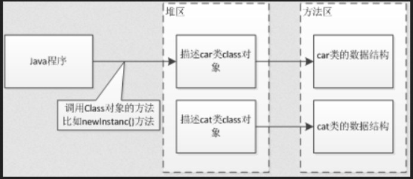
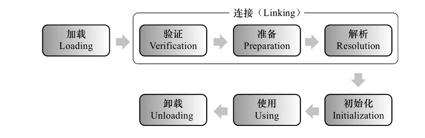
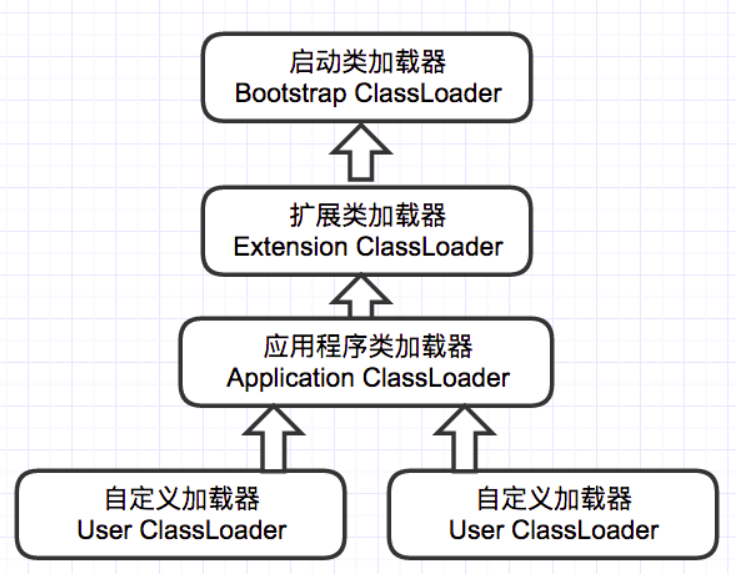

在 [JVM-内存模型](./jvm-memory-model.md) 篇已经详细讲解了 JVM 内存模型的结构，如果想先了解 JVM 的内存模型，可以戳一下链接先去看看哦。这一篇，我将着重描述 Java 类加载机制，在 JVM 中类的加载到底经历了哪些过程。

## 什么是类的加载

类的加载指的是将类的 `.class` 文件中的二进制数据读入到内存中，将其放在 JVM 运行时数据区的方法区内，然后在堆区创建一个`java.lang.Class`对象，用来封装类在方法区内的数据结构。类的加载的最终结果是位于堆区中的 Class 对象，Class 对象封装了类在方法区内的数据结构，并提供了访问方法区内的数据结构的接口。

我们可以简单看张图理解下：



从图片我们知道，类加载完毕后，类的数据全部都存放在 JVM 的方法区，堆区只是提供了一个入口去调用相应的对象数据，比如`Class.newInstance()`，所以到这里，我们也能理解为什么 Java 对象都存放在堆区的原因。

类加载器并不需要等到某个类被“首次主动使用”时再加载它，JVM 规范允许类加载器在预料某个类将要被使用时就预先加载它，如果在预先加载的过程中遇到了`.class`文件缺失或存在错误，类加载器必须在程序首次主动使用该类时才报告错误（LinkageError 错误），如果这个类一直没有被程序主动使用，那么类加载器就不会报告错误。（此段引用于 [纯洁的微笑-Java 类加载机制](http://www.ityouknow.com/jvm/2017/08/19/class-loading-principle.html)）

## 类的加载过程

如下图所示，JVM 类加载主要经历五个部分：加载、连接、初始化、使用、卸载。接下来一一讲解每个部分都做了什么。



### 加载

加载是类加载过程的第一个阶段，主要是查找并加载类的二进制数据，而这一阶段也就会在堆区生成一个 `java.lang.Class` 对象，作为入口用于访问该对象在方法区里的数据结构。而且这一步也是可控的，我们可以使用默认的类加载器，也可以自定义类加载器对 Java 文件进行加载（关于 [类加载器](#classLoader) 👈下面有做简单介绍）。

### 连接

连接细化分下来，其实有三步，分别为以下三个部分：

#### 验证：确保被加载的类的正确性

这是连接的第一步，判断当前 Class 文件的字节流信息是否符合当前 JVM 规范要求，大致会进行以下四个部分的验证：

- 文件格式验证：验证字节流是否符合 Class 文件格式的规范
- 元数据验证：对字节码描述的信息进行语义分析，以保证其描述的信息符合 Java 语言规范的要求
- 字节码验证：通过数据流和控制流分析，确定程序语义是合法的、符合逻辑的
- 符号引用验证：确保”解析”动作能正确执行

#### 准备：为类的静态变量分配内存，并将其初始化为默认值

这一步主要是在方法区中为类变量分配内存，并初始化类变量的值。

比如声明如下，`value`的值在准备阶段会被初始化为 0，而不是 80，即数据类型的默认初始值，实际值的初始化会在 **初始化** 阶段（下面会讲到）：

```java
public static int value = 80;
```

但如果是下面的声明方式，则会直接赋值为 8080，在编译阶段会为 `value` 生成 ConstantValue 属性，并在准备阶段赋值为 8080：

```java
public static final int value = 8080;
```

#### 解析：把常量池内的符号引用转换为直接引用

主要针对类或接口、字段、类方法、接口方法、方法类型、方法句柄和调用点限定符七类符号引用，符号引用类型常见如下：

- CONSTANT_Class_info
- CONSTANT_Field_info
- CONSTANT_Method_info

**符号引用**：一组符号来描述目标，可以是任何字面量，它与虚拟机实现的布局无关，引用的目标并不一定要已经加载到内存中。各种虚拟机实现的内存布局可以各不相同，但是它们能接受的符号引用必须是一致的，因为符号引用的字面量形式明确定义在 Java 虚拟机规范的 Class 文件格式中。

**直接引用**：就是直接指向目标的指针、相对偏移量或一个间接定位到目标的句柄，当有了直接引用，就说明引用的目标在内存已经存在。

### 初始化

为类的静态变量赋予正确的初始值，JVM 负责对类进行初始化，主要对类变量进行初始化，Java 中为类变量进行初始值设定有两种方式：(1) 声明类变量时指定值；(2) 在静态代码块赋值。

**初始化的步骤如下**：

1. 假如这个类还没有被加载和连接，则程序先加载并连接该类
2. 假如该类的直接父类还没有被初始化，则先初始化其直接父类
3. 假如类中有初始化语句，则系统依次执行这些初始化语句

类初始化其实是执行类构造器方法的过程，编译器会自动收集类中的类变量赋值操作和静态代码块的语句合并而成，并且 JVM 会保证子构造器方法执行前，父类构造器已经执行完毕。如果一个类中既没有类变量也没有静态代码块，那么编译器可以不为这个类生成构造器方法。

**而初始化只有在对类的主动使用时才会触发，触发方式大概有以下几种**：

- 创建类的实例，也就是 new 的方式
- 访问某个类或接口的静态变量，或者对该静态变量赋值
- 调用类的静态方法反射（如`Class.forName("com.Test")`）
- 初始化某个类的子类，则其父类也会被初始化
- Java 虚拟机启动时被标明为启动类的类，直接使用 java.exe 命令来运行某个主类

**不会触发类初始化的情况如下**：

- 通过子类引用父类的静态字段，只会触发父类的初始化，而子类不会初始化
- 定义数组对象，不会触发该类的初始化
- 常量在编译期间会存入调用类的常量池，但本质上并没有直接引用定义常量的类，所以也不会触发初始化
- 通过类名获取 Class 对象（`Test.Class`），不会触发
- 通过`Class.forName()`加载指定类时，如果指定参数`initialize`为 false ，不会触发类初 始化，因为该参数是告诉虚拟机是否要对类进行初始化

## <a id="classLoader">类加载器</a>

类加载经过 **初始化** 这一步后，就已经可以正常使用，这个过程走下来，其实在最初的 **加载** 这一步开发者可以控制外，其它都是由 JVM 自行完成。而控制加载过程，则需要使用到类加载器。

我们先简单了解下 JVM 提供的三种类加载器，如下图所示：



- **启动类加载器(Bootstrap ClassLoader)** ：负责加载 JAVA_HOME\lib 目录中的，或通过 -Xbootclasspath 参数指定路径中的，且被 虚拟机认可（按文件名识别，如 rt.jar）的类。
- **扩展类加载器(Extension ClassLoader)** ：负责加载 JAVA_HOME\lib\ext 目录中的，或通过 java.ext.dirs 系统变量指定路径中的类库。
- **应用程序类加载器(Application ClassLoader）**：负责加载用户路径（classpath）上的类库。

### 双亲委派模型

在上面类加器图中我们可以看到，当一个类加载器收到类加载任务，会先交给其父类加载器去完成，因此最终加载任务都会传递到顶层的启动类加载器，只有当父类加载器无法完成加载任务时，才会尝试执行加载任务。这样子的好处是保证了使用不同的类加载器最终得到的都是同样一个 Object 对象。

而类加载器存在以下机制：

- **全盘负责**：当一个类加载器负责加载某个 Class 时，该 Class 所依赖的和引用的其他 Class 也将由该类加载器负责载入，除非显示使用另外一个类加载器来载入。
- **父类委托**：先让父类加载器试图加载该类，只有在父类加载器无法加载该类时才尝试从自己的类路径中加载该类。
- **缓存机制**：缓存机制将会保证所有加载过的 Class 都会被缓存，当程序中需要使用某个 Class 时，类加载器先从缓存区寻找该 Class，只有缓存区不存在，系统才会读取该类对应的二进制数据，并将其转换成 Class 对象，存入缓存区。这就是为什么修改了 Class 后，必须重启 JVM，程序的修改才会生效。

### 自定义类加载器

当然，如果有需要，我们也可以自定义类加载器，只要 **继承 ClassLoader 并重写其 loadClass() 方法**，然后编写加载的具体逻辑代码即可。但这里有个要注意的点，如果直接重写 **loadClass()** 方法，有可能会破坏原本的双亲委派模型哦，具体如何避免该问题，就得查看浏览下 **loadClass()** 方法的源码了。而自定义实现类加载器的有 Tomcat、Java 代码生成器之类的案例，有兴趣的读者也可了解下。

## 总结

本篇主要讲解 JVM 类加载机制，意在让读者明白 Java 文件编写后 JVM 是如何处理并正确使用，并理解类加载器的执行机制。当然本篇并不算全面细致的讲解，也有忽略的细节，如 **连接-验证** 步骤若是反复验证影响了加载效率该如何做，启动类加载器无法被 Java 程序直接引用等问题。

但事无巨细，很多问题都是在某些情况下触发，都是要读者们在实际应用中去注意、发现并解决这些问题，久而久之，不仅问题解决了，还能更深入的理解其核心原理。

## 参考资料

- 《[深入理解Java虚拟机](https://book.douban.com/subject/6522893/)》第7章 / 周志明 / 机械工业出版社