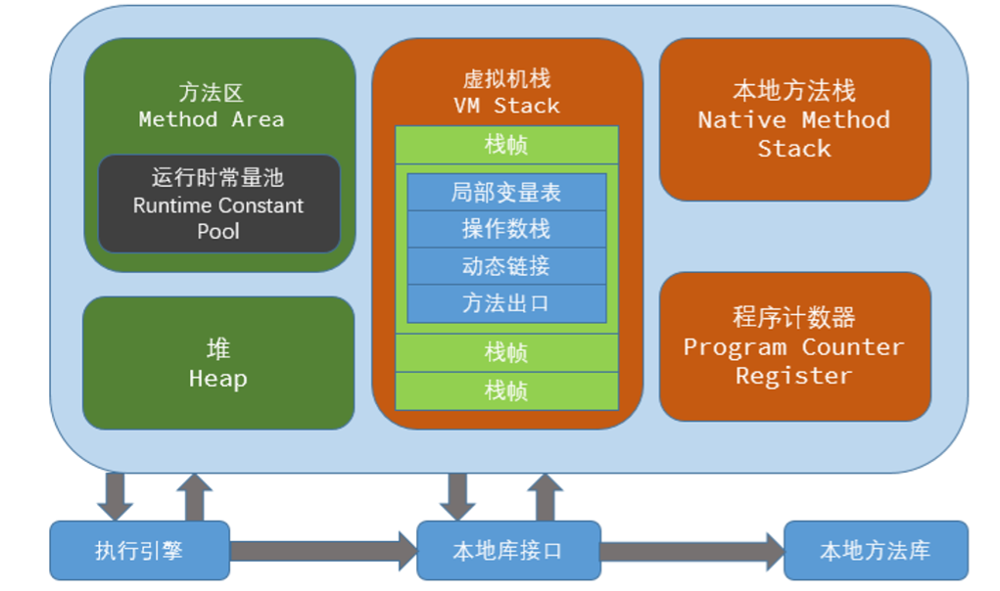
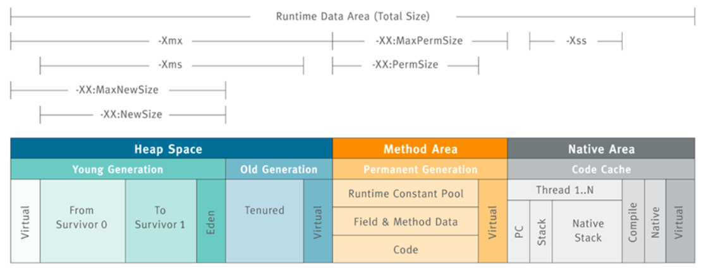

## 什么是 JVM

### 概念

JVM 是 **Java Virtual Machine**（Java 虚拟机）的缩写，是一种用于计算设备的规范、能够运行 Java 字节码的虚拟机，拥有自己完善的硬体架构，如处理器、堆栈、寄存器等，还具有相应的指令系统。

引入 Java 虚拟机后，Java 语言开发的程序在不同平台上运行时不需要重新编译。JVM 屏蔽了与具体操作系统平台相关的信息，使得 Java 程序只需生成在 JVM 上运行的字节码（.class），就可以在多种平台上不加修改地运行。对于 JVM，除了 Oracle，也有其它的开源或闭源实现。（摘自[维基百科](https://yudi-corgi.github.io/2020/07/08/JVM-内存模型/[https://zh.wikipedia.org/wiki/Java虚拟机](https://zh.wikipedia.org/wiki/Java虚拟机))）

### 理解

Java 是一门可跨平台的语言，但其本身并不能跨平台，而是通过 JVM 来实现。是通过 JVM 将编译好的文件解释成平台系统（Mac、Linux、Windows 等）可执行的机器码，然后系统加以运行，实现 **“一次编译，到处运行”** 的效果。

学习 JVM，可以围绕四个部分进行：

- 类的加载机制
- 内存模型
- GC 算法、垃圾回收
- GC 分析、命令调优

本篇着重于 JVM 内存模型的讲解，作为 Java 开发人员，平常或多或少会有这样的疑问，堆内存空间应当设置多大？OOM（OutOfMemoryError）异常到底涉及了运行时数据内存哪块区域？JVM 内存调优从哪里入手？

在理解了 JVM 内存模型后，我们就可以知道，平常编写的 Java 文件信息是如何被 JVM 管理、存放，Java 方法执行时生成的变量、返回结果等 JVM 又是如何操作，堆内存大小如何设置等等。

## JVM 内存模型

Java 程序的开发，并不需要像 C/C++ 开发一样时刻关注内存的释放，而是全权交由 JVM 去管理，JVM 内存模型主要是指运行时内存模型，分为 **线程私有** 和 **线程共享** 数据区两大类：

- 线程私有：程序计数器、虚拟机栈、本地方法栈；
- 线程共享：Java 堆（Heap）、方法区（包含运行时常量池）。

线程私有数据区域生命周期与线程相同，依赖用户线程的启动（结束）而创建（销毁）；线程共享数据区域则随虚拟机的启动（关闭）而创建（销毁）。

JVM 内存模型结构图（绿色共享，橙色私有）：

### 程序计数器（私有）

程序计数器是一块较小的内存空间，是当前线程所执行的字节码的行号指示器，每个线程都有一个独立的计数器，互不影响。通过该计数器，JVM 解释器就知道下一步要执行的字节码指令位置，而分支、循环、跳转、异常处理、线程恢复等基础功能也都依赖于该计数器来实现。

如果线程正在执行的是一个 Java 方法，则计数器记录的是正在执行的虚拟机字节码指令的地址，若为 Native 方法，则计数器的值为空（Undefined），并且该内存区域是唯一一个在虚拟机中没有规定任何 OOM 异常情况的区域。

### 虚拟机栈（私有）

是描述 Java 方法执行的内存模型，每个方法（不含 Native）在执行时都会创建一个栈帧，方法执行过程，就对应着虚拟机栈的入栈到出栈的过程。（现在明白平常用 IDE 调试时点击 Drop Frame 是回退到方法执行前的原因了吧 (●’◡’●)）

#### 栈帧（Stack Frame）结构

- 局部变量表
- 操作栈
- 动态链接
- 方法返回地址
- 额外附加信息

栈帧是用来存储数据和部分过程结果的数据结构，同时也被用来处理动态链接、方法返回值和异常分派（Dispatch Exception）。栈帧随着方法调用而创建，随着方法结束而销毁——无论方法是正常完成还是异常完成（抛出了在方法内未被捕获的异常）都算作方法结束。

#### 异常（Exception）

JVM 规范规定该区域有两种异常：

- **StackOverFlowError**：当线程请求栈深度超出虚拟机栈所允许的深度时抛出；
- **OutOfMemoryError**：当 JVM 动态扩展到无法申请足够内存时抛出。

### 本地方法栈（私有）

本地方法栈的作用其实与虚拟机栈类似，区别只在于 **本地方法栈是为 Native 方法 服务**，**而虚拟机栈是为 Java 方法 服务**。虚拟机规范中对本地方法栈中的方法使用的语言、方式与数据结构并没有强制规定，因此具体的虚拟机可以自由实现它。有的虚拟机实现也将本地方法栈和虚拟机栈合并，如 HotSpot 虚拟机。

对于异常抛出规范，也与虚拟机栈相同，分别是 **StackOverFlowError** 和 **OutOfMemoryError**。

### 堆（共享）

Java 堆（Heap）是 JVM 管理的最大的一块内存，也是 GC（Garbage Collection，垃圾收集）的重点照顾对象，存放的是几乎所有的对象实例和数组数据。（JIT 编译器有栈上分配、标量替换等优化技术的实现导致部分对象实例数据不存在 Java 堆，而是栈内存）

由于主流 JVM 实现对于 GC 采用分代收集算法，因此从 GC 角度来看，Java 堆可分为：

- 新生代（Eden 区、From Servivor 区、To Servivor 区）
- 老年代

可以简单的理解新生代主要是存放新创建的对象，而老年代则是存放生命周期或存活时间较长的对象。并且 JVM 在新生代的 Eden 区开辟了一小块内存区域，即 **分配缓冲区（TLAB - Thread-local allocation buffer，线程私有）**，因为 Java 程序中很多对象都是小对象且用过即丢，不存在线程共享和适合被快速 GC ，所以小对象通常会被 JVM 优先分配在 TLAB 上，好处是分配内存效率高。

#### 异常（Exception）

JVM 规范规定该区域可抛出异常： **OutOfMemoryError**，如果在堆中没有内存完成实例分配，并且堆也无法再扩展时抛出。

### 方法区（共享）

方法区主要存放的是虚拟机加载的类信息、常量、静态变量、编译器编译后的代码等，而 GC 在此区域出现频率较低，主要针对的是常量池的回收和类型的卸载，GC 不会在主程序运行期对方法区进行清理，所以容易随着加载的 Class 增多导致类膨胀，从而引发 **OutOfMemoryError** 异常。

方法区也常被称为**“永久代（Permanent Generation）”**，这是因为 **HotSpot 虚拟机（Sun JDK 和 Open JDK 自带的虚拟机实现）**的设计团队选择把 GC 分代收集扩展至方法区（也可以理解为是用永久代方法实现了方法区），从而在 GC 方面与 Java 堆保持一致。

在 Java 8 后，永久代则被替换为**“元空间（Metaspace）”**，当然了，后者依然是基于 HotSpot 虚拟机，两者区别主要在于：**元空间并不在虚拟机中，而是使用本地内存**。因此元空间的大小仅受本地内存限制，基本不存在 OOM 异常问题。并且类的元数据放入本地内存，字符串池和静态变量等则放入到 Java 堆中。

#### 运行时常量池

作为方法区的一部分，用于存放编译期生产的各种字面量和符号引用，运行时常量池除了编译期产生的 Class 文件的常量池，还可以在运行期间，将新的常量加入常量池，比如 String 类的 intern() 方法。该区域不会抛出 **OutOfMemoryError** 异常。

- 字面量：与 Java 语言层面的常量概念相近，包含文本字符串、声明为 final 的常量值等；
- 符号引用：编译语言层面的概念，包括以下三类：
  1. 类和接口的全限定名；
  2. 字段的名称和描述符；
  3. 方法的名称和描述符。

## 补充

关于堆、栈内存的大小设置，可以通过 IDE（IDEA、Eclipse）或 Web 容器（Tomcat ）等来配置，可通过下图来了解参数所控制的区域分别是什么。

参数控制：

- -Xms：设置堆的最小空间大小；
- -Xmx：设置堆的最大空间大小；
- -XX:NewSize：设置新生代最小空间大小；
- -XX:MaxNewSize：设置新生代最大空间大小；
- -XX:PermSize：设置永久代最小空间大小；（JDK 8 后无效）
- -XX:MaxPermSize：设置永久代最大空间大小；（JDK 8 后无效）
- -XX:MetaspaceSize：设置元空间最小空间大小；（JDK 8 后有效）
- -XX:MaxMetaspaceSize：设置元空间最大空间大小；（JDK 8 后有效）
- -Xss：设置每个线程的堆栈大小。

## 总结

本篇主要说明 JVM 内存结构及其概念，意在让大伙了解 JVM 结构是个什么样子，而了解 JVM 是如何管理内存、如何处理 Java 程序运行所产生的数据，可以启发我们在内存管理、性能分析和调优方面的思维。作为 Java 开发者，想要强化个人的技术，扩展自己的思维，JVM 是一道必须攻破的关卡。

## 参考资料

- 《[深入理解Java虚拟机](https://book.douban.com/subject/6522893/)》第2章 / 周志明 / 机械工业出版社
- 《[Java虚拟机规范](https://book.douban.com/subject/26418340/)》/ 作者:Tim Lindholm、Frank Yellin 等 / 译者:爱飞翔、周志明等 / 机械工业出版社
- 技术博客：[Java 虚拟机：JVM 内存模型](https://www.fangzhipeng.com/javainterview/2019/04/09/jmm.html)，作者：[方志朋](https://www.fangzhipeng.com/)

## 花絮

本篇是我第一次编写的博客文章，之所以以 JVM 知识为开头，也是因为对于 JVM 的内容一直都是仅凭记忆，就导致容易遗忘，而且很多知识点都是零零散散，没有连结成知识网，也没有做一些知识记录，加上本人也想通过搭建一个博客网站，来总结自己一路学习的技术和知识，并分享给别人，因此便有了这个开头。

博客的编写，尤其是技术类，要考虑的细节还是挺多，如技术原理、常用实现方式、个人实际使用经验、流行程度、更新迭代等。总的来说，这对于我个人的知识总结能力也大有脾益，对一门新技术，我崇尚的是从不会、到了解掌握、再到能讲解给别人听让别人理解。

路漫漫其修远兮，吾将上下而求索。