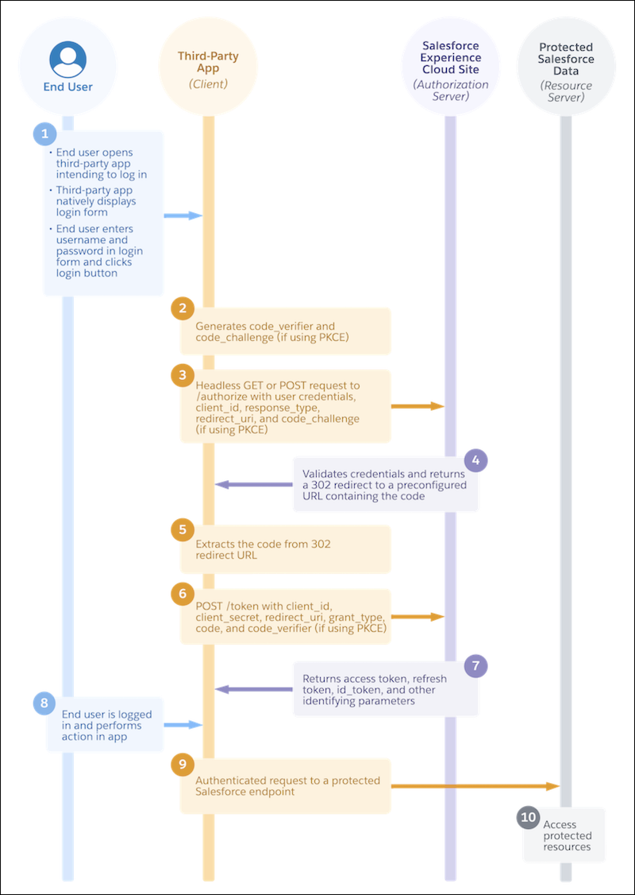
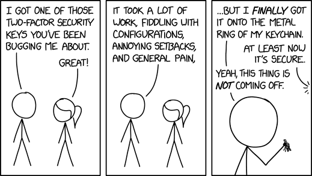

## 写在前头

本篇是 [Why is OAuth still hard in 2023?](https://www.nango.dev/blog/why-is-oauth-still-hard) 一文的中文翻译（由[沉浸式翻译](https://immersivetranslate.com/)提供并优化了下排版），文章内容翔实，说明了 OAuth 的复杂性、安全性、实际应用困难等方面的问题。

以下是太长不看版（由 AI 整理）：

这篇文章讨论了为什么 OAuth 在 2023 年仍然难以实现。作者们通过为 50 个最受欢迎的 API 实现 OAuth 的经验得出结论，OAuth 实际应用中的体验类似于 2008 年的 JavaScript 浏览器 API。尽管有一个通用的共识关于如何实现 OAuth，但每个 API 实际上都有自己对标准的解释、实现上的怪癖、非标准行为和扩展。

文章中提到的问题包括：

1. **OAuth 标准过于庞大和复杂**：OAuth 2.0 标准包含了 17 个不同的 RFC（定义标准的文档），覆盖了从 OAuth 框架到威胁模型和私钥 JWT 的所有内容。尽管不是所有 RFC 对于简单的第三方访问令牌授权都是相关的，但即使只关注相关的部分，也足以让人感到复杂。
2. **每个 API 的 OAuth 实现都有细微差异**：由于每个 API 实现的 OAuth 子集不同，开发者需要详细阅读每个 API 的 OAuth 文档，了解所需的参数、请求方式、重定向 URL 等。
3. **许多 API 添加了非标准的 OAuth 扩展**：尽管 OAuth 标准已经非常广泛，但许多 API 仍然觉得需要添加一些非标准的功能。这意味着开发者需要为每个 API 实现特定的逻辑。
4. **调试 OAuth 流程困难**：OAuth2 有标准化的错误消息，但它们通常无法提供足够的信息来帮助开发者调试问题。文档错误、缺失细节或未更新的情况很常见，导致 OAuth 流程在首次实施时经常遇到问题。
5. **基于 API 的构建需要繁琐的批准流程**：许多流行的 API 需要开发者提交审核，这个过程可能需要数天甚至数月才能完成。有些 API 甚至要求开发者与他们签订收入分成协议。
6. **OAuth 安全性难以把握且不断变化**：随着攻击手段的发现和网络技术的发展，OAuth 标准也在不断变化。新的安全最佳实践，如即将到来的 OAuth 2.1 标准，将使一些当前的最佳实践成为强制性要求。

文章最后提到，作者正在开发一个名为 Nango 的开源服务，它提供了预构建的 OAuth 流程、安全的令牌存储和自动令牌刷新功能，支持超过 90 个 OAuth API。欢迎读者尝试使用并提供反馈。

**以下是原文+翻译：**

## 为什么 2023 年 OAuth 仍然很难？  Why is OAuth still hard in 2023?

We implemented OAuth for the 50 most popular APIs. TL;DR: It is still a mess.
我们为 50 个最流行的 API 实现了 OAuth。TL;DR（Tong long, did't read）：仍然是一团糟。

OAuth is a standard protocol. Right? And there are client libraries for OAuth 2.0 [available](https://oauth.net/code/nodejs/) [in](https://oauth.net/code/php/) [basically](https://oauth.net/code/java/) [every](https://oauth.net/code/python/) [programming](https://oauth.net/code/go/) [language](https://oauth.net/code/rust/) [you](https://oauth.net/code/dotnet/) [can](https://oauth.net/code/kotlin/) [imagine](https://oauth.net/code/swift/).
OAuth 是一个标准协议。正确的？基本上您能想象到的每种编程语言都有适用于 OAuth 2.0 的客户端库。

You might conclude that, armed with a client library, you would be able to implement OAuth for any API in about 10 minutes. Or at least in an hour.
您可能会得出结论，配备客户端库后，您将能够在大约 10 分钟内为任何 API 实现 OAuth。或者至少一个小时内。

If you manage, please email us — we’d like to treat you to a delicious dinner and hear how you did it.
如果您成功了，请给我们发电子邮件——我们很乐意请您享用一顿美味的晚餐，并听听您是如何做到的。

### OAuth 实践  OAuth in practice

We implemented OAuth for the 50 most popular APIs, such as Google (Gmail, Calendar, Sheets etc.), HubSpot, Shopify, Salesforce, Stripe, Jira, Slack, Microsoft (Azure, Outlook, OneDrive), LinkedIn, Facebook and [other OAuth APIs.](https://docs.nango.dev/providers)‍
我们为 50 个最流行的 API 实现了 OAuth，例如 Google（Gmail、日历、表格等）、HubSpot、Shopify、Salesforce、Stripe、Jira、Slack、Microsoft（Azure、Outlook、OneDrive）、LinkedIn、Facebook 和其他 OAuth蜜蜂

Our conclusion: The real-world OAuth experience is comparable to JavaScript browser APIs in 2008. There’s a general consensus on how things should be done, but in reality every API has its own interpretation of the standard, implementation quirks, and nonstandard behaviors and extensions. The result: footguns behind every corner.
我们的结论：现实世界的 OAuth 体验可与 2008 年的 JavaScript 浏览器 API 相媲美。对于应该如何完成工作存在普遍共识，但实际上每个 API 对标准、实现怪癖以及非标准行为和扩展都有自己的解释。结果是：每个角落后面都有枪。

If it weren’t so annoying, it would be quite funny. Let’s dive in!
如果不是那么烦人的话，那就很有趣了。让我们深入了解一下！

## 问题 1：OAuth 标准太大且复杂  Problem 1: The OAuth standard is just too big and complex

> “This API also uses OAuth 2.0, and we already did that a few weeks ago. I should be done by tomorrow.”
> “这个 API 还使用 OAuth 2.0，我们几周前就已经这样做了。我应该在明天之前完成。”
> – Famous last words from the intern
> ——实习生著名的遗言

OAuth is a very big standard. The [OAuth 2.0’s official site](https://oauth.net/2/) currently lists 17 different RFCs (documents defining a standard) that together define how OAuth 2 works. They cover everything from the OAuth framework and Bearer tokens to threat models and private key JWTs.
OAuth 是一个非常大的标准。 OAuth 2.0 的官方网站目前列出了 17 个不同的 RFC（定义标准的文档），它们共同定义了 OAuth 2 的工作方式。它们涵盖了从 OAuth 框架和 Bearer 令牌到威胁模型和私钥 JWT 的所有内容。

“But,” I hear you say, “surely not all of these RFCs are relevant for a simple third-party-access token authorization with an API?”
“但是，”我听到您说，“肯定不是所有这些 RFC 都与使用 API 的简单第三方访问令牌授权相关吗？”
You’re right. Let’s focus only on the things that are likely to be relevant for the typical API third-party-access use case:
是的。让我们只关注可能与典型 API 第三方访问用例相关的内容：

- OAuth standard: OAuth 2.0 is the default now, but OAuth 1.0a is still used by some (and 2.1 is around the corner). Once you know which one your API uses, move on to:
  OAuth 标准：OAuth 2.0 现在是默认值，但 OAuth 1.0a 仍然被一些人使用（2.1 即将推出）。一旦您知道您的 API 使用哪一个，请继续：
- Grant type: Do you need authorization_code, client_credentials, or device_code? What do they do, and when should you use each of them? When in doubt, try authorization_code.
  授权类型：您需要 authorization_code、client_credentials 或 device_code 吗？它们有什么作用，什么时候应该使用它们？如有疑问，请尝试 authorization_code。
- Side note: Refresh tokens are also a grant type, but kind of a special one. How they work is standardized, but how you ask for them in the first place is not. More on that later.
  旁注：刷新令牌也是一种授予类型，但有点特殊。它们的工作方式是标准化的，但您最初要求它们的方式却不是标准化的。稍后会详细介绍。
- Now that you’re ready for your requests, let’s look at the many (72, to be precise) [official OAuth parameters](https://www.iana.org/assignments/oauth-parameters/oauth-parameters.xhtml) with a defined meaning and behavior. Common examples are prompt, scope, audience, resource, assertion, and login_hint. However, in our experience, most API providers seem to be as oblivious to this list as you probably were until now, so don't worry too much about it.
  现在您已准备好接收请求，让我们看一下许多（准确地说是 72 个）具有定义含义和行为的官方 OAuth 参数。常见示例有提示、范围、受众、资源、断言和登录提示。然而，根据我们的经验，大多数 API 提供商似乎都像您到目前为止一样忽视了此列表，因此不必太担心。

If you think this still feels too complicated and like a lot to learn, we tend to agree with you.
如果您认为这仍然感觉太复杂并且需要学习很多东西，我们倾向于同意您的观点。

Most teams building public APIs seem to agree as well. Instead of implementing a full OAuth 2.0 subset, they just implement the parts of OAuth they think they need for their API’s use case. This leads to pretty long pages in docs outlining how OAuth works for this particular API. But we have a hard time blaming them; they have only the best intentions in mind for their DX. And if they truly tried to implement the full standard, you’d need to read a small book!
大多数构建公共 API 的团队似乎也同意这一点。他们没有实现完整的 OAuth 2.0 子集，而是只实现他们认为 API 用例所需的 OAuth 部分。这导致文档中出现相当长的页面来概述 OAuth 如何针对此特定 API 工作。但我们很难责怪他们；他们对 DX 的想法只有最好的。如果他们真的尝试实施完整的标准，您需要阅读一本小书！

The trouble is that everybody has a slightly different idea of which subset of OAuth is relevant for them, so you end up with lots of different (sub-) implementations.
问题在于，每个人对于 OAuth 的哪个子集与他们相关的想法都略有不同，因此最终会得到许多不同的（子）实现。

## 问题 2：每个人的 OAuth 都有细微的差别  Problem 2: Everybody’s OAuth is different in subtle ways

As every API implements a different subset of OAuth, you quickly get into a situation where you are forced to read their long pages of OAuth docs in detail:
由于每个 API 都实现 OAuth 的不同子集，因此您很快就会陷入被迫详细阅读其长页 OAuth 文档的情况：

- Which parameters do they require in the authorize call?
  他们在授权调用中需要哪些参数？
  
  - For Jira, the audience parameter is key (and must be set to a specific fixed value). Google prefers to handle this through different scopes but really cares about the prompt parameter. Meanwhile, somebody at Microsoft discovered the response_mode parameter and demands that you always set it to query.
    对于 Jira 来说，受众参数是关键（并且必须设置为特定的固定值）。谷歌更喜欢通过不同的范围来处理这个问题，但真正关心的是提示参数。与此同时，微软的某人发现了response_mode参数并要求你始终将其设置为查询。
  - The Notion API takes a radical approach and does away with the ubiquitous scope parameter. In fact, you won’t even find the word “scope” in their API docs. Notion calls them “capabilities,” and you set them when you register the app. It took us 30 confused minutes to understand what was going on. Why did they reinvent this wheel?
    Notion API 采用了一种激进的方法，取消了无处不在的作用域参数。事实上，您甚至在他们的 API 文档中找不到“范围”这个词。 Notion 将它们称为“功能”，您可以在注册应用程序时设置它们。我们困惑地花了 30 分钟才明白发生了什么事。他们为什么要重新发明这个轮子？
  - It gets worse with offline_access: Most APIs these days expire access tokens after a short while. To get a refresh token, you need to request “offline_access,” which needs to be done through a parameter, a scope, or something you set when you register your OAuth app. Ask your API or OAuth doctor for details.
    Offline_access 的情况会变得更糟：现在大多数 API 的访问令牌都会在短时间内过期。要获取刷新令牌，您需要请求“offline_access”，这需要通过参数、范围或注册 OAuth 应用程序时设置的内容来完成。请咨询您的 API 或 OAuth 医生了解详细信息。
  
- What do they want to see in the token request call?
  他们希望在令牌请求调用中看到什么？
  
  - Some APIs, like Fitbit, insist on getting data in the headers. Most really want it in the body, encoded as x-www-url-form-encoded, except for a few, such as Notion, which prefer to get it as JSON.
    一些 API（例如 Fitbit）坚持在标头中获取数据。大多数人确实希望它在正文中，编码为 x-www-url-form-encoded，但少数人（例如 Notion）更喜欢将其编码为 JSON。
  - Some want you to authenticate this request with Basic auth. Many don’t bother with that. But beware, they may change their mind tomorrow.
    有些人希望您使用基本身份验证来验证此请求。许多人对此不屑一顾。但要小心，他们明天可能会改变主意。
  
- Where should I redirect my users to authorize?
  我应该将用户重定向到哪里进行授权？

    - Shopify and Zendesk have a model in which every user gets a subdomain like {subdomain}.myshopify.com. And yes, that includes the OAuth authorization page, so you’d better build dynamic URLs into your model and frontend code.
      Shopify 和 Zendesk 有一个模型，其中每个用户都会获得一个子域，例如 {subdomain}.myshopify.com。是的，其中包括 OAuth 授权页面，因此您最好将动态 URL 构建到模型和前端代码中。

    - Zoho Books has different data centers for their customers in different locations. Hopefully, they remember where their data resides: To authorize your app, your U.S. customers should go to https:\//accounts.zoho.com, Europeans can visit https:\//accounts.zoho.eu, and Indians are welcome at https:\//accounts.zoho.in. The list goes on.
      Zoho Books 在不同地点为客户提供不同的数据中心。希望他们记住数据所在的位置：要授权您的应用程序，您的美国客户应访问 https:\//accounts.zoho.com，欧洲客户可以访问 https:\//accounts.zoho.eu，欢迎印度客户访问 https:\//accounts.zoho.in。这样的例子还在继续。

- But at least I can pick my callback URL, no?
  但至少我可以选择我的回调 URL，不是吗？
  - If you enter http:\//localhost:3003/callback as a callback for the Slack API, they kindly remind you to “Please use https for security.” Yes, also for localhost. Luckily [there are solutions for OAuth redirects on localhost](https://www.nango.dev/blog/oauth-redirects-on-localhost-with-https).
    如果您输入 http:\//localhost:3003/callback 作为 Slack API 的回调，他们会善意地提醒您“为了安全起见，请使用 https”。是的，也适用于本地主机。幸运的是，本地主机上有 OAuth 重定向的解决方案。

We could go on for a long time, but we think you probably get the point by now.
我们可以继续说很长时间，但我们认为您现在可能已经明白了要点。

## 问题 3：许多 API 向 OAuth 添加非标准扩展  Problem 3: Many APIs add nonstandard extensions to OAuth

Even though the OAuth standard is vast, many APIs still seem to find gaps in it for features they need. A common issue we see is that you need some data in addition to the access_token to work with the API. Wouldn’t it be neat if this additional data could be returned to you together with the access_token in the OAuth flow?
尽管 OAuth 标准很庞大，但许多 API 似乎仍然在其中找到了它们所需功能的空白。我们看到的一个常见问题是，除了 access_token 之外，您还需要一些数据才能使用 API。如果这些附加数据可以与 OAuth 流程中的 access_token 一起返回给您，岂不是很完美？

We actually think this is a good idea — orr at least it’s better than forcing users to do quirky additional API requests afterward to fetch this information (looking at you, Jira). But it does mean more nonstandard behavior that you specifically need to implement for every API.
我们实际上认为这是一个好主意 - 或者至少它比强迫用户随后执行奇怪的额外 API 请求来获取此信息要好（看着你，Jira）。但这确实意味着您特别需要为每个 API 实现更多非标准行为。

Here’s a small list of nonstandard extensions we have seen:
以下是我们见过的一小部分非标准扩展：

- Quickbooks employs a realmID, which you need to pass in with every API request. The only time they tell you this realmID is as an additional parameter in the OAuth callback. Better store it somewhere safe!
  Quickbooks 使用realmID，您需要在每个API 请求中传递该realmID。他们唯一一次告诉您此 RealmID 是作为 OAuth 回调中的附加参数。最好将其存放在安全的地方！
- Braintree does the same with a companyID
  Braintree 对 companyID 执行同样的操作
- Salesforce uses a different API base URL for each customer; they call this the instance_url. Thankfully, they return the instance_url of the user together with the access token in the token response, but you do need to parse it out from there and store it.
  Salesforce 为每个客户使用不同的 API 基本 URL；他们称之为instance_url。值得庆幸的是，它们返回用户的 instance_url 以及令牌响应中的访问令牌，但您确实需要从那里解析它并存储它。
- Unfortunately, the [Salesforce API](https://www.nango.dev/blog/how-we-built-a-salesforce-api-integration-in-3-hours) also does even more annoying things: Access tokens expire after a preset period of time, which can be customized by the user. Fine so far, but for some reason they don’t tell you in the token response when the access token you just received will expire (everybody else does this). Instead, you need to query an additional token details endpoint to get the (current) expiration date of the token. Why, Salesforce, why?
  不幸的是，Salesforce API 还做了更烦人的事情：访问令牌会在预设时间段后过期，该时间段可以由用户自定义。到目前为止还好，但由于某种原因，他们不会在令牌响应中告诉您刚刚收到的访问令牌何时过期（其他人都会这样做）。相反，您需要查询额外的令牌详细信息端点以获取令牌的（当前）到期日期。为什么，Salesforce，为什么？
- Slack has two different types of scopes: scopes you hold as a Slack bot and scopes that allow you to take action on behalf of the user who authorized your app. Smart, but instead of just adding different scopes for each, they implemented a separate user_scopes parameter that you need to pass in the authorization call. You’d better be aware of this, and good luck finding support for this in your OAuth library.
  Slack 有两种不同类型的范围：您作为 Slack 机器人持有的范围和允许您代表授权您的应用程序的用户采取操作的范围。很聪明，但他们不是仅仅为每个范围添加不同的范围，而是实现了一个单独的 user_scopes 参数，您需要在授权调用中传递该参数。您最好意识到这一点，并祝您好运在您的 OAuth 库中找到对此的支持。

For the sake of brevity and simplicity, we’re skipping the many not-really-standard OAuth flows we have encountered.
为了简洁起见，我们跳过了我们遇到的许多不真正标准的 OAuth 流程。

## 问题 4：“invalid_request”——调试 OAuth 流程很困难  Problem 4: “invalid_request” — debugging OAuth flows is hard

Debugging distributed systems is always hard. It’s harder when the service you’re working with uses broad, generic error messages.
调试分布式系统总是很困难。当您使用的服务使用广泛的通用错误消息时，事情会变得更加困难。

OAuth2 has [standardized error messages](https://datatracker.ietf.org/doc/html/rfc6749#section-5.2), but they’re about as useful in telling you what’s going on as the example in the title above (which, by the way, is one of the recommended error messages from the OAuth standard).
OAuth2 具有标准化的错误消息，但它们在告诉您正在发生的情况方面与上面标题中的示例一样有用（顺便说一下，这是 OAuth 标准中推荐的错误消息之一）。

You could argue that OAuth is a standard and that there are docs for every API, so what is there to debug?
您可能会说 OAuth 是一个标准，每个 API 都有文档，那么有什么可调试的呢？
A lot. I cannot tell you how often the docs are wrong. Or missing a detail. Or have not been updated for the latest change. Or you missed something when you first looked at them. A good 80% of the OAuth flows we implement have some problem upon first implementation and require debugging.
很多。我无法告诉你文档出错的频率有多少。或者遗漏了一个细节。或者尚未更新最新的更改。或者当你第一次看到它们时你错过了一些东西。我们实现的 OAuth 流程中有 80% 在首次实现时都存在一些问题，需要调试。

Some flows also break for, what seem to be, random reasons: LinkedIn OAuth, for instance, breaks if you pass in PKCE parameters. The error you get? “client error - invalid OAuth request.” That is … telling? It took us an hour to understand that passing in (optional, usually disregarded) PKCE parameters is what breaks the flow.
有些流程也会因随机原因而中断：例如，如果您传入 PKCE 参数，LinkedIn OAuth 就会中断。你得到的错误是？ “客户端错误 - OAuth 请求无效。”这就是……告诉我们？我们花了一个小时才明白传入（可选的，通常被忽略的）PKCE 参数是破坏流程的原因。

Another common mistake is sending scopes that don’t match the ones you preregistered with the app. (Preregister scopes? Yes, a lot of APIs these days demand that.) This often results in a generic error message about there being an issue with scopes. Duh.
另一个常见的错误是发送的范围与您在应用程序中预先注册的范围不匹配。 （预注册范围？是的，现在很多 API 都要求这样做。）这通常会导致出现有关范围存在问题的通用错误消息。

## 问题 5：基于 API 构建的审批繁琐  Problem 5: Cumbersome approvals to build on top of APIs

The truth is, if you build toward some other system by using their API, you’re probably in the weaker position. Your customers are asking for the integration because they’re already using the other system. Now you need to make them happy.
事实是，如果您使用其他系统的 API 进行构建，您可能会处于较弱的位置。您的客户要求集成，因为他们已经在使用其他系统。现在你需要让他们开心。

To be fair, many APIs are liberal and provide easy self-service signup flows for developers to register their apps and start using OAuth. But some of the most popular APIs out there require reviews before your app becomes public and can be used by any of their users. Again, to be fair, most review processes are sane and can be completed in a few days. They’re probably a net gain in terms of security and quality for end users.
公平地说，许多 API 都是自由的，并为开发人员提供简单的自助注册流程来注册他们的应用程序并开始使用 OAuth。但一些最流行的 API 在您的应用程序公开并可供任何用户使用之前需要经过审核。再次强调，公平地说，大多数审核流程都是合理的，并且可以在几天内完成。对于最终用户来说，它们可能在安全性和质量方面带来净收益。

But some notorious examples can take months to complete, and some even require you to enter into revenue-share agreements:
但一些臭名昭著的例子可能需要几个月的时间才能完成，有些甚至要求您签订收入分成协议：

- Google requires a “security review” if you want to access scopes with more sensitive user data, such as email contents. We have heard these reviews can take days or weeks to pass and require a nontrivial amount of work on your side.
  如果您想访问包含更敏感用户数据（例如电子邮件内容）的范围，Google 需要进行“安全审查”。我们听说这些审核可能需要几天或几周的时间才能通过，并且需要您做大量的工作。
- Looking to integrate with Rippling? Get ready for their 30-plus questions and security preproduction screening. We hear access takes months (if you are approved).
  想要与 Ripple 集成吗？准备好接受 30 多个问题和安全预生产筛查。我们听说访问需要几个月的时间（如果您获得批准）。
- HubSpot, Notion, Atlassian, Shopify, and pretty much everybody else who has an integrations marketplace or app store requires a review to get listed there. Some reviews are mild, and some ask you for demo logins, video walkthroughs, blog posts (yes!), and more. However, listing on the marketplace or store is often optional.
  HubSpot、Notion、Atlassian、Shopify 以及几乎所有拥有集成市场或应用程序商店的其他人都需要经过审核才能在其中列出。有些评论很温和，有些则要求您提供演示登录、视频演练、博客文章（是的！）等等。然而，在市场或商店上列出通常是可选的。
- Ramp, Brex, Twitter, and a good number of others don’t have a self-service signup flow for developers and require that you fill in forms for manual access. Many are quick to process requests, but we’re still waiting to hear back from some after weeks.
  Ramp、Brex、Twitter 和许多其他网站没有为开发人员提供自助注册流程，需要您填写表格才能手动访问。许多人都会很快处理请求，但我们仍在等待几周后的回复。
- Xero is a particularly drastic example of a monetized API: If you want to exceed a limit of 25 connected accounts, you have to [become a Xero partner](https://developer.xero.com/documentation/xero-app-store/app-partner-guides/app-partner-steps/) and list your app in their app store. They will then take (as of the time of this writing) a 15% revenue cut from every lead generated from that store.
  Xero 是货币化 API 的一个特别激烈的例子：如果您想超过 25 个连接帐户的限制，您必须成为 Xero 合作伙伴并在他们的应用商店中列出您的应用程序。然后，他们将从该商店产生的每条销售线索中扣除 15% 的收入（截至撰写本文时）。

## 问题 6：OAuth 安全性很困难且目标不断变化  Problem 6: OAuth security is hard and a moving target

As attacks have been uncovered, and the available web technologies have evolved, the OAuth standard has changed as well. If you’re looking to implement the current security best practices, the OAuth working group has a [rather lengthy guide](https://datatracker.ietf.org/doc/html/draft-ietf-oauth-security-topics) for you. And if you’re working with an API that is still using OAuth 1.0a today, you realize that backwards compatibility is a never-ending struggle.
随着攻击的被发现以及可用的 Web 技术的发展，OAuth 标准也发生了变化。如果您希望实施当前的安全最佳实践，OAuth 工作组为您提供了相当冗长的指南。如果您现在使用的 API 仍在使用 OAuth 1.0a，您就会意识到向后兼容性是一场永无休止的斗争。

Luckily, security is getting better with every iteration, but it often comes at the cost of more work for developers. The upcoming OAuth 2.1 standard will make some current best practices mandatory and includes mandatory PKCE (today only a handful of APIs require this) and additional restrictions for refresh tokens.
幸运的是，安全性随着每次迭代而变得越来越好，但这通常是以开发人员付出更多工作为代价的。即将推出的 OAuth 2.1 标准将强制执行一些当前的最佳实践，并包括强制的 PKCE（目前只有少数 API 需要此）以及刷新令牌的附加限制。

The biggest change has probably been ushered in with expiring access tokens and the rise of refresh tokens. On the surface, the process seems simple: Whenever an access token expires, refresh it with the refresh token and store the new access token and refresh token.
最大的变化可能是随着访问令牌的过期和刷新令牌的兴起而带来的。从表面上看，该过程似乎很简单：每当访问令牌过期时，使用刷新令牌刷新它并存储新的访问令牌和刷新令牌。

In reality, when we implemented this we had to consider:
事实上，当我们实现这一点时，我们必须考虑：

- Race conditions: How can we make sure no other requests run while we refresh the current access token?
  竞争条件：如何确保在刷新当前访问令牌时没有其他请求运行？
- Some APIs also expire the refresh token if you don’t use it for a certain number of days (or if the user has revoked the access). Expect some refreshes to fail.
  如果您在一定天数内不使用刷新令牌（或者用户已撤销访问权限），某些 API 也会使刷新令牌过期。预计某些刷新会失败。
- Some APIs issue you a new refresh token with every refresh request …
  有些 API 在每次刷新请求时都会向您发出一个新的刷新令牌……
- … but some also silently assume that you will keep the old refresh token and keep on using it.
  …但有些人也默默地假设您将保留旧的刷新令牌并继续使用它。
- Some APIs will tell you the access token expiration time in absolute values. Others only in relative “seconds from now.” And some, like Salesforce, don’t divulge this kind of information easily.
  某些 API 会以绝对值形式告诉您访问令牌过期时间。其他的则仅在相对“从现在开始的几秒钟内”发生。有些公司（例如 Salesforce）不会轻易泄露此类信息。

## 最后但并非最不重要的一点：有些事情我们还没有讨论过  Last but not least: Some things we haven’t talked about yet

Sadly, we have only just scratched the surface of your OAuth implementation. Now that your OAuth flow runs and you get access tokens, it’s time to think about:
遗憾的是，我们仅仅触及了 OAuth 实现的皮毛。现在您的 OAuth 流程已运行并且您获得了访问令牌，是时候考虑以下问题了：

- How to securely store these access tokens and refresh tokens. They are like passwords to your users’ accounts. But hashing is not an option; you need secure, reversible encryption.
  如何安全地存储这些访问令牌和刷新令牌。它们就像用户帐户的密码。但散列不是一种选择；而是一种选择。您需要安全、可逆的加密。
- Checking that the granted scopes match the requested scopes (some APIs allow users to change the scopes they grant in the authorize flow).
  检查授予的范围是否与请求的范围匹配（某些 API 允许用户更改他们在授权流程中授予的范围）。
- Avoiding race conditions when refreshing tokens.
  刷新令牌时避免竞争条件。
- Detecting access tokens revoked by the user on the provider side.
  检测提供商端用户撤销的访问令牌。
- Letting users know that access tokens have expired, so they can re-authorize your app if needed.
  让用户知道访问令牌已过期，以便他们可以在需要时重新授权您的应用程序。
- How to revoke access tokens you no longer need (or that the user has requested you delete under GDPR).
  如何撤销您不再需要的访问令牌（或者用户根据 GDPR 要求删除的访问令牌）。
- Changes in available OAuth scopes, provider bugs, missing documentation, and so on.
  可用 OAuth 范围的更改、提供程序错误、缺少文档等。

## 有更好的方法吗？  A better way?

If you’ve read this far, you might be thinking, “There must be a better way!”
如果您读到这里，您可能会想：“一定有更好的方法！”

We think there is, which is why we’re building [Nango](https://www.nango.dev/): An [open-source](https://github.com/NangoHQ/nango), self-contained service that comes with prebuilt OAuth flows, secure token storage, and automatic token refreshes [for more than 90 OAuth APIs](https://docs.nango.dev/providers).
我们认为是存在的，这就是我们构建 Nango 的原因：一种开源、独立的服务，附带预构建的 OAuth 流程、安全令牌存储以及针对 90 多个 OAuth API 的自动令牌刷新。

If you give it a try, we’d love to hear your feedback. And if you want to share your worst OAuth horror story with us, we’d love to hear about it in our [Slack community](https://nango.dev/slack).
如果您尝试一下，我们很乐意听到您的反馈。如果您想与我们分享您最糟糕的 OAuth 恐怖故事，我们很乐意在 Slack 社区中听到它。

Thanks for reading and happy authorizing!
感谢您的阅读并快乐授权！