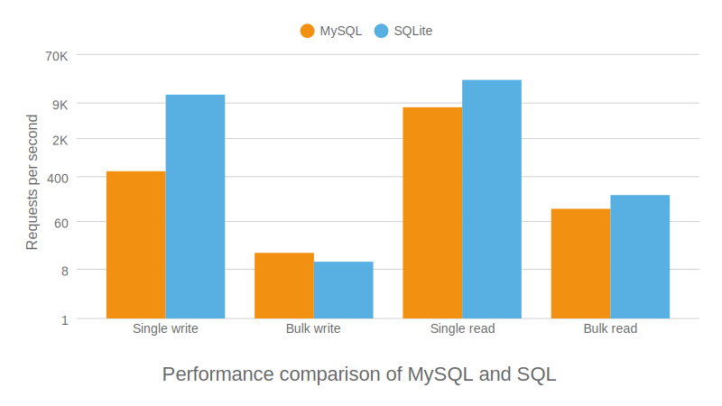
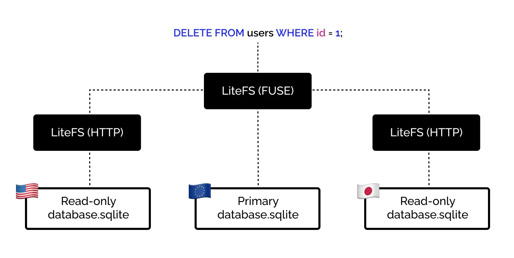
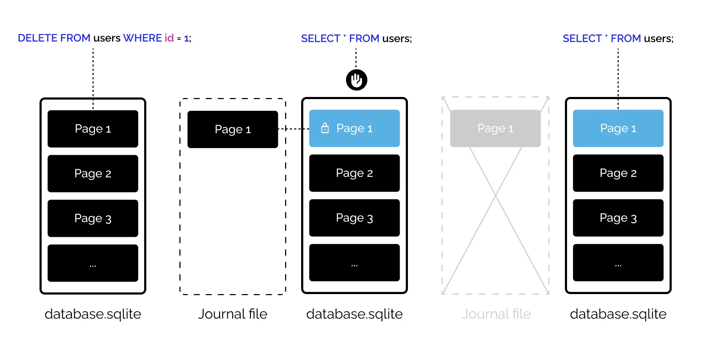
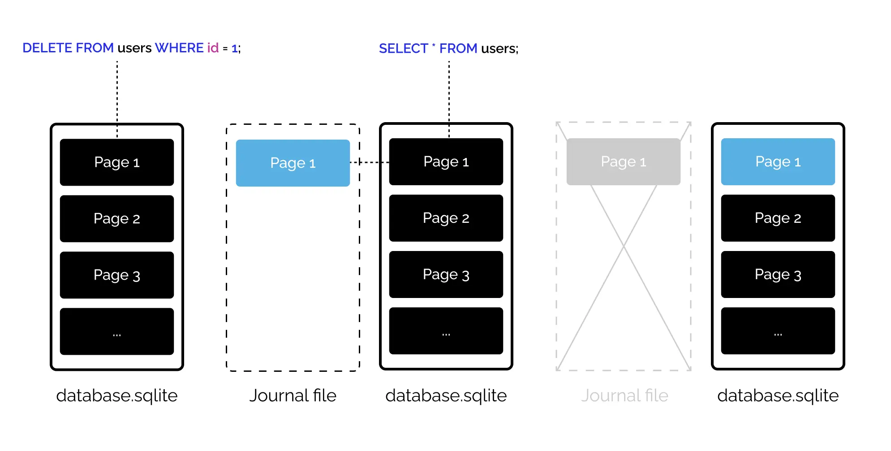

## 写在前头

本篇是 [Is it time to ditch MySQL and PostgreSQL for SQLite?](https://onfold.sh/blog/is-it-time-to-ditch-mysql-and-postgresql-for-sqlite) 一文的中文翻译（由[沉浸式翻译](https://immersivetranslate.com/)提供并优化了下排版），文章主要描述了 SQLite 与 MySQL 的对比，自身的优缺点以及在现实生产环境中的应用情况；并且作者也给出了是否考虑在生产项目中应用 SQLite 的建议。

**以下是太长不看版（由 AI 整理）**：

文章讨论了 SQLite 是否适合作为生产环境中的数据库替代 MySQL 和 PostgreSQL。文章首先提到了 SQLite 的流行趋势和一些知名人士对其的支持，然后详细分析了 SQLite 的优缺点，并与 MySQL 和 PostgreSQL 进行了性能比较。以下是文章的详细内容分析：

**SQLite 的优点：**

1. **简单性**：SQLite 易于集成，无需额外的服务器或网络配置，简化了开发流程。
2. **可移植性**：SQLite 数据库文件易于移动和备份，适用于多种平台。
3. **速度**：在基准测试中，SQLite 在某些操作（如单次写入和读取）上比 MySQL 更快，但在批量写入方面稍慢。
4. **可靠性**：SQLite 经过严格测试，具有高可靠性，广泛应用于各种设备。
5. **成本效益**：SQLite 免费且与常见编程语言捆绑，减少了成本和 DevOps 工作量。
6. **安全性**：由于没有网络接口，SQLite 的安全风险较低。

**SQLite 的缺点：**

1. **水平扩展限制**：SQLite 默认不支持水平扩展，虽然可以通过 LiteFS 实现，但可能会牺牲性能。
2. **并发限制**：SQLite 默认模式下，写入时会锁定表，但可以通过 WAL 日志模式来提高并发读取能力。
3. **迁移支持**：SQLite 的表结构修改命令有限，对于复杂的数据库迁移可能需要额外的工具或方法。
4. **数据类型限制**：SQLite 提供的数据类型较少，可能需要创造性地解决某些数据存储需求。

**与 MySQL 的性能比较**：作者通过在 Laravel 应用中进行基准测试，展示了 SQLite 在某些操作（如单次写入和读取）上的性能优于 MySQL。然而，在批量写入操作中，SQLite 的性能不如 MySQL。这表明 SQLite 在处理大量数据插入时可能不是最佳选择。

**生产环境建议**：对于不需要水平扩展、数据量不大的项目，SQLite 是一个合适的选择。它特别适用于那些希望简化数据库管理、减少成本和提高开发效率的场景。尽管 SQLite 在某些方面存在限制，但它在许多实际应用中已经证明了其有效性，如 Nomadlist 和 Remoteok。

**结论**：选择数据库时应根据项目的具体需求进行评估。SQLite 可能不是所有场景的最佳选择，但对于许多 Web 应用程序来说，它提供了一个简单、快速且成本效益高的解决方案。如果项目需求发生变化，从 SQLite 迁移到其他数据库也是可行的。

**以下是原文+翻译：**

## 是时候放弃 MySQL 和 PostgreSQL 而转而使用 SQLite 了吗？ <br>Is it time to ditch MySQL and PostgreSQL for SQLite?

*SQLite is getting all the hype lately, but can it really compete with MySQL and PostgreSQL for production web applications?
SQLite 最近受到了广泛的炒作，但它真的能在生产 Web 应用程序方面与 MySQL 和 PostgreSQL 竞争吗？*

Alright, I hear you, "SQLite is a toy database", "SQLite is too slow", "SQLite is not scalable", yada yada yada.
好吧，我听到了，“SQLite 是一个玩具数据库”、“SQLite 太慢”、“SQLite 不可扩展”，yada yada yada。

Well, we're in 2024 now, and things have changed. SQLite is all the rage, with [Kent C. Dodds](https://www.epicweb.dev/why-you-should-probably-be-using-sqlite) and [DHH](https://twitter.com/dhh/status/1746248449555878243) pushing it, [native support added to Bun](https://twitter.com/jarredsumner/status/1746892626618671322), and if you've been following hacker news, you [probably](https://news.ycombinator.com/item?id=26816954) [noticed](https://news.ycombinator.com/item?id=34812527) an [increase](https://news.ycombinator.com/item?id=31318708) in SQLite praising posts in the past few years.
好吧，现在已经是 2024 年了，事情已经发生了变化。 SQLite 风靡一时，Kent C. Dodds 和 DHH 推动它，Bun 中添加了本机支持，如果您一直关注黑客新闻，您可能会注意到过去几年 SQLite 赞扬帖子的增加。

It's not news, SQLite has been around for more than 20 years, and is the most deployed database engine, but got ignored for web application in favor of client-server databases that perform better on write-intensive applications.
这不是什么新闻，SQLite 已经存在了 20 多年，并且是部署最多的数据库引擎，但在 Web 应用程序中被忽视，而在写入密集型应用程序上表现更好的客户端-服务器数据库更受青睐。

Should you follow the hype and start using SQLite in production? And if so, how to do it properly? Let's find out together.
您是否应该跟随炒作并开始在生产中使用 SQLite？如果是这样，如何正确地做到这一点？让我们一起来了解一下吧。

## 为什么选择 SQLite 而不是 MySQL 或 PostgreSQL？ <br>Why choose SQLite over MySQL or PostgreSQL? 

DevOps fatigue is real, developers are expected to know more and more about infrastructure, CI / CD, Docker, networking, Kubernetes, clustering, sharding, and the list goes on. But the reality of the trade is that most projects don't need half of these things. There's a pushback against the complexity of modern web development, engraved with a comeback of the Monolith and a steady growth on simpler frontends frameworks like Alpine.js and htmx.
DevOps 疲劳是真实存在的，开发人员需要越来越多地了解基础设施、CI/CD、Docker、网络、Kubernetes、集群、分片等等。但现实情况是，大多数项目并不需要这些东西的一半。现代 Web 开发的复杂性受到了阻碍，Monolith 的卷土重来以及 Alpine.js 和 htmx 等更简单的前端框架的稳定增长。

SQLite fits in this logic by providing a simpler alternative to the traditional client-server model of MySQL and PostgreSQL, not without its own set of tradeoffs that can make your project a disaster if not carefully considered.
SQLite 通过提供一种比传统的 MySQL 和 PostgreSQL 客户端-服务器模型更简单的替代方案来满足这一逻辑，但它也有自己的一套权衡，如果不仔细考虑，这些权衡可能会让您的项目变成一场灾难。

So why would you choose SQLite over MySQL or PostgreSQL? Here are some of the main reasons:
那么为什么你会选择 SQLite 而不是 MySQL 或 PostgreSQL呢？以下是一些主要原因：

### SQLite 很简单 <br>SQLite is simple

SQLite is already bundled with the default [PHP](https://www.php.net/manual/en/extensions.membership.php) and [Python](https://docs.python.org/3/library/sqlite3.html) installation, and if you use another backend language, chances are that there's good support for it.
SQLite 已经与默认的 PHP 和 Python 安装捆绑在一起，如果您使用其他后端语言，很可能对其有很好的支持。

By the nature of its design as an embedded C library, you do not need to manage a process, a server, or a socket. You can see it as a language extension that writes/read a `.sqlite` file when you ask it to and that's it.
由于其设计为嵌入式 C 库的本质，您不需要管理进程、服务器或套接字。您可以将其视为一种语言扩展，当您要求它时，它会写入/读取 `.sqlite` 文件，仅此而已。

Because it's already bundled with the languages that we love, it greatly simplifies the release process. No need to worry about installing and maintaining a database server on all developer's local environment, you get simpler CI/CD pipelines, if you have PHP/Python installed, you have a working database.
因为它已经与我们喜欢的语言捆绑在一起，所以它极大地简化了发布过程。无需担心在所有开发人员的本地环境上安装和维护数据库服务器，您将获得更简单的 CI/CD 管道，如果您安装了 PHP/Python，那么您就有了一个工作数据库。

In comparison, MySQL and PostgreSQL will require you to install it, usually from a package manager, handle user access, add it as a dependency to your CI/CD pipelines, and finally do it all again in a new production server that you will need to manage and secure, you get the picture.
相比之下，MySQL 和 PostgreSQL 需要您通常从包管理器安装它，处理用户访问，将其添加为 CI/CD 管道的依赖项，最后在您需要的新生产服务器中再次执行这一切管理和安全，您一目了然。

### SQLite 是可移植的 <br>SQLite is portable

It runs pretty much anywhere, and it's painless to move around as everything just sits in a single file.
它几乎可以在任何地方运行，并且移动起来很轻松，因为所有内容都位于一个文件中。

One of your colleagues needs your local database to check something? Send them the file. Need to make a backup? Copy the file. Need to reset the database? Delete the file.
您的一位同事需要您的本地数据库来检查某些内容？将文件发送给他们。需要备份吗？复制文件。需要重置数据库吗？删除文件。

```bash
# Simple to move around
rsync database.sqlite user@server:/path/to/database.sqlite

# Simple to backup
cp database.sqlite database.backup.sqlite

# Simple to delete
rm database.sqlite
```

You can even commit it to your git repository, and have a single source of truth for your database schema and data, or even get a pre-seeded database that is ready to use for your future colleagues.
您甚至可以将其提交到 git 存储库，并拥有数据库架构和数据的单一事实来源，甚至可以获得一个可供未来同事使用的预种子数据库。

Move it from Windows to macOS, to a Linux CI/CD pipelines on Docker, to a Raspberry Pi, to a VPS, to a serverless function, it will work without any change.
将其从 Windows 迁移到 macOS、Docker 上的 Linux CI/CD 管道、Raspberry Pi、VPS、无服务器功能，无需任何更改即可运行。

> "*Fun fact: The creators of SQLite described it as a* [serverless database](https://www.sqlite.org/serverless.html) *in 2007 which was 7 years before the release of AWS Lambda.*"
> *有趣的事实：SQLite 的创建者在 2007 年将其描述为无服务器数据库，比 AWS Lambda 发布早了 7 年*

### SQLite 速度很快 <br>SQLite is fast 

Yes, benchmarks should always be taken with a grain of salt, but the takeaway is that SQLite is fast enough for most small-to-medium web applications. In fact, in the right conditions it can even be [faster than MySQL or PostgreSQL](https://www.golang.dk/articles/benchmarking-sqlite-performance-in-go).
是的，基准测试应该持保留态度，但要点是 SQLite 对于大多数中小型 Web 应用程序来说足够快。事实上，在适当的条件下，它甚至可以比 MySQL 或 PostgreSQL 更快。

I made a **simplistic** benchmark performed on a base Laravel application, with a default local MySQL database, and a slightly tuned SQLite database with the following tests:
我在基本 Laravel 应用程序上执行了一个简单的基准测试，使用默认的本地 MySQL 数据库和稍微调整的 SQLite 数据库，并进行了以下测试：

- Single write: insert 5 000 rows one by one
  单次写入：逐一插入5000行
- Bulk write: insert 200 times 5 000 rows at once
  批量写入：一次插入 200 次 5 000 行
- Single read: read 5 000 rows one by one
  单次读取：逐一读取5 000行
- Bulk read: read 5 000 times 5 000 rows at once
  批量读取：一次读取 5 000 行 5 000 次

The benchmark is performed on a 5-column table with the following structure:
基准测试在具有以下结构的 5 列表上执行：

- Auto increment ID 自动递增ID
- Random text column with index
  带索引的随机文本列
- Random text column 随机文本栏
- Random integer column 随机整数列
- Random float column 随机浮动列

I performed this benchmark on my laptop, a ThinkPad extreme gen 3 with an Intel i7-10850H CPU and 32Gb of ram. But you can try it for yourself using the code in this [GitHub repository](https://github.com/onfold/sqlite-benchmark).
我在笔记本电脑上执行了此基准测试，这是一台配备 Intel i7-10850H CPU 和 32Gb 内存的 ThinkPad Extreme gen 3。但您可以使用此 GitHub 存储库中的代码自行尝试。



As you can see, SQLite is faster than MySQL except for bulk writes. This is a simplistic approach with a small amount of data. The point is that in most cases, SQLite is fast enough, and we just scratched the surface of what can be done to optimize it.
正如您所看到的，除了批量写入之外，SQLite 比 MySQL 更快。这是一种使用少量数据的简单方法。关键是，在大多数情况下，SQLite 足够快，我们只是触及了优化它的表面。

### SQLite 是可靠的 <br>SQLite is reliable

High reliability is one of the main selling points of SQLite, you probably have hundreds of SQLite databases on your Laptop and your phone, they are also used [in aircraft](https://www.sqlite.org/famous.html).
高可靠性是 SQLite 的主要卖点之一，您的笔记本电脑和手机上可能有数百个 SQLite 数据库，它们也用于飞机上。

More importantly, SQLite is [thoroughly tested](https://www.sqlite.org/testing.html), with an impressive 100% of Modified Condition/Decision Coverage (MC/DC), and more than 2M tests with a ratio of 590 test lines for each line of code.
更重要的是，SQLite经过了彻底的测试，具有令人印象深刻的100%修改条件/决策覆盖率（MC/DC），以及超过2M的测试，每行代码有590个测试行。

> "*SQLite's developers created their own version control system called* [Fossil](https://www.fossil-scm.org/) *to manage the development of SQLite itself.*"
> *SQLite 的开发人员创建了自己的版本控制系统 Fossil 来管理 SQLite 本身的开发。*

### SQLite 具有成本效益 <br>SQLite is cost-effective

As previously mentioned, SQLite is already bundled with common backend languages, so you don't need to pay for a separate database server. You can also do that by installing MySQL or PostgreSQL on the server that hosts your code, but that's not how they shine.
如前所述，SQLite 已经与常见的后端语言捆绑在一起，因此您无需为单独的数据库服务器付费。您还可以通过在托管代码的服务器上安装 MySQL 或 PostgreSQL 来实现这一点，但这并不是它们的优点。

Due to its simplicity, you will also need less DevOps time to manage / secure / scale it = less money spent on DevOps.
由于其简单性，您还需要更少的 DevOps 时间来管理/保护/扩展它 = 花在 DevOps 上的钱更少。

### SQLite 的安全性简单明了 <br>SQLite is straightforward to secure

SQLite doesn't have a network interface, so it should not be exposed to the outside world making the biggest attack vector of traditional databases a non-issue. It also doesn't have a user management system, so you don't need to worry about managing database credentials.
SQLite 没有网络接口，因此它不应该暴露给外界，这使得传统数据库的最大攻击媒介不再是问题。它也没有用户管理系统，因此您无需担心管理数据库凭据。

You already need to spend time and effort to secure your application serve, and in most cases, that's enough to also secure SQLite. Quick win.
您已经需要花费时间和精力来保护您的应用程序服务，并且在大多数情况下，这也足以保护 SQLite。快赢。

## 它是否适合您项目的生产数据库？ <br>Can it be a good fit for your project's production database? 

Now that you are pumped and ready to start your next project with SQLite as the main database, I'm going to crush your dreams of simplicity.
现在您已准备好开始使用 SQLite 作为主数据库的下一个项目，我将粉碎您的简单梦想。

Choosing a database is a big decision that will impact your project in the long run, and SQLite is far from a perfect solution for web applications, unless carefully considered.
选择数据库是一个重大决定，从长远来看会影响您的项目，除非仔细考虑，否则 SQLite 远不是 Web 应用程序的完美解决方案。

The whole point of this article is to help you make an informed decision, so let's talk about the drawbacks.
本文的重点是帮助您做出明智的决定，所以让我们谈谈缺点。

### 需要一些尝试和错误才能正确使用它 <br>It will take some trial and error to use it properly

This first point is not specific to SQLite, but a friendly reminder about making the switch to any new technology. There will come a time when you are stuck and need to figure out how to do or fix something. Even if it's pretty close to MySQL and PostgreSQL, there are some behavior differences, mainly around transactions and migrations, that you'll need to remember every time that you do something to avoid killing your app.
第一点并不是 SQLite 特有的，而是关于转向任何新技术的友好提醒。有时候你会陷入困境，需要弄清楚如何做或修复某些事情。即使它非常接近 MySQL 和 PostgreSQL，也存在一些行为差异，主要是在事务和迁移方面，您每次执行某些操作时都需要记住这些差异，以避免杀死应用程序。

> "*If you are proficient with a client-server database, with CI/CD pipelines, backups and infrastructure already figured out, you will get little benefits from SQLite.*"
> *如果您精通客户端-服务器数据库，并且已经掌握了 CI/CD 管道、备份和基础架构，那么您将不会从 SQLite 中获得多少好处。*

### 未按水平伸缩设计 <br>Not made to scale horizontally

The strength of SQLite is also its weakness, it stores everything in a single file, so you can't **by default** scale your application horizontally. A good amount of web application will never need to scale horizontally anyway, considering how easy it is today to get performant hardware.
SQLite 的优点也是它的缺点，它将所有内容存储在单个文件中，因此默认情况下您无法水平扩展应用程序。考虑到如今获得高性能硬件是多么容易，大量 Web 应用程序永远不需要水平扩展。

An SQLite database can grow up to 281 TB of data, but [as advised in the documentation](https://www.sqlite.org/whentouse.html) if you plan on growing your database in the realm of Terabytes, you will be better off with a centralized client-server database.
SQLite 数据库最多可以增长 281 TB 的数据，但根据文档中的建议，如果您计划将数据库增长到 TB 级，那么使用集中式客户端服务器数据库会更好。

Vertical scaling has its own trade-off, and if you're a follower of the [Twelve-Factor App](https://12factor.net/) dogma, or need to deploy multiple instance for geographic optimization, it's still possible to create read-replicas of your SQLite database across a cluster of machines thanks to the [LiteFS](https://github.com/superfly/litefs).
垂直扩展有其自身的权衡，如果您是十二因素应用程序教条的追随者，或者需要部署多个实例以进行地理优化，那么仍然可以跨集群创建 SQLite 数据库的只读副本。得益于 LiteFS 的机器。

LiteFS use a [FUSE](https://en.wikipedia.org/wiki/Filesystem_in_Userspace) file system to intercept the SQLite queries sent by your application. It then replicates the changes between your instances through an HTTP server.
LiteFS 使用 FUSE 文件系统来拦截应用程序发送的 SQLite 查询。然后，它通过 HTTP 服务器在实例之间复制更改。

You can get a deeper overview of how LiteFS works on [the project's architecture documentation](https://github.com/superfly/litefs/blob/main/docs/ARCHITECTURE.md).
您可以通过项目的架构文档更深入地了解 LiteFS 的工作原理。

While this works fine and allows incredible performance on read intensive app, it also removes many advantages of using SQLite. You need to take care of the LiteFS process on your servers and secure the ports it uses to communicate between replicas. Using FUSE also means that write transactions are limited to ~100 per second which might be a deal-breaker for write-heavy applications.
虽然这工作得很好并且可以在读取密集型应用程序上提供令人难以置信的性能，但它也消除了使用 SQLite 的许多优势。您需要管理服务器上的 LiteFS 进程并保护它用于在副本之间通信的端口。使用 FUSE 还意味着写入事务限制为每秒约 100 个，这对于写入密集型应用程序来说可能会造成破坏。



Another limitation of LiteFS is that writes queries should occur on your primary instance. You could use a proxy to route write queries to the primary instance, but that's again more complexity to handle.
LiteFS 的另一个限制是写入查询应该发生在主实例上。您可以使用代理将写入查询路由到主实例，但这又会增加处理的复杂性。

> "*LiteFS is stable and used in production, notably on* [Fly.io](https://fly.io/docs/litefs/)*, but still in Beta. So you might encounter bugs or breaking API changes.*"
> *LiteFS 很稳定并在生产中使用，特别是在 Fly.io 上，但仍处于 Beta 阶段。因此，您可能会遇到错误或破坏 API 更改。*

### 并发数有限 <br>Concurrency is limited

It's a recurring belief among developers that SQLite is not suitable for web applications because it can only handle one write at a time and data cannot be read while a writing operation occurs.
开发人员普遍认为 SQLite 不适合 Web 应用程序，因为它一次只能处理一次写入，并且在发生写入操作时无法读取数据。

While this is true by default, it's not as big of a limitation as you think thanks to the [Write-Ahead Logging (WAL)](https://www.sqlite.org/wal.html) journal mode.
虽然默认情况下确实如此，但由于预写日志记录 (WAL) 日志模式，它并没有您想象的那么大。

What is a journal mode I hear you ask? Well, fear not as I will explain this to you in plain English.
我听到你问什么是日记模式？好吧，不用担心，我会用简单的英语向您解释这一点。

SQLite stores data in a single file that is internally split into pages. By default, when you execute a query that changes data, SQLite will copy the page that is about to be modified. This copy is called a journal file.
SQLite 将数据存储在单个文件中，该文件在内部分为多个页面。默认情况下，当您执行更改数据的查询时，SQLite 将复制即将修改的页面。该副本称为日志文件。

This is done to ensure that if something goes wrong during the write operation, the database can be restored to its previous state, enforcing the [ACID](https://www.sqlite.org/transactional.html) properties of the SQLite.
这样做是为了确保如果在写入操作期间出现问题，数据库可以恢复到之前的状态，从而强制执行 SQLite 的 ACID 属性。

When your write query is fully executed, SQLite will delete the previously created journal file.
当您的写入查询完全执行时，SQLite 将删除之前创建的日志文件。



> The full process is a bit more complex with [3 incremental locking mechanism](https://www.sqlite.org/lockingv3.html), but that's the gist of it.
> 完整的过程有点复杂，有 3 个增量锁定机制，但这就是它的要点。

The issue with this default mode, called `DELETE`, is that it will prevent any read operation on the table that is being modified until the end of the transaction, which can considerably slow down your application.
这种默认模式（称为 `DELETE` )的问题在于，它将阻止对正在修改的表进行任何读取操作，直到事务结束，这会大大减慢应用程序的速度。

Enter the Write-Ahead Logging (WAL) journal mode. In this mode, SQLite does the reverse operation by writing the requested change into the journal file first, avoiding any lock on the table. That way, concurrent read queries can still be performed on the main data while our write transaction is being executed. A reconciliation task is then performed to merge the data in the journal file with the main database, this is done automatically by SQLite.
进入预写日志记录 (WAL) 日志模式。在此模式下，SQLite 通过首先将请求的更改写入日志文件来执行相反的操作，从而避免表上的任何锁定。这样，在执行写入事务时，仍然可以对主数据执行并发读取查询。然后执行协调任务，将日志文件中的数据与主数据库合并，这是由 SQLite 自动完成的。



> The WAL mode is not without its own set of tradeoffs, but it's a better default choice for most web applications.
> WAL 模式并非没有自己的一套权衡，但对于大多数 Web 应用程序来说，它是更好的默认选择。

The journal mode can be enabled by a single `PRAGMA` instruction and will persist once set on a database:
日志模式可以通过单个 `PRAGMA` 指令启用，并且一旦在数据库上设置就会持续存在：

```bash
sqlite3 mydb.sqlite "PRAGMA journal_mode = wal"
```

### 有限的迁移支持 <br>Limited migration support

Modifying your application schema is painful in SQLite, there are only four commands that can alter a table:
在 SQLite 中修改应用程序模式非常痛苦，只有四个命令可以更改表：

- rename table 重命名表
- rename column 重命名列
- add column 添加列
- drop column 删除列

If you need to do anything more than that, like changing a column type, or adding a foreign key in an existing table, you will need to get creative.
如果您需要执行更多操作，例如更改列类型或在现有表中添加外键，则需要发挥创意。

Of course, the open source community comes to the rescue. The most popular frameworks have abstracted this process to perform the most common modifications but read the documentation carefully, as SQLite support has usually a few caveats.
当然，开源社区会来救援。最流行的框架已经抽象了这个过程来执行最常见的修改，但请仔细阅读文档，因为 SQLite 支持通常有一些警告。

There are also standalone tools like [sqlite-utils](https://github.com/simonw/sqlite-utils) or [golang-migrate](https://github.com/golang-migrate/migrate) that help create smooth migration scripts.
还有独立的工具，如 sqlite-utils 或 golang-migrate，可以帮助创建平滑的迁移脚本。

### 有限的数据类型 <br>Limited data types

No need to go check the documentation every time you need to create a column, there are [only five data types](https://www.sqlite.org/datatype3.html) to remember:
无需每次需要创建列时都去检查文档，只需记住五种数据类型：

- NULL 
  无效的
- INTEGER and REAL for numeric values
  数值的 INTEGER 和 REAL
- TEXT and BLOB for everything else
  TEXT 和 BLOB 用于其他所有内容

Compared to most client-server databases, it's a very limited set of data types. Even more when you consider the latest generation of databases that can allow for more than 40 types with support for Vectors, Geospatial data, geographical data, or even IP addresses.
与大多数客户端-服务器数据库相比，它的数据类型非常有限。当您考虑最新一代的数据库时，情况更是如此，它可以支持 40 多种类型，并支持矢量、地理空间数据、地理数据甚至 IP 地址。

This is enough to store anything, for example, if you need to store a date, you can put it in ISO 8601 format in a TEXT column, or as a timestamp in an INTEGER column.
这足以存储任何内容，例如，如果需要存储日期，可以将其以 ISO 8601 格式放入 TEXT 列中，或将其作为时间戳放入 INTEGER 列中。

SQLite provides a good set of functions that you can use to handle most common types like [date and time](https://www.sqlite.org/lang_datefunc.html) or [JSON](https://www.sqlite.org/json1.html).
SQLite 提供了一组很好的函数，可用于处理最常见的类型，例如日期和时间或 JSON。

```bash
sqlite> CREATE TABLE test(id INT, datetime TEXT);
sqlite> INSERT INTO test(id, datetime) VALUES(1, '2024-01-01 01:01:01');
sqlite> SELECT date(datetime) FROM test;
2024-01-01
```

Using an ORM with type casting should abstract this problem away, but it can get painful quickly if you need to enforce type casting in multiple backend / languages. Or you can ignore type casting if you're that kind of person that likes to live dangerously.
使用带有类型转换的 ORM 应该可以解决这个问题，但是如果您需要在多种后端/语言中强制执行类型转换，它很快就会变得痛苦。或者，如果你是那种喜欢危险生活的人，你可以忽略类型转换。

## 现实世界生产环境下的 SQLite <br>Production SQLite in the real world

SQLite is used on billions of devices, but isn't as popular for web applications for the reasons mentioned above. There's a few notable large companies that run their main database with it, like [Expensify](https://use.expensify.com/blog/scaling-sqlite-to-4m-qps-on-a-single-server) and more recently [Tailscale](https://tailscale.com/blog/database-for-2022).
SQLite 在数十亿台设备上使用，但由于上述原因在 Web 应用程序中并不流行。有一些著名的大公司用它来运行他们的主数据库，比如 Expensify 和最近的 Tailscale。

I won't list all small-to-medium web apps that run on SQLite, but a great example is Pieter Levels' [Nomadlist](https://nomadlist.com/) and [Remoteok](https://remoteok.com/) that are both running with SQLite on a VPS that handle 50M+ requests per month for only $40. So if you think your application won't scale vertically, think again.
我不会列出所有在 SQLite 上运行的中小型 Web 应用程序，但一个很好的例子是 Pieter Levels 的 Nomadlist 和 Remoteok，它们都在 VPS 上与 SQLite 一起运行，每月只需 40 美元即可处理 5000 万个以上的请求。因此，如果您认为您的应用程序无法垂直扩展，请再考虑一下。

## 结论 <br>Conclusion

Like with every decision in software development, there's no one-size-fits-all solution, and you will have to carefully evaluate the pros and cons of SQLite for your specific needs. Most developers tend to over-estimate how many resources a project needs to run, and underestimate the performance and benefits of simple "less shiny" solutions like SQLite.
与软件开发中的每一项决策一样，不存在一刀切的解决方案，您必须根据您的特定需求仔细评估 SQLite 的优缺点。大多数开发人员倾向于高估一个项目运行需要多少资源，而低估 SQLite 等简单“不太闪亮”的解决方案的性能和优势。

A lot of web applications would benefit from using an embedded database, and if you do not plan on scaling horizontally, or have more than 1TB of data, it's a no-brainer to go with SQLite.
许多 Web 应用程序将受益于使用嵌入式数据库，如果您不打算水平扩展，或者拥有超过 1TB 的数据，那么使用 SQLite 是理所当然的。

And if the need arises, migrating from SQLite to MySQL or PostgreSQL is not too painful.
如果有需要，从 SQLite 迁移到 MySQL 或 PostgreSQL 也不会太痛苦。

## 参考 <br>References 

If you would like to explore SQLite further, here are some well-written resources that inspired this article:
如果您想进一步探索 SQLite，这里有一些为本文提供灵感的精心编写的资源：

- [Consider SQLite](https://blog.wesleyac.com/posts/consider-sqlite)
- [SQLite: Small. Fast. Reliable. Choose any three.](https://charlesleifer.com/blog/sqlite-small-fast-reliable-choose-any-three-/)
- [SQLite the only database you will ever need in most cases](https://unixsheikh.com/articles/sqlite-the-only-database-you-will-ever-need-in-most-cases.html)

As well as some read worthy documentation pages:
以及一些值得阅读的文档页面：

- [How SQLite Is Tested](https://sqlite.org/testing.html)
- [Appropriate Uses For SQLite](https://www.sqlite.org/whentouse.html)
- [35% Faster Than The Filesystem](https://www.sqlite.org/fasterthanfs.html)
- [SQLite As An Application File Format](https://www.sqlite.org/appfileformat.html)
- [SQLite on Wikipedia](https://en.wikipedia.org/wiki/SQLite)