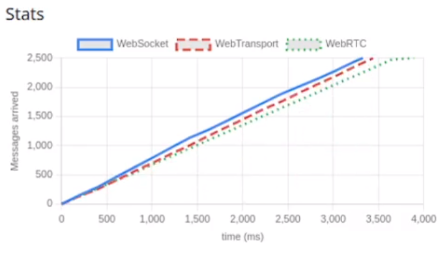

## 写在前头

本篇是 [WebSockets vs Server-Sent-Events vs Long-Polling vs WebRTC vs WebTransport](https://rxdb.info/articles/websockets-sse-polling-webrtc-webtransport.html) 一文的中文翻译（由[沉浸式翻译](https://immersivetranslate.com)提供并优化了下排版），文章表达了在如今的实时 Web 应用程序中，由服务器主动推送事件数据到客户端的多种方案实现，分别是 **Long-Polling**（长轮询）、**WebSockets**、**Server-Sent-Events**（SSE，服务器发送事件）、**WebTransport**、**WebRTC**。这五种方式各有优劣，文章讲述了五种方案的概念与对比后，也给出了选择建议，读者在实际开发中可引为参考。

**以下是太长不看版（由 AI 整理）**：

文章深入探讨了现代实时 Web 应用程序中服务器与客户端之间通信的几种技术：长轮询、WebSockets、服务器发送事件（SSE）、WebTransport 以及 WebRTC。每种技术都有其独特的优势和局限性，适用于不同的使用场景。

**长轮询**是最初的解决方案，通过保持连接开放直到服务器有新数据发送，减少了不必要的网络流量和服务器负载，但可能引入通信延迟。

**WebSockets** 提供了全双工通信通道，允许数据实时交换，非常适合需要低延迟和高频更新的应用，如实时聊天和游戏。但它在生产环境中可能较为复杂，需要处理连接断开和重连的问题。

**服务器发送事件**（SSE）是一种标准方式，用于从服务器向客户端单向推送更新，适用于实时新闻提要或体育比分等场景。与 WebSockets 不同，SSE 在连接丢失时会自动重连。

**WebTransport** 是一个新兴的 API，利用 HTTP/3 QUIC 协议实现高效、低延迟的通信，支持多流传输和乱序发送数据。尽管非常有前景，但目前还是工作草案，尚未广泛支持。

**WebRTC** 是一个开源项目和 API 标准，支持在浏览器和移动应用中进行点对点的实时通信，适用于音视频通话和数据共享。尽管设计为客户端间通信，也可以用于服务器-客户端通信，但通常需要信令服务器。

文章还讨论了这些技术的局限性，比如双向数据发送、每个域的连接限制、移动应用中的连接保持问题、代理和防火墙的挑战。性能比较显示 WebSockets、WebRTC 和WebTransport 在性能上相当，但 WebTransport 可能在未来有更多的性能优化。

在建议和用例适用性方面，SSE 因其简单性和易于集成而成为实现的直接选项，适用于频繁服务器到客户端更新的应用。WebSockets 适合需要持续双向通信的场景，如浏览器游戏和聊天应用。WebTransport 尽管有潜力，但目前面临采用挑战，不是大多数用例的可行选项。长轮询由于效率低下，现在基本上已经过时。

最后，文章指出所有实时流技术都有已知问题，例如客户端在重新连接时可能会错过事件，以及公司防火墙可能会导致问题。开发实时应用程序时，需要考虑这些因素，并进行充分的测试。

**以下是原文+翻译：**

## WebSockets vs Server-Sent-Events vs Long-Polling vs WebRTC vs WebTransport

For modern real-time web applications, the ability to send events from the server to the client is indispensable. This necessity has led to the development of several methods over the years, each with its own set of advantages and drawbacks. Initially, [long-polling](#what-is-long-polling) was the only option available. It was then succeeded by [WebSockets](#what-are-websockets), which offered a more robust solution for bidirectional communication. Following WebSockets, [Server-Sent Events (SSE)](#what-are-server-sent-events) provided a simpler method for one-way communication from server to client. Looking ahead, the [WebTransport](#what-is-the-webtransport-api) protocol promises to revolutionize this landscape even further by providing a more efficient, flexible, and scalable approach. For niche use cases, [WebRTC](#what-is-webrtc) might also be considered for server-client events.
对于现代实时 Web 应用程序来说，将事件从服务器发送到客户端的能力是必不可少的。多年来，这种必要性导致了多种方法的发展，每种方法都有自己的优点和缺点。最初，长轮询是唯一可用的选择。随后 WebSockets 继承了它，为双向通信提供了更强大的解决方案。继 WebSocket 之后，服务器发送事件 (SSE) 提供了一种更简单的方法，用于从服务器到客户端的单向通信。展望未来，WebTransport 协议有望通过提供更高效、灵活和可扩展的方法来进一步彻底改变这一领域。对于利基用例，WebRTC 也可能被考虑用于服务器-客户端事件。

This article aims to delve into these technologies, comparing their performance, highlighting their benefits and limitations, and offering recommendations for various use cases to help developers make informed decisions when building real-time web applications. It is a condensed summary of my gathered experience when I implemented the [RxDB Replication Protocol](https://rxdb.info/replication.html) to be compatible with various backend technologies.
本文旨在深入研究这些技术，比较它们的性能，强调它们的优点和局限性，并为各种用例提供建议，以帮助开发人员在构建实时 Web 应用程序时做出明智的决策。这是我在实现 RxDB 复制协议以兼容各种后端技术时收集的经验的浓缩总结。

### 什么是长轮询？ <br>What is Long Polling?{#what-is-long-polling}

Long polling was the first "hack" to enable a server-client messaging method that can be used in browsers over HTTP. The technique emulates server push communications with normal XHR requests. Unlike traditional polling, where the client repeatedly requests data from the server at regular intervals, long polling establishes a connection to the server that remains open until new data is available. Once the server has new information, it sends the response to the client, and the connection is closed. Immediately after receiving the server's response, the client initiates a new request, and the process repeats. This method allows for more immediate data updates and reduces unnecessary network traffic and server load. However, it can still introduce delays in communication and is less efficient than other real-time technologies like WebSockets.
长轮询是第一个启用服务器-客户端消息传递方法的“黑客”，该方法可以通过 HTTP 在浏览器中使用。该技术通过正常的 XHR 请求模拟服务器推送通信。与传统轮询（客户端定期从服务器重复请求数据）不同，长轮询会建立与服务器的连接，该连接在新数据可用之前保持打开状态。一旦服务器有新的信息，它就会向客户端发送响应，并关闭连接。客户端收到服务器的响应后立即发起新的请求，如此循环往复。此方法允许更即时的数据更新并减少不必要的网络流量和服务器负载。但是，它仍然会导致通信延迟，并且效率低于 WebSocket 等其他实时技术。

```js
// long-polling in a JavaScript client
function longPoll() {
    fetch('http://example.com/poll')
        .then(response => response.json())
        .then(data => {
            console.log("Received data:", data);
            longPoll(); // Immediately establish a new long polling request
        })
        .catch(error => {
            /**
             * Errors can appear in normal conditions when a 
             * connection timeout is reached or when the client goes offline.
             * On errors we just restart the polling after some delay.
             */
            setTimeout(longPoll, 10000);
        });
}
longPoll(); // Initiate the long polling
```

Implementing long-polling on the client side is pretty simple, as shown in the code above. However on the backend there can be multiple difficulties to ensure the client receives all events and does not miss out updates when the client is currently reconnecting.
在客户端实现长轮询非常简单，如上面的代码所示。然而，在后端，要确保客户端接收所有事件并且在客户端当前重新连接时不会错过更新，可能存在多种困难。

### 什么是 WebSocket？ <br>What are WebSockets?{#what-are-websockets}

[WebSockets](https://developer.mozilla.org/en-US/docs/Web/API/WebSocket?retiredLocale=de) provide a full-duplex communication channel over a single, long-lived connection between the client and server. This technology enables browsers and servers to exchange data without the overhead of HTTP request-response cycles, facilitating real-time data transfer for applications like live chat, gaming, or financial trading platforms. WebSockets represent a significant advancement over traditional HTTP by allowing both parties to send data independently once the connection is established, making it ideal for scenarios that require low latency and high-frequency updates.
WebSockets 通过客户端和服务器之间的单个长期连接提供全双工通信通道。该技术使浏览器和服务器能够交换数据，而无需 HTTP 请求响应周期的开销，从而促进实时聊天、游戏或金融交易平台等应用程序的实时数据传输。 WebSocket 相对于传统 HTTP 来说是一个重大进步，它允许双方在建立连接后独立发送数据，非常适合需要低延迟和高频更新的场景。

```js
// WebSocket in a JavaScript client
const socket = new WebSocket('ws://example.com');

socket.onopen = function(event) {
  console.log('Connection established');
  // Sending a message to the server
  socket.send('Hello Server!');
};

socket.onmessage = function(event) {
  console.log('Message from server:', event.data);
};
```

While the basics of the WebSocket API are easy to use it has shown to be rather complex in production. A socket can loose connection and must be re-created accordingly. Especially detecting if a connection is still usable or not, can be very tricky. Mostly you would add a [ping-and-pong](https://developer.mozilla.org/en-US/docs/Web/API/WebSockets_API/Writing_WebSocket_servers#pings_and_pongs_the_heartbeat_of_websockets) heartbeat to ensure that the open connection is not closed. This complexity is why most people use a library on top of WebSockets like [Socket.IO](https://socket.io/) which handles all these cases and even provides fallbacks to long-polling if required.
虽然 WebSocket API 的基础知识很容易使用，但在生产中却显得相当复杂。套接字可能会断开连接，并且必须相应地重新创建。特别是检测连接是否仍然可用，可能非常棘手。大多数情况下，您会添加乒乓心跳以确保打开的连接不会关闭。这种复杂性就是为什么大多数人使用 WebSocket 之上的库（例如 Socket.IO）来处理所有这些情况，甚至在需要时提供长轮询的回退。

### 什么是服务器发送事件？ <br>What are Server-Sent-Events?{#what-are-server-sent-events}

Server-Sent Events (SSE) provide a standard way to push server updates to the client over HTTP. Unlike WebSockets, SSEs are designed exclusively for one-way communication from server to client, making them ideal for scenarios like live news feeds, sports scores, or any situation where the client needs to be updated in real time without sending data to the server.
服务器发送事件 (SSE) 提供了一种通过 HTTP 将服务器更新推送到客户端的标准方法。与 WebSocket 不同，SSE 专为从服务器到客户端的单向通信而设计，这使得它们非常适合实时新闻提要、体育比分或客户端需要实时更新而不向服务器发送数据的任何情况。

You can think of Server-Sent-Events as a single HTTP request where the backend does not send the whole body at once, but instead keeps the connection open and trickles the answer by sending a single line each time an event has to be send to the client.
您可以将 Server-Sent-Events 视为单个 HTTP 请求，其中后端不会立即发送整个请求体，而是保持连接打开，并通过每次必须将事件发送到时发送一行来滴答答案客户端。

Creating a connection for receiving events with SSE is straightforward. On the client side in a browser, you initialize an [EventSource](https://developer.mozilla.org/en-US/docs/Web/API/EventSource) instance with the URL of the server-side script that generates the events.
使用 SSE 创建接收事件的连接非常简单。在浏览器的客户端，您可以使用生成事件的服务器端脚本的 URL 初始化 EventSource 实例。

Listening for messages involves attaching event handlers directly to the EventSource instance. The API distinguishes between generic message events and named events, allowing for more structured communication. Here's how you can set it up in JavaScript:
侦听消息涉及将事件处理程序直接附加到 EventSource 实例。 API 区分通用消息事件和命名事件，从而允许更结构化的通信。以下是在 JavaScript 中进行设置的方法：

```js
// Connecting to the server-side event stream
const evtSource = new EventSource("https://example.com/events");

// Handling generic message events
evtSource.onmessage = event => {
    console.log('got message: ' + event.data);
};
```

In difference to WebSockets, an EventSource will automatically reconnect on connection loss.
与 WebSocket 不同，EventSource 将在连接丢失时自动重新连接。

On the server side, your script must set the `Content-Type` header to `text/event-stream` and format each message according to the [SSE specification](https://www.w3.org/TR/2012/WD-eventsource-20120426/). This includes specifying event types, data payloads, and optional fields like event ID and retry timing.
在服务器端，您的脚本必须将 `Content-Type` 标头设置为 `text/event-stream` 并根据 SSE 规范格式化每条消息。这包括指定事件类型、数据有效负载以及事件 ID 和重试计时等可选字段。

Here's how you can set up a simple SSE endpoint in a Node.js Express app:
以下是如何在 Node.js Express 应用程序中设置简单的 SSE 端点：

```ts
import express from 'express';
const app = express();
const PORT = process.env.PORT || 3000;

app.get('/events', (req, res) => {
    res.writeHead(200, {
        'Content-Type': 'text/event-stream',
        'Cache-Control': 'no-cache',
        'Connection': 'keep-alive',
    });

    const sendEvent = (data) => {
        // all message lines must be prefixed with 'data: '
        const formattedData = `data: ${JSON.stringify(data)}\n\n`;
        res.write(formattedData);
    };

    // Send an event every 2 seconds
    const intervalId = setInterval(() => {
        const message = {
            time: new Date().toTimeString(),
            message: 'Hello from the server!',
        };
        sendEvent(message);
    }, 2000);

    // Clean up when the connection is closed
    req.on('close', () => {
        clearInterval(intervalId);
        res.end();
    });
});
app.listen(PORT, () => console.log(`Server running on http://localhost:${PORT}`));
```

### 什么是 WebTransport API？ <br>What is the WebTransport API?{#what-is-the-webtransport-api}

WebTransport is a cutting-edge API designed for efficient, low-latency communication between web clients and servers. It leverages the [HTTP/3 QUIC protocol](https://en.wikipedia.org/wiki/HTTP/3) to enable a variety of data transfer capabilities, such as sending data over multiple streams, in both reliable and unreliable manners, and even allowing data to be sent out of order. This makes WebTransport a powerful tool for applications requiring high-performance networking, such as real-time gaming, live streaming, and collaborative platforms. However, it's important to note that WebTransport is currently a working draft and has not yet achieved widespread adoption. As of now (March 2024), WebTransport is in a [Working Draft](https://w3c.github.io/webtransport/) and not widely supported. You cannot yet use WebTransport in the [Safari browser](https://caniuse.com/webtransport) and there is also no native support [in Node.js](https://github.com/w3c/webtransport/issues/511). This limits its usability across different platforms and environments.
WebTransport 是一种尖端 API，旨在实现 Web 客户端和服务器之间高效、低延迟的通信。它利用 HTTP/3 QUIC 协议来实现各种数据传输功能，例如以可靠和不可靠的方式通过多个流发送数据，甚至允许乱序发送数据。这使得 WebTransport 成为需要高性能网络的应用程序的强大工具，例如实时游戏、直播和协作平台。然而，值得注意的是，WebTransport 目前只是一个工作草案，尚未得到广泛采用。截至目前（2024 年 3 月），WebTransport 仍处于工作草案中，尚未得到广泛支持。您还无法在 Safari 浏览器中使用 WebTransport，并且 Node.js 中也没有本机支持。这限制了它在不同平台和环境中的可用性。

Even when WebTransport will become widely supported, its API is very complex to use and likely it would be something where people build libraries on top of WebTransport, not using it directly in an application's sourcecode.
即使 WebTransport 将得到广泛支持，其 API 使用起来也非常复杂，并且人们可能会在 WebTransport 之上构建库，而不是直接在应用程序的源代码中使用它。

### 什么是 WebRTC？ <br>What is WebRTC?{#what-is-webrtc}

[WebRTC](https://webrtc.org/) (Web Real-Time Communication) is an open-source project and API standard that enables real-time communication (RTC) capabilities directly within web browsers and mobile applications without the need for complex server infrastructure or the installation of additional plugins. It supports peer-to-peer connections for streaming audio, video, and data exchange between browsers. WebRTC is designed to work through NATs and firewalls, utilizing protocols like ICE, STUN, and TURN to establish a connection between peers.
WebRTC（Web 实时通信）是一个开源项目和 API 标准，可直接在 Web 浏览器和移动应用程序中实现实时通信 (RTC) 功能，无需复杂的服务器基础设施或安装其他插件。它支持点对点连接，以便在浏览器之间传输音频、视频和数据交换。 WebRTC 旨在通过 NAT 和防火墙工作，利用 ICE、STUN 和 TURN 等协议在对等点之间建立连接。

While WebRTC is made to be used for client-client interactions, it could also be leveraged for server-client communication where the server just simulated being also a client. This approach only makes sense for niche use cases which is why in the following WebRTC will be ignored as an option.
虽然 WebRTC 旨在用于客户端与客户端的交互，但它也可以用于服务器与客户端的通信，其中服务器只是模拟为客户端。这种方法仅对利基用例有意义，这就是为什么在下面的 WebRTC 选项中将被忽略的原因。

The problem is that for WebRTC to work, you need a signaling-server anyway which would then again run over websockets, SSE or WebTransport. This defeats the purpose of using WebRTC as a replacement for these technologies.
问题是，要使 WebRTC 工作，您无论如何都需要一个信令服务器，然后该服务器将再次在 websockets、SSE 或 WebTransport 上运行。这违背了使用 WebRTC 替代这些技术的目的。

## 技术的局限性 <br>Limitations of the technologies

### 双向发送数据 <br>Sending Data in both directions

Only WebSockets and WebTransport allow to send data in both directions so that you can receive server-data and send client-data over the same connection.
只有 WebSocket 和 WebTransport 允许双向发送数据，以便您可以通过同一连接接收服务器数据和发送客户端数据。

While it would also be possible with **Long-Polling** in theory, it is not recommended because sending "new" data to an existing long-polling connection would require to do an additional http-request anyway. So instead of doing that you can send data directly from the client to the server with an additional http-request without interrupting the long-polling connection.
虽然理论上长轮询也是可能的，但不建议这样做，因为将“新”数据发送到现有的长轮询连接无论如何都需要执行额外的 http 请求。因此，您可以使用额外的 http 请求将数据直接从客户端发送到服务器，而无需中断长轮询连接。

**Server-Sent-Events** do not support sending any additional data to the server. You can only do the initial request, and even there you cannot send POST-like data in the http-body by default with the native [EventSource API](https://developer.mozilla.org/en-US/docs/Web/API/EventSource). Instead you have to put all data inside of the url parameters which is considered a bad practice for security because credentials might leak into server logs, proxies and caches. To fix this problem, [RxDB](https://rxdb.info/) for example uses the [eventsource polyfill](https://github.com/EventSource/eventsource) instead of the native `EventSource API`. This library adds additional functionality like sending **custom http headers**. Also there is [this library](https://github.com/Azure/fetch-event-source) from microsoft which allows to send body data and use `POST` requests instead of `GET`.
Server-Sent-Events 不支持向服务器发送任何附加数据。您只能执行初始请求，即使在那里，默认情况下也无法使用本机 EventSource API 在 http-body 中发送类似 POST 的数据。相反，您必须将所有数据放入 url 参数中，这被认为是一种不好的安全做法，因为凭据可能会泄漏到服务器日志、代理和缓存中。为了解决这个问题，RxDB 使用 eventsource polyfill 而不是原生的 `EventSource API` 。该库添加了其他功能，例如发送自定义 http 标头。微软还有一个库，它允许发送正文数据并使用 `POST` 请求而不是 `GET`。

### 每个域限制 6 个请求 <br>6-Requests per Domain Limit

Most modern browsers allow six connections per domain () which limits the usability of all steady server-to-client messaging methods. The limitation of six connections is even shared across browser tabs so when you open the same page in multiple tabs, they would have to shared the six-connection-pool with each other. This limitation is part of the HTTP/1.1-RFC (which even defines a lower number of only two connections).
大多数现代浏览器允许每个域有六个连接（），这限制了所有稳定的服务器到客户端消息传递方法的可用性。六个连接的限制甚至在浏览器选项卡之间共享，因此当您在多个选项卡中打开同一页面时，它们必须彼此共享六个连接池。此限制是 HTTP/1.1-RFC 的一部分（它甚至定义了仅两个连接的较低数量）。

> Quote From [RFC 2616 – Section 8.1.4](https://www.w3.org/Protocols/rfc2616/rfc2616-sec8.html#sec8.1.4): "Clients that use persistent connections SHOULD limit the number of simultaneous connections that they maintain to a given server. A single-user client SHOULD NOT maintain more than **2 connections** with any server or proxy. A proxy SHOULD use up to $2*N$ connections to another server or proxy, where N is the number of simultaneously active users. These guidelines are intended to improve HTTP response times and avoid congestion."
> 引自 RFC 2616 – 第 8.1.4 节：“使用持久连接的客户端应该限制它们与给定服务器保持的同时连接的数量。单用户客户端不应与任何服务器或代理保持超过 2 个连接。代理应该使用最多 $2*N$ 个连接到另一个服务器或代理，其中 N 是同时活动用户的数量。这些准则旨在缩短 HTTP 响应时间并避免拥塞。”

While that policy makes sense to prevent website owners from using their visitors to D-DOS other websites, it can be a big problem when multiple connections are required to handle server-client communication for legitimate use cases. To workaround the limitation you have to use HTTP/2 or HTTP/3 with which the browser will only open a single connection per domain and then use multiplexing to run all data through a single connection. While this gives you a virtually infinity amount of parallel connections, there is a [SETTINGS_MAX_CONCURRENT_STREAMS](https://www.rfc-editor.org/rfc/rfc7540#section-6.5.2) setting which limits the actually connections amount. The default is 100 concurrent streams for most configurations.
虽然该策略对于防止网站所有者使用 D-DOS 访问其他网站来说是有意义的，但当需要多个连接来处理合法用例的服务器客户端通信时，这可能是一个大问题。要解决此限制，您必须使用 HTTP/2 或 HTTP/3，浏览器将仅为每个域打开一个连接，然后使用多路复用通过单个连接运行所有数据。虽然这为您提供了几乎无限数量的并行连接，但有一个 SETTINGS_MAX_CONCURRENT_STREAMS 设置限制了实际连接数量。对于大多数配置，默认值为 100 个并发流。

In theory the connection limit could also be increased by the browser, at least for specific APIs like EventSource, but the issues have beem marked as "won't fix" by [chromium](https://issues.chromium.org/issues/40329530) and [firefox](https://bugzilla.mozilla.org/show_bug.cgi?id=906896).
理论上，浏览器也可以增加连接限制，至少对于像 EventSource 这样的特定 API 来说是这样，但这些问题已被 chromium 和 firefox 标记为“无法修复”。

> :information_source: LOWER THE AMOUNT OF CONNECTIONS IN BROWSER APPS
> ​​ ​减少浏览器应用程序中的连接量
>
> When you build a browser application, you have to assume that your users will use the app not only once, but in multiple browser tabs in parallel. By default you likely will open one server-stream-connection per tab which is often not necessary at all. Instead you open only a single connection and shared it between tabs, no matter how many tabs are open. [RxDB](https://rxdb.info/) does that with the [LeaderElection](https://rxdb.info/leader-election.html) from the [broadcast-channel npm package](https://github.com/pubkey/broadcast-channel) to only have one stream of replication between server and clients. You can use that package standalone (without RxDB) for any type of application.
> 当您构建浏览器应用程序时，您必须假设您的用户不仅会使用该应用程序一次，而且还会在多个浏览器选项卡中并行使用该应用程序。默认情况下，您可能会为每个选项卡打开一个服务器流连接，但这通常根本没有必要。相反，无论打开多少个选项卡，您都只打开一个连接并在选项卡之间共享它。 RxDB 通过广播通道 npm 包中的 LeaderElection 来实现这一点，以便在服务器和客户端之间只有一个复制流。您可以将该包独立使用（无需 RxDB）用于任何类型的应用程序。

### 移动应用程序上的连接不会保持打开状态 <br>Connections are not kept open on mobile apps

In the context of mobile applications running on operating systems like Android and iOS, maintaining open connections, such as those used for WebSockets and the others, poses a significant challenge. Mobile operating systems are designed to automatically move applications into the background after a certain period of inactivity, effectively closing any open connections. This behavior is a part of the operating system's resource management strategy to conserve battery and optimize performance. As a result, developers often rely on **mobile push notifications** as an efficient and reliable method to send data from servers to clients. Push notifications allow servers to alert the application of new data, prompting an action or update, without the need for a persistent open connection.
在 Android 和 iOS 等操作系统上运行的移动应用程序中，维护开放连接（例如用于 WebSocket 等的连接）带来了重大挑战。移动操作系统旨在在一段时间不活动后自动将应用程序移至后台，从而有效地关闭任何打开的连接。此行为是操作系统资源管理策略的一部分，旨在节省电池并优化性能。因此，开发人员通常依赖移动推送通知作为将数据从服务器发送到客户端的有效且可靠的方法。推送通知允许服务器向应用程序发出新数据的警报，提示操作或更新，而无需持续打开连接。

### 代理和防火墙 <br>Proxies and Firewalls

From consutling many [RxDB](https://rxdb.info/) users, it was shown that in enterprise environments (aka "at work") it is often hard to implement a WebSocket server into the infrastructure because many proxies and firewalls block non-HTTP connections. Therefore using the Server-Sent-Events provides and easier way of enterprise integration. Also long-polling uses only plain HTTP-requests and might be an option.
通过咨询许多 RxDB 用户，结果表明，在企业环境（也称为“工作中”）中，通常很难在基础设施中实现 WebSocket 服务器，因为许多代理和防火墙会阻止非 HTTP 连接。因此，使用服务器发送事件提供了更简单的企业集成方式。此外，长轮询仅使用普通 HTTP 请求，并且可能是一个选项。

## 性能比较 <br>Performance Comparison

Comparing the performance of WebSockets, Server-Sent Events (SSE), Long-Polling and WebTransport directly involves evaluating key aspects such as latency, throughput, server load, and scalability under various conditions.
比较 WebSocket、服务器发送事件 (SSE)、长轮询和 WebTransport 的性能直接涉及评估各种条件下的关键方面，例如延迟、吞吐量、服务器负载和可扩展性。

First lets look at the raw numbers. A good performance comparison can be found in [this repo](https://github.com/Sh3b0/realtime-web?tab=readme-ov-file#demos) which tests the messages times in a [Go Lang](https://go.dev/) server implementation. Here we can see that the performance of WebSockets, WebRTC and WebTransport are comparable:
首先让我们看一下原始数据。在此存储库中可以找到良好的性能比较，该存储库测试了 Go Lang 服务器实现中的消息时间。这里我们可以看到 WebSockets、WebRTC 和 WebTransport 的性能是相当的：



> :information_source: **NOTE**
>
> Remember that WebTransport is a pretty new technologie based on the also new HTTP/3 protocol. In the future (after March 2024) there might be more performance optimizations. Also WebTransport is optimized to use less power which metric is not tested.
> 请记住，WebTransport 是一项基于新的 HTTP/3 协议的全新技术。未来（2024 年 3 月之后）可能会有更多性能优化。此外，WebTransport 还经过优化，可以使用更少的功率，但尚未测试该指标。

Lets also compare the Latency, the throughput and the scalability:
我们还可以比较延迟、吞吐量和可扩展性：

### 延迟 <br>Latency

- **WebSockets**: Offers the lowest latency due to its full-duplex communication over a single, persistent connection. Ideal for real-time applications where immediate data exchange is critical.
  WebSockets：由于其通过单个持久连接进行全双工通信，因此可提供最低的延迟。非常适合即时数据交换至关重要的实时应用程序。
- **Server-Sent Events**: Also provides low latency for server-to-client communication but cannot natively send messages back to the server without additional HTTP requests.
  服务器发送事件：还为服务器到客户端的通信提供低延迟，但如果没有额外的 HTTP 请求，则无法本机将消息发送回服务器。
- **Long-Polling**: Incurs higher latency as it relies on establishing new HTTP connections for each data transmission, making it less efficient for real-time updates. Also it can occur that the server wants to send an event when the client is still in the process of opening a new connection. In these cases the latency would be significantly larger.
  长轮询：由于每次数据传输都依赖于建立新的 HTTP 连接，因此会产生较高的延迟，从而降低实时更新的效率。当客户端仍在打开新连接的过程中时，服务器也可能想要发送事件。在这些情况下，延迟会明显变大。
- **WebTransport**: Promises to offer low latency similar to WebSockets, with the added benefits of leveraging the HTTP/3 protocol for more efficient multiplexing and congestion control.
  WebTransport：承诺提供类似于 WebSocket 的低延迟，并具有利用 HTTP/3 协议实现更高效的多路复用和拥塞控制的额外优势。

### 吞吐量 <br>Throughput

- **WebSockets**: Capable of high throughput due to its persistent connection, but throughput can suffer from [backpressure](https://chromestatus.com/feature/5189728691290112) where the client cannot process data as fast as the server is capable of sending it.
  WebSockets：由于其持久连接而能够实现高吞吐量，但吞吐量可能会受到背压的影响，因为客户端处理数据的速度无法与服务器发送数据的速度一样快。
- **Server-Sent Events**: Efficient for broadcasting messages to many clients with less overhead than WebSockets, leading to potentially higher throughput for unidirectional server-to-client communication.
  服务器发送事件：能够有效地将消息广播到许多客户端，并且开销比 WebSocket 更少，从而可能提高单向服务器到客户端通信的吞吐量。
- **Long-Polling**: Generally offers lower throughput due to the overhead of frequently opening and closing connections, which consumes more server resources.
  长轮询：由于频繁打开和关闭连接的开销，通常会提供较低的吞吐量，这会消耗更多的服务器资源。
- **WebTransport**: Expected to support high throughput for both unidirectional and bidirectional streams within a single connection, outperforming WebSockets in scenarios requiring multiple streams.
  WebTransport：预计在单个连接内支持单向和双向流的高吞吐量，在需要多个流的场景中优于 WebSocket。

### 可扩展性和服务器负载 <br>Scalability and Server Load

- **WebSockets**: Maintaining a large number of WebSocket connections can significantly increase server load, potentially affecting scalability for applications with many users.
  WebSocket：维护大量 WebSocket 连接会显着增加服务器负载，可能会影响具有许多用户的应用程序的可扩展性。
- **Server-Sent Events**: More scalable for scenarios that primarily require updates from server to client, as it uses less connection overhead than WebSockets because it uses "normal" HTTP request without things like [protocol updates](https://developer.mozilla.org/en-US/docs/Web/HTTP/Protocol_upgrade_mechanism) that have to be run with WebSockets.
  服务器发送事件：对于主要需要从服务器到客户端进行更新的场景更具可扩展性，因为它使用的连接开销比 WebSocket 更少，因为它使用“正常”HTTP 请求，而无需使用 WebSocket 运行协议更新之类的内容。
- **Long-Polling**: The least scalable due to the high server load generated by frequent connection establishment, making it suitable only as a fallback mechanism.
  长轮询：由于频繁建立连接会产生高服务器负载，因此可扩展性最差，因此仅适合作为后备机制。
- **WebTransport**: Designed to be highly scalable, benefiting from HTTP/3's efficiency in handling connections and streams, potentially reducing server load compared to WebSockets and SSE.
  WebTransport：设计为高度可扩展，受益于 HTTP/3 在处理连接和流方面的效率，与 WebSocket 和 SSE 相比，可能会减少服务器负载。

## 建议和用例适用性 <br>Recommendations and Use-Case Suitability

In the landscape of server-client communication technologies, each has its distinct advantages and use case suitability. **Server-Sent Events** (SSE) emerge as the most straightforward option to implement, leveraging the same HTTP/S protocols as traditional web requests, thereby circumventing corporate firewall restrictions and other technical problems that can appear with other protocols. They are easily integrated into Node.js and other server frameworks, making them an ideal choice for applications requiring frequent server-to-client updates, such as news feeds, stock tickers, and live event streaming.
在服务器-客户端通信技术领域，每种技术都有其独特的优势和用例适用性。服务器发送事件 (SSE) 成为最直接的实施选项，利用与传统 Web 请求相同的 HTTP/S 协议，从而规避企业防火墙限制和其他协议可能出现的其他技术问题。它们可以轻松集成到 Node.js 和其他服务器框架中，使其成为需要频繁服务器到客户端更新的应用程序的理想选择，例如新闻源、股票行情和实时事件流。

On the other hand, **WebSockets** excel in scenarios demanding ongoing, two-way communication. Their ability to support continuous interaction makes them the prime choice for browser games, chat applications, and live sports updates.
另一方面，WebSocket 在需要持续双向通信的场景中表现出色。它们支持持续交互的能力使其成为浏览器游戏、聊天应用程序和体育直播更新的首选。

However, **WebTransport**, despite its potential, faces adoption challenges. It is not widely supported by server frameworks [including Node.js](https://github.com/w3c/webtransport/issues/511) and lacks compatibility with [safari](https://caniuse.com/webtransport). Moreover, its reliance on HTTP/3 further limits its immediate applicability because many WebServers like nginx only have [experimental](https://nginx.org/en/docs/quic.html) HTTP/3 support. While promising for future applications with its support for both reliable and unreliable data transmission, WebTransport is not yet a viable option for most use cases.
然而，尽管 WebTransport 具有潜力，但其采用仍面临挑战。它没有得到包括 Node.js 在内的服务器框架的广泛支持，并且缺乏与 safari 的兼容性。此外，它对 HTTP/3 的依赖进一步限制了它的直接适用性，因为许多 Web 服务器（如 nginx）仅具有实验性的 HTTP/3 支持。虽然 WebTransport 支持可靠和不可靠的数据传输，有望为未来的应用带来希望，但对于大多数用例来说，WebTransport 还不是一个可行的选择。

**Long-Polling**, once a common technique, is now largely outdated due to its inefficiency and the high overhead of repeatedly establishing new HTTP connections. Although it may serve as a fallback in environments lacking support for WebSockets or SSE, its use is generally discouraged due to significant performance limitations.
长轮询曾经是一种常见技术，但由于其效率低下以及重复建立新 HTTP 连接的高开销，现在基本上已经过时了。尽管它可以作为缺乏 WebSockets 或 SSE 支持的环境中的后备方案，但由于显着的性能限制，通常不鼓励使用它。

## 已知问题 <br>Known Problems

For all of the realtime streaming technologies, there are known problems. When you build anything on top of them, keep these in mind.
对于所有实时流技术，都存在已知的问题。当你在它们之上构建任何东西时，请记住这些。

### 客户端重新连接时可能会错过事件 <br>A client can miss out events when reconnecting

When a client is connecting, reconnecting or offline, it can miss out events that happened on the server but could not be streamed to the client. This missed out events are not relevant when the server is streaming the full content each time anyway, like on a live updating stock ticker. But when the backend is made to stream partial results, you have to account for missed out events. Fixing that on the backend scales pretty bad because the backend would have to remember for each client which events have been successfully send already. Instead this should be implemented with client side logic.
当客户端正在连接、重新连接或离线时，它可能会错过服务器上发生但无法流式传输到客户端的事件。无论如何，当服务器每次都流式传输完整内容时（例如实时更新股票行情），这种错过的事件并不相关。但是，当后端流式传输部分结果时，您必须考虑错过的事件。在后端修复这个问题非常糟糕，因为后端必须记住每个客户端哪些事件已经成功发送。相反，这应该使用客户端逻辑来实现。

The [RxDB replication protocol](https://rxdb.info/replication.html) for example uses two modes of operation for that. One is the [checkpoint iteration mode](https://rxdb.info/replication.html#checkpoint-iteration) where normal http requests are used to iterate over backend data, until the client is in sync again. Then it can switch to [event observation mode](https://rxdb.info/replication.html#event-observation) where updates from the realtime-stream are used to keep the client in sync. Whenever a client disconnects or has any error, the replication shortly switches to [checkpoint iteration mode](https://rxdb.info/replication.html#checkpoint-iteration) until the client is in sync again. This method accounts for missed out events and ensures that clients can always sync to the exact equal state of the server.
例如，RxDB 复制协议为此使用两种操作模式。一种是检查点迭代模式，其中使用普通的 http 请求来迭代后端数据，直到客户端再次同步。然后它可以切换到事件观察模式，其中来自实时流的更新用于保持客户端同步。每当客户端断开连接或出现任何错误时，复制都会立即切换到检查点迭代模式，直到客户端再次同步。此方法会考虑错过的事件，并确保客户端始终可以同步到服务器的完全相同的状态。

### 公司防火墙可能会导致问题 <br>Company firewalls can cause problems

There are many known problems with company infrastructure when using any of the streaming technologies. Proxies and firewall can block traffic or unintentionally break requests and responses. Whenever you implement a realtime app in such an infrastructure, make sure you first test out if the technology itself works for you.
使用任何流媒体技术时，公司基础设施都存在许多已知问题。代理和防火墙可能会阻止流量或无意中中断请求和响应。每当您在此类基础设施中实现实时应用程序时，请确保首先测试该技术本身是否适合您。

## 补充 <br>Follow Up

- Check out the [hackernews discussion of this article](https://news.ycombinator.com/item?id=39745993)
  查看本文的 hackernews 讨论